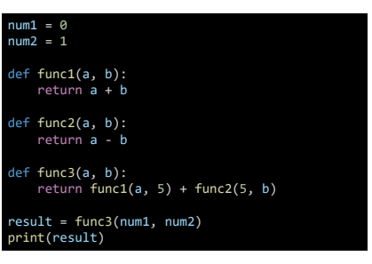

## 7월 13일 강의 정리

## 함수

## 함수의 기초

> 함수 란?
> 
> 함수(Function)
> 
> - 특정한 기능을 가는 코드의 조각(묶음)
> - 특정 명령을 수행하는 코드를 매번 작성할 필요 無, 필요 시 호출 하여 사용

1. 사용자 함수(Custom Function)
   
   - 구현되어 있는 함수가 없을 경우, 사용자가 직접 함수를 정의 할 수 있다
     
     ```python
     def function_name
         # code block
         return returning_value
     ```

2. 함 수 기본 구조
   
   - 선언과 호출(define & call)
     - 함수의 선언은 def 키워드를 활용
     - 들여쓰기를 통해 Function body(실행코드 블록)를 작성
     - 함수는 parameter를 넘겨줄 수 있음
     - 함수는 동락 후에 return을 통해 결과값을 전달
     - 함수명()로 호출


**< 예시 >**



- 결과값(Output)
  
  - 함수는 반드시 값을 하나만 return한다.
    - 명시적 return이 없는 경우에도 None을 반환한다
  - 함수는 return과 동시에 실행이 종료된다.

- 입력(input)
  
  - Parameter : 함수를 실행할 때 , 함수 내부에서 사용되는 식별자
  
  - Argument : 함수를 호출 할 때, 넣어주는 값
    
    > Argument 란?
    > 
    > - 함수 호출 시 함수의 parameter를 통해 전달되는 값
    > - Arguments는 소괄호 안에 할당 func_name(argument)
    >   - 필수 Argument : 반드시 전달되아야 하는 argument
    >   - 선택 Argument : 값을 전달하지 않아도 되는 경우는 기본 값이 전달
  
  - Keyword Arguments
    
    - 직접 변수의 이름으로 특정 Argument를 전달 할수 있음
    - Keyword Argument 다음에 Positional Argument를 활용할 수 없음

- 범위(Scope)

- 
