## 7월 14일 오전 강의

## 데이터구조
## ## 시퀀스

> 순서가 있는 데이터 구조

## **문자열(string)**

- 문자들의 나열(sequence of characters)
  - 모든 문자는 str 타입
- 문자열은 작은 따옴표(')나 큰따옴표(")를 활용하여 표기
  - 문자열을 묶을 때 동일한 문장부호를 활용
  - PFP8에서는 소스코드 내에서 하나의 문장부호를 선택하여 유지하도록 함

**문자열 탐색/검증**

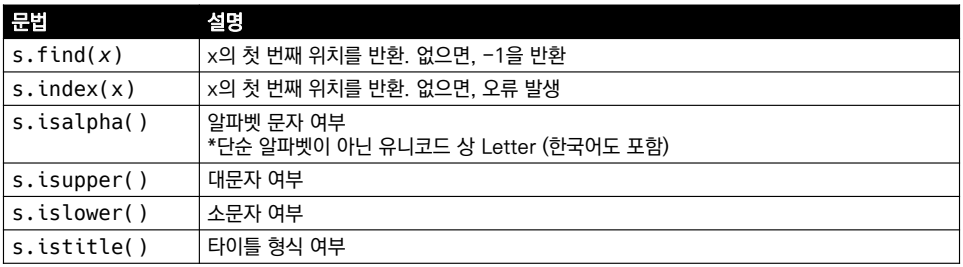

- .find(x)
  - x의 첫번째 위치를 반환. 없으면, -1을 반환함

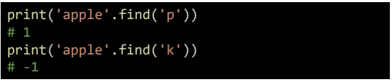

- .index(x)
  - x의 첫번째 위치를 반환. 없으면, 오류 발생

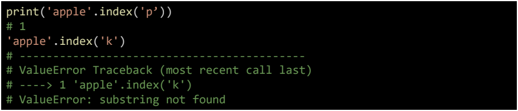

**문자열 관련 검증 메소드**

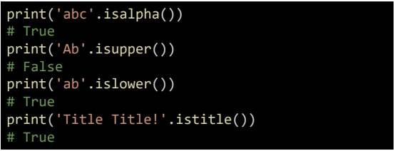

**문자열 변경**

- .replace(old, new[,count])
  - 바꿀 대상 글자를 새로운 글라조 바꿔서 변환
  - count를 지정하면, 해당 개수만큼만 시행

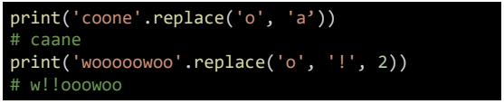

- .strip([chars])
  - 특정한 문자들을 지정하면,
  - 양쪽을 제거하거나(strip), 왼쪽을 제거하거나(lstrip), 오른쪽을 제거(rstrip)
  - 문자열을 지정하지 않으면 공백을 제거람

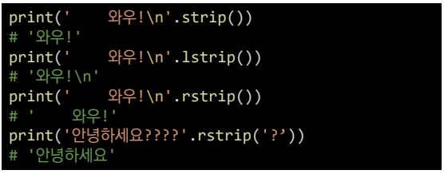

- .split(sep=None, maxsplit =-1)
  - 문자열을 특정한 단위로 나눠 리스트로 반환
    - sep이 None이거나 지정되지 않으면 연속된 공백문자를 단일한 공백문자로 간주하고, 
      선행/후행 공백은 빈문자열에 포함시키지 않음.
    - maxsplit이 -1인 경우에는 제한이 없음

- 'separator'.join([iterable])
  - 반복가능한(iterable) 컨테이너 요소들을 separator(구분자)로 합쳐 문자열 반환
    - iterable에 문자열이 아닌 값이 있으면 TypeError 발생

- 기타 변경
  - 예시

## **리스트(List)**

> 리스트의 정의
>
> - 변경 가능한 값들의 나열된 자료형
> - 순서를 가지며, 서로 다른 타입의 요소를 가질 수 있음
> - 변경 가능하며(mutable), 반복 가능함(iterable)
> - 항상 대괄호 형태로 정의하며, 요소는 콤마로 구분

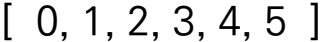

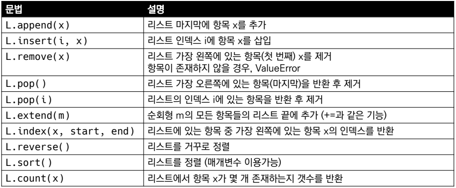

**값 추가 및 삭제**

- .append(x)
  - 리스트에 값을 추가함

- .extend(iterable)
  - 리스트에 iterable의 학목을 추가함

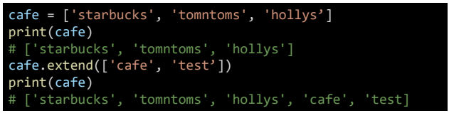

- .insert(i, x)
  - 정해진 위치 i에 값을 추가함

- .remove(x)

  - 리스트에서 값이 x인 것 삭제

  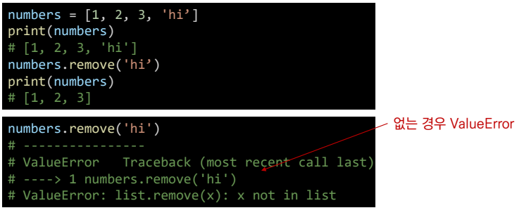

- .pop(i)
  - 정해진 위치 i에 있는 값을 삭제하고, 그 항목을 반환함
  - i가 지정되지 않으면, 마지막 항목을 삭제하고 반환함

- clear()
  - 모든 항목을 삭제함

**탐색 및 정렬**

- .index(x)

  - x값을 찾아 해당 index 값을 반환

  

- .count(x)
  - 원하는 값의 개수를 반환함

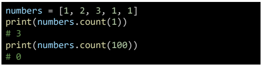

- .sort()
  - 원본 리스트를 정렬함. None 반환
  - sotred 함수와 비교 할 것

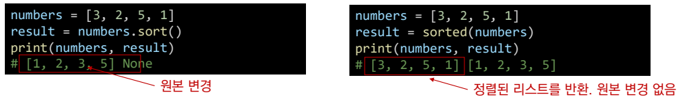

- .reverse()

  - 순서를 반대로 뒤집음(정령하는 것이 아님) none 반환

  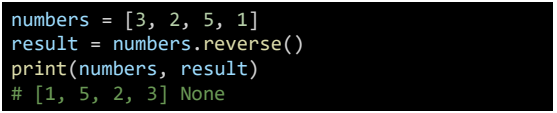

## 컬렉션

> 순서가 없는 데이터 구조

**세트(Set)**

- 유일한 값들의 모음(collection)

- 순서가 없고 중복된 값이 없음

  - 수학에서의 집합과 동일한 구조를 가지며, 집합 연산도 가능

- 변경 가능하며(mutable), 반복 가능항(iterable)

  - 단, 세트는 순서가 없어 반복의 결과가 정의한 순서와 다를 수 있음

- 세트 메서드

  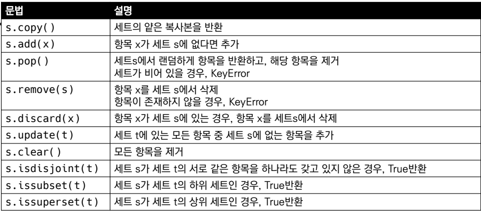

**딕셔너리(Dictionary)**

- 키-값(key-value) 쌍으로 이뤄진 모음
  - 키(key)
    - 불변 자료형만 가능(리스트, 딕셔너리 등은 불가능함)
  - 값(value)
    - 어떠한 형태든 관계 없음
- 키와 값은 `:`로 구분 된다. 개별의 요소는 `,`로 구분 한다
- 변경 가능 하며, 반복 가능하다
  - 딕셔너리는 반복하면 키가 반환된다

**조회**

- .get(key[,default])

  - key를 통해 value를 가져옴
  - keyerror가 발생하시 않으며 default값을 설정할 수 있음(기본:none)

  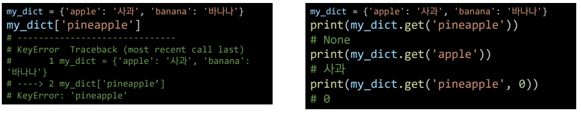

**추가 및 삭제**

- .pop(key[,default])
  - key가 딕셔너리에 있으면 제거하고 해당 값을 반환
  - 그렇지 않으면 dafault를 반환
  - default갑시 없으면 KeyError

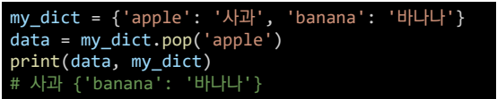

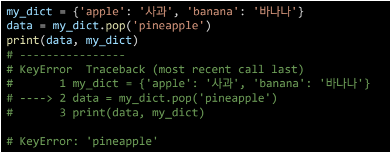

- update([other])
  - 값을 제공하는 key, value로 덮어 쓴다.

