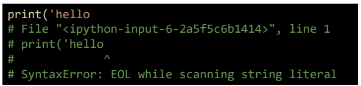
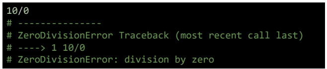
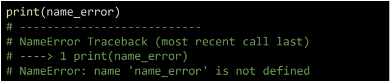
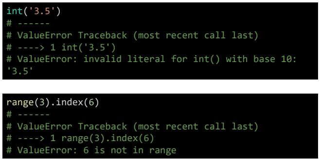
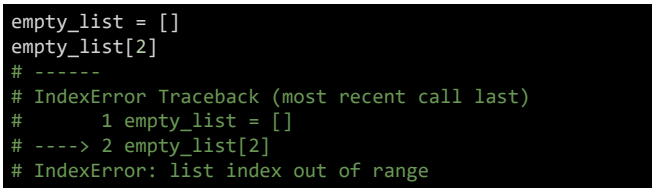
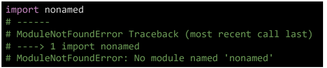

## 딕셔너리 해설

## 에러/예외처리

> 오류는 어느 부분에서 가장 많이 발생을 하며
> 어느 부분을 중점적으로 봐야 할까요?

## 제어가 되는 시점 조건/반복, 함수
**branches**

- 모든 조건이 원하는대로 종작하는지

**for loops**

- 반복문에 진입하는지, 원하는 횟수 만큼 실행되는지

**while loops**

- for loops 와동일 종료조건이 제대로 동작하는지

**function**

- 함수 호출시, 함수 파라미터, 함수 결과

- print 함수 활용
  
  - 특정 함수 결과, 반복/조건 결과 등 나눠서 생각, 코드를 disection으로 나눠서 생각

- 개발 환경등에서 제공하는 기능 활용
  
  - breakpoint, 변수 조회등

- python tutor 활용 (단순코드)

- 뇌컴파일, 눈디버깅

## 에러 메시지가 발생하는 경우

- 해당 하는 위치를 찾아 메시지를 해결
  

## 로직 에러가 발생하는 경우

- 명시적인 에러 메시지 없이 예상과 다른 결과가 나온 경우

  - 정상적으로 동작하였던 코드 이후 작성된 코드를 생각해봄
  - 전체 코드를 살펴봄
  - 휴식을 가져봄
  - 누군가에게 설명해봄(러버덕...)

## 문법 에러(Syntax Error)

- Syntax error가 발생하면, 파이썬 프로그램은 실행이 되지 않음
- 파일 이름, 줄번호 ^ 문자를 통해 파이썬 코드를 읽어 나갈때 문제가 발생하면
  해당 위치를 표현
- 줄에서 에러가 감지된 가장 앞의 위치를 가리키는 캐럿이호(^)를 표시

**EOL**(end of line)

**EOE**(End oof File)

**invalid syntax**

**assign to itreal**

# 예외(Exception)

- 실행 도중 예상치 못한 상황을 맞이하면, 프로그램 실행을 멈춤
  - 문장이나 표현식이 문법적으로 오바르더라도 발생하는 에러
- 실행 중에 감지되는 에러들을 예외(Exception)라고 부름
- 예외는 여러 타입(type)으로 나타나고, 타입이 메시지의 일부로 출력됨
  - NameError, TypeError 등 발생한 예외 타입의 종류

- 모든 내장 예외는 Exception Class를 상속받아 이뤄짐
- 사용자 정의 예외를 만어 관리 할 수 있음

---

**ZeroDivisionError** : 0나누고자 할때 발생

**nameError** : namespace 상에 이름이 없는 경우(변수로 선언한적이 있는지 없는지)

## TpyeError

## ValueError - 타입급 올바르나 값이 적절하지 않을겨우

## IndexError

## KeyError

## ModuleNotFoundError

> 존재하지 않는 모듈을 import 하는 경우

## 예외처리

> IF 문과 다르게 오류를 발생하지 않는다/ 오류를 원하는 방법으로 출력하기 위해 사용

- try 문(statemnet) / except절을 이용하여 예외처리 할 수 있음
- try문
  - 오류가 발생할 가능성이 있는 코드를 실행
  - 예외가 발생되지 않으면, excpet문을 실행 한다

- excpet문
  - 예외가 발생하면, except절 실행
  - 예외 상황을 처리하는 코드를 받아서 적절한 조치를 취함

- else
  - try문에서 예외가 발생하지 않으면 실행

- finally
  - 예외 발생 여부와 관계없이 항상 실행

## 예외 발생 시키기
- raise statement
  - raise를 통해 예외를 강제로 발생

