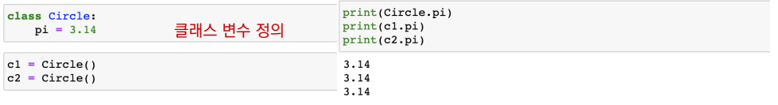
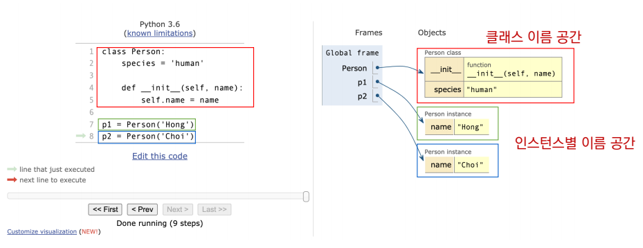
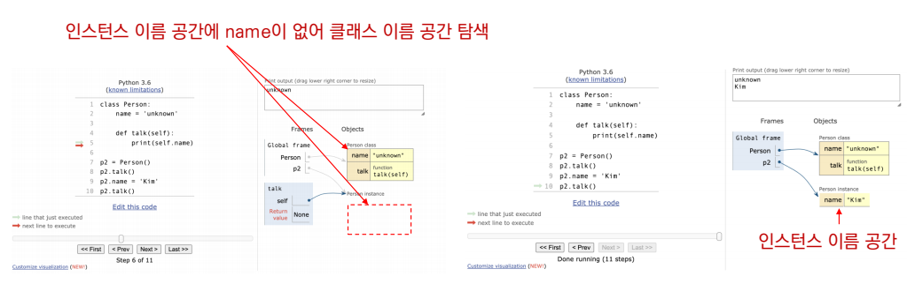
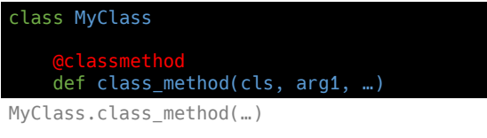
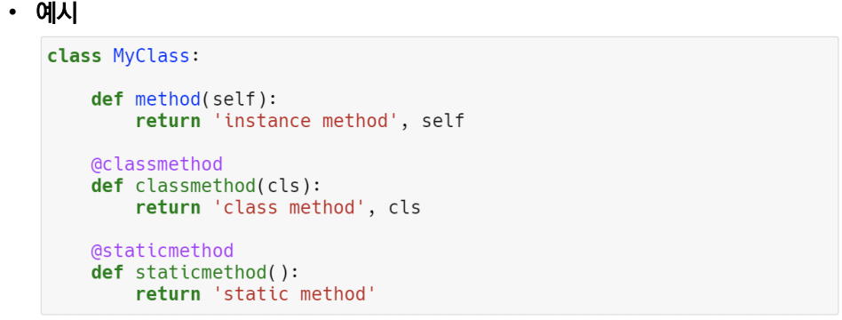

## 객체지향 프로그래밍

## 클래스

- 클래스 속성(attribute)
  - 한 클래스의 모든 인스턴스라도 똑같은 값을 가지고 있는 속성
  - 클래스 선언 내부에서 정의
  - <calssname>.<name>으로 접근 및 할당

- 인스턴스와 클래스 간의 이름 공간(namespace)
  - 클래스를 정의하면, 클래스와 해당하는 이름 공간 생성
  - 인스턴르를 만들면, 인스턴스 객체가 생성되고 이름 공간 생성
  - 인스턴스에서 특정 속성에 접근하면, 인스턴스-클래스 순으로 탐색

- 클래스 메소드
  - 클래스가 사용할 메소드
  - @classmethod 데코레이터를 사용하여 정의
    - 데코레이터 : 함수를 어떤 함수로 꾸며서 새로운 기능을 부여
  - 호출 시, 첫번째 인자로 클래스(cls)가 전달됨

- 스택틱 메소드
  - 인스턴스 변수, 클래스 변수를 전혀 다루지 않는 메소드
- 언제 사용하는가??
  - 속성을 다루지 않고 단지 기능(행동)만을 하는 메소드를 정의할 때 사용
  - @staticmethod 데코레이터를 사용하여 정의
  - 호출시, 어떠한 인자도 전달하지 않음(클래스 정보에 접근/수정 불가)

- 메소드 정리
  - 인스턴스 메소드
    - 호출한 인스턴스를 의미하는 self 매게 변수를 통해 인스턴스를 조작
  - 클래스 메소드
    - 클래스를 의미하는 cls 매개 변수를 통해 클래그 조작
  - 스태틱 메소드
    - 인스턴스나 클래스를 의미하는 매개 변수를 사용하지 않음
      - 즉, 객체 상태나 클래스 상태를 수정할 수 없음
    - 일반 함수처럼 동작하지만 클래스의 이름공간에 귀속됨
      - 주로 해당 크랠스로 한정하는 요도로 사용

## 객체지향의 햑심 4가지

- 추상화
  - 어떠한 기능/정보 를 표현을 하기위한 모습 
- 상속
  - 두 클래스 사이 부모 - 자식 관계를 정립 한다
  - 급래스는 상속이 가능함
    - 모든 파이썬 클래스는 object를 상속 받음

- ​	상속 정리
  - 하위 클래스는 상위 클래스 정의도니 속성, 행동, 관계및 제약 조건을 모두 상속 받음
  - 부모클래스의 속성, 메소드가 자식 클래스에 상속되므로, 코드 재사용 성이 높아짐
  - super()를 통해 부모클래스의 요소를 호출 할 수 있음
  - 상속관계에서의 이름 공간은 인스턴스, 자식 클래스, 부모 클래스 순으로 탐색

- 다형성
  - 서로 다른 클래스에 속해 있는 객체들이 동일한 메시지에 대해 다른 방식으로 응답 될 수 있음
  - 메소드 를 덮어쓰기 할 수 있다
- 캡슐화
  - 객체의 일부 구현 내용에 대해 외부로부터의 직접적인 액세스를 차단
  - 파이썬에서 기능상으로 존재하지 않지만, 관용적으로 사용되는 표현이 있음
