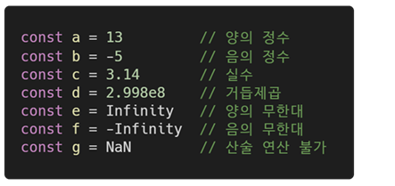

# ECMA Script

## 코딩 스타일 가이드

- 코딩 스타일의 핵심은 합의된 원칙과 일관성
  - 절대적인 하나의 정갑은 없으며, 상황에 맞게 원칙을 정하고 일관성 있게 사용하는 것이 중요
- 코딩 스타일은 코드의 품질에 직결되는 중요한 요소
  - 코드의 가동성, 유지보수 또는 팀원과의 커뮤니케이션 등 개발 과정 전체에 영향을 끼침
- (참고) 다양한 자바스크립트 코딩 스타일 가이드
  - [Airbnb Javascript Style Guide](https://github.com/airbnb/javascript) 
  - [Google Javascript Style Guide](https://google.github.io/styleguide/jsguide.html)
  - [standardjs](https://standardjs.com/#javascript-style-guide-linter-and-formatter)

# 변수와 식별자

- 식별자(identifier)는 변수를 구분할 수 있는 변수명을 말함
- 실벽자는 반드시 문자, 달러(\$) 또는 밑줄(\_)로 시작
- 대소문자를 구분하며, 클래스명 외에는 모두 소문자로 시작
- 예약어\* 사용 불가능

  - 예약어 예시 : for, if, function 등

- 선언, 할당, 초기화
- 선언(Declaration)
  - 변수를 생성하는 행위 또는 시점
- 할당(Assignment)
  - 선언된 변수에 값을 저장하는 행위 또는 시점
- 초기화(Initialization)
  - 선언된 변수에 처음으로 값을 저장하는 행위 또는 시점

### let, const

- **블록 스코프* (block scope)**
  - if, for, 함수 등의 중괄호 내부를 가리킴
  - 블록 스코프를 가지는 변수는 블록 바깥에서 접근 불가능

### var

- **함수 스코스* (function scope)**
  - 함수의 중괄호 내부를 가리킴
  - 함수 스코프를 가지는 변수는 함수 바깥에서 접근 불가능

### 호이스팅

- **호이스팅(Hoisting)**
  - 변수를 선언 이전에 참조할 수 있는 현상
  - 변수 전언 이전의 위치에서 접근 시 undefined를 반환
- 자바스크립트는 모든 선언을 호이스팅한다.
- 즉, var, let, const 모두 호이스팅이 발생하지만, car는 선언과 초기화가 동시에 발생하여
  일시적 사작지대가 존재하지 않는다

### let, const, var 비교

## 데이터 타입

- 자바스크립트의 모든 값은 특정한 타입을 가짐
- 크게 원시 타입* (Primitive type) 과 참조 타입* (Reference typr)으로 분류됨

### 원시 타입(Primitive type)

- 객채(object)가 아닌 기본타입
- 변수에 해당 타입의 값이 담김
- 다른 변수에 복사할 때 실제 값이 복사됨

### 참조 타입(Reference typr)

- 객체(object) 타입의 자료형
- 변수에 해당 객체의 참조 값이 담김
- 다른 변수에 복사할 때 참조 값이 복사됨

### 숫자(Number) 타입

- 정수, 실수 구분 없는 하나의 숫자 타입
- 부동소수점 형식을 따름
- (참고) NaN(Not-A-Number)
  - 계산 불가능한 경우 반환되는 값
    - ex) 'Angel' / 1004 => NaN

### 문자열(String) 타입

- 텍스트 데이터를 나타내는 타입
- 16비트 유니코드 문자의 집합
- 작은따옴표 또는 큰따옴표 모두 가능
- 템플릿 리터럴(Template Literal)
  - ES6부터 지원
  - 따옴표 대신 backick(' ')으로 표현
  - ${ expression } 형태로 표현식 삽입 가능

