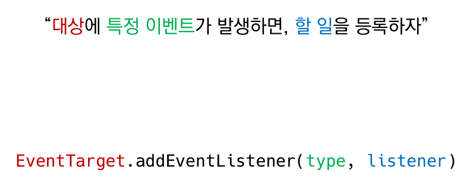
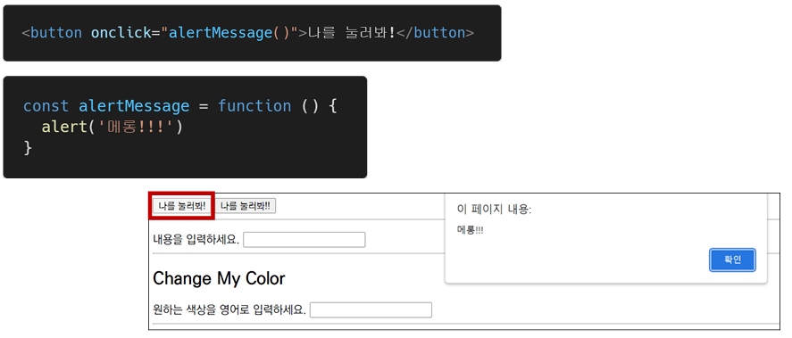
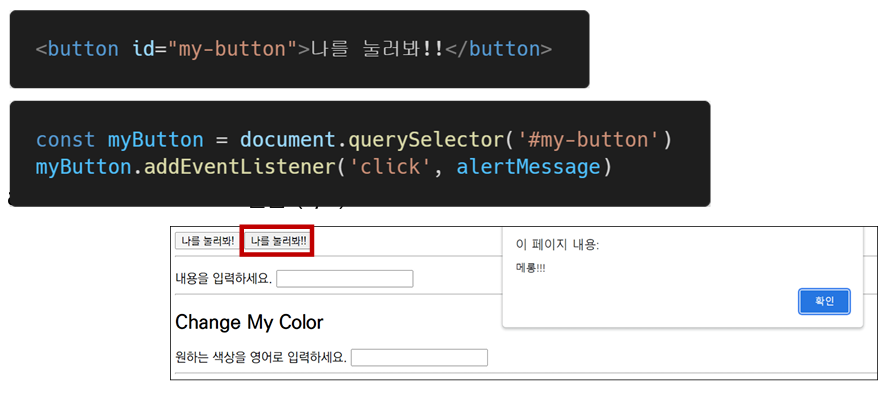
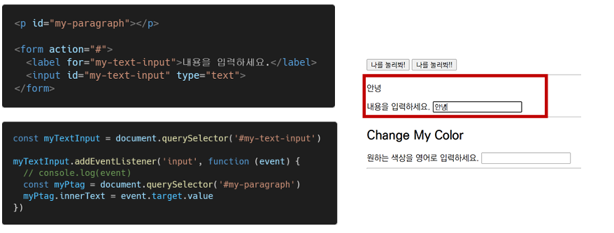
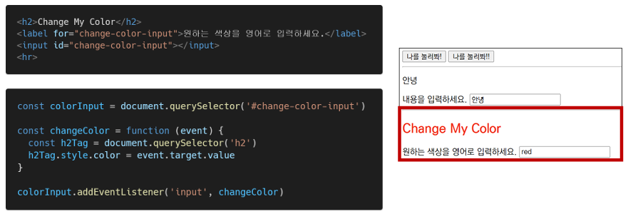
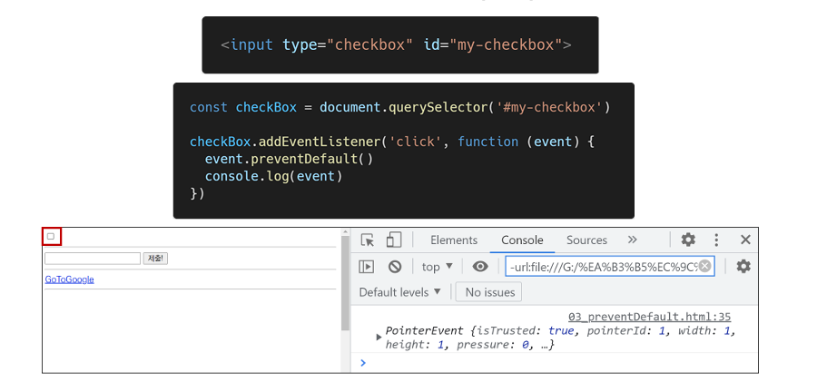
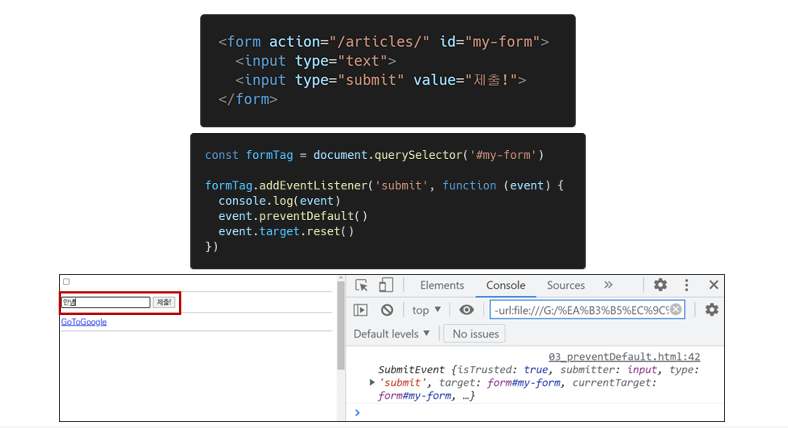
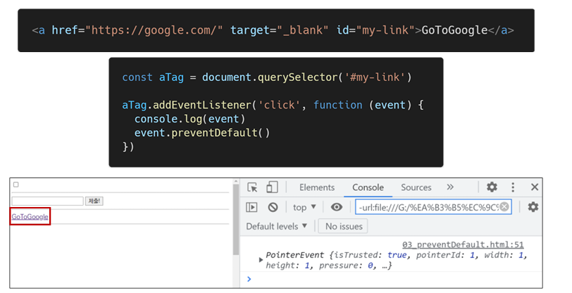

# Event

## Event 개념

> 네트워크 활동이나 사용자와의 상호작용 같은 사건의 발생을 알리기 위한 객체

- 이벤트 발생
  - 마우스를 클릭하거나 키보드를 누르는 등 사용자 행동으로 발생할 수도 있음
  - 특정 메서드를 호출(Element.click())하여 프로그래밍적으로도 만들어 낼 수 있음

### Evnet의 역할

1. "~ 하면 ~ 한다."
2. "클릭**`하면`**, 경고창**`을 띄운다`**"
3. "특정 이벤트가 발생 **`하면`**, 할 일(함수)을 등록**`한다`**"

### Event handler - addEventListener()

- EventTarget.addEventListener()
  - 지정한 이벤트가 대상에 전달될 떄마다 호출할 함수를 설정
  - 이벤트를 지원하는 모든 객체(Element, Documentm Window 등)를 대상으로 지정 가능
- Target.addEventListenter(type, listener[,options])
  - type
    - 반응 할 이벤트 유형(대소문자 구분 문자열)
  - listener
    - 지정된 타입의 이벤트가 발생했을 때 알림을 받는 객체 
      EventListener 인터페이스 혹은 JS function 객체(콜백 함수)여야 함

### 실습1

### 실습2

### 실습3

### 실습4

## Event 취소

- event.preventDefault()

- 현재 이벤트의 기본 동작을 중단
- HTML 요소의 기본 동작을 작동하지 않게 막음
  - ex) a 태그의 기본동작을 클릭 시 링크로 이동 / form 태그의 기본 동작은 form 데이터 전송
- 이벤트를 취소할 수 있는 경우, 이벤트의 전파를 막지 않고 그 이벤트를 취고

### 취소 실습1

### 취소 실습2

### 취소 실습3

