# CSS position

- 문서 상에서 요소의 위치를 지정

- static : 모든 태그의 기본 값(기준 위치)

  - 일반적인 요소의 배치 순서에 따름(좌측상단)
  - 부모 요소 내에서 배치될 때는 부모 요소의 위치를 기준으로 배치됨

- 아래는 좌표 프로퍼티(top, bottom, left, right)를 사용하여 이동

  1. relative
  2. absolute
  3. fixedd
  4. sticky

  

1. relative : 상대 위치
   - 자기 자신의 static  위치를 기준으로 이동 (normal flow 유지)
   - 레이아웃에서 요소가 차지하는 공간은 static일 때와 같음
2. absolute : 절대 위치
   - 요소를 일반적인 문서의 흐름에서 제거 후 레이아웃에 공간을 차지하지 않음(normal flow에서 벗어남)
   - static이 아닌 가장 가까이 있는 부모/조상 요소를 기준으로 이동(없을 경우 브라우저 화면 기준 이동)
3. fixed : 고정 위치
   - 요소를 일반적인 문서 흐름에서 제거 후 레이아웃에 공간을 차지하지 않음(normal flow에서 벗어남)
   - 부모 요소와 관계없이 viewport를 기준으로 이동
     - **`스크롤 시에도 항상 같은 곳에 위치함`**
4. sticky : 스크롤에 따라서 static -> fixed로 변경
   - 속성을 적용한 박스는 평소에 문서 안에서 **position: static** 상태와 같이 일반적인 흐름에 따르지만
     스크롤 위치가 임계점에 이르면 **position: fixed**와 같이 박스를 화면에 고정할 수 있는 속성

## static 해보기

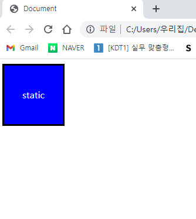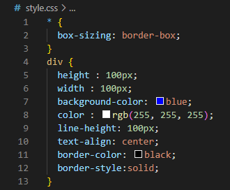

## relative 해보기

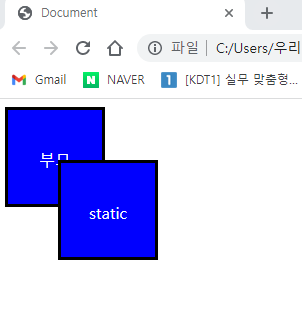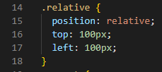

## absolute 해보기

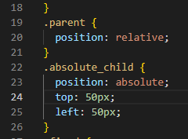

## fixed 해보기

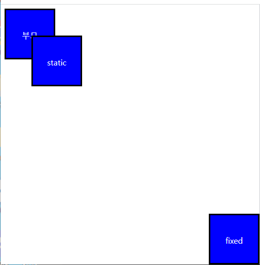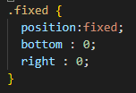

## absolute vs relative 비교해보기

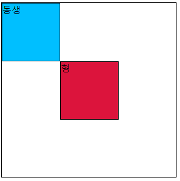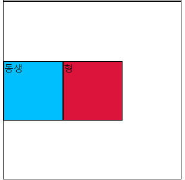

## absolute 언제 사용 할까?

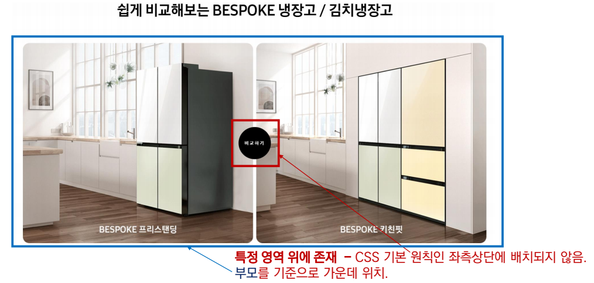

## fixed 언제 사용 할까?

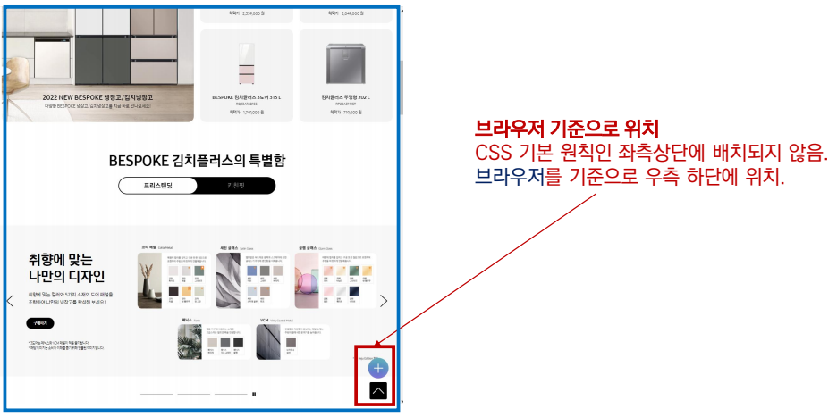

## CSS 원칙 II

- CSS원칙 I, II : normal flow
  - 모든 요소는 메노(박스모델), 좌측 상단에 배치
  - display에 따라 그키와 배치가 달라짐
- CSS 원칙 II
  - position으로 위치의 기준을 변경
    - relative : 본인의 원래 위치
    - absolute : 특정 부모의 위치
    - ficed : 화면의 위치(고정)
    - sitcky: 기본적으로 static속성이나 스크롤이 이동하면 fixed로 변경

# CSS Layout

- Display
- Position
- Float (CSS1, 1996)
- Flexbox (2012)
- Grid (2017)
- 기타
  - Responsive Web Design(2010), Media Queries(2012)

## Flexbox

- 행과 열 형태로 아이템들을 배치하는 1차원 레이아웃 모델
- 축
  - main axis (메인 축)
  - cross axis (교차 축)
- 구성 요소
  - Flex container (부모 요소)
  - Flex Item (자식 요소)

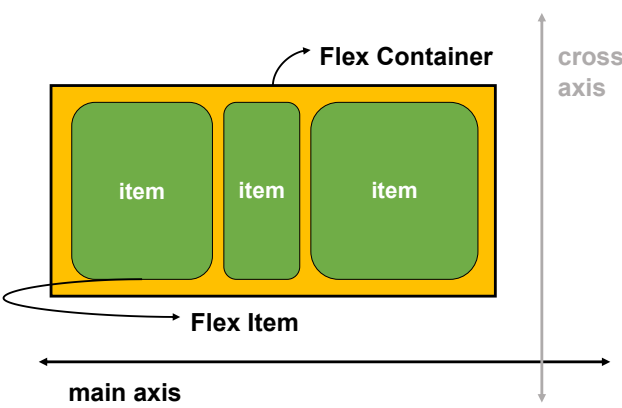

## Flexbox 구성요소

- Flex Container (부모요소)
  - flexbox 레이아웃을 형성하는 가장 기본적인 모델
  - Flex Item들이 놓여 있는 영역
  - display 속성을 flex 혹은 inline-flex로 지정

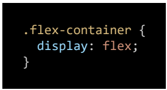

- Flex Item (자식 요소)
  - 컨테이더에 속해 있는 컨텐츠(박스)

**왜 Flexbox를 사용 할까?**

> 이전 까지 Nornal Flow를 벗아사는(이동하는) 수단은 Flot or Position 사용

**Flebox 사용 안할 시 어려운점**

1.  수직 정렬
2.  아이템의 너비와 높이, 간격을 동일하게 배치

## Flex 속성

- 배치 설정
  - flex-direction
  - flex-wrap
- 공간 나누기
  - justify-content (main axis)
  - align-content (cross axis)
- 정렬
  - align-items (모든 아이템을 cross axis 기준으로)
  - align-self (개별 아이템)

**flex-direction**

- main axis 기준 방향 설정
- 역방향의 경우 HTML 태그 선언 순서와 시각적으로 다르니 유의 (웹 접근성에 영향)

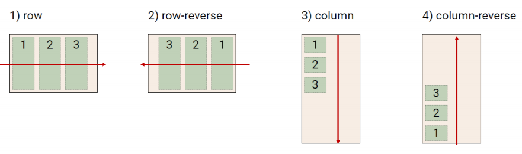

**flex-wrap**

- 아이템이 컨테이너를 벗어사는 경우 해당 영역내에 채비되도록 설정
- 기본적으로 컨테이너 영역을 벗어나지 않도록 함

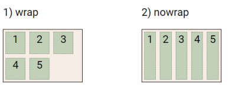

**flex-direction & flex-wrap** 정리

- flex-direction : Main axis 방향으로 설정
- flex-wrap : 요소들이 강제로 한 줄에 배치되게 할 것인지 설정
  - nowrap (기본값) : 한줄로 모두 배치
  - wrap : 넘치면 다음 줄로 배치

**justify-content**

- Main axis를 기준으로 공간 배분

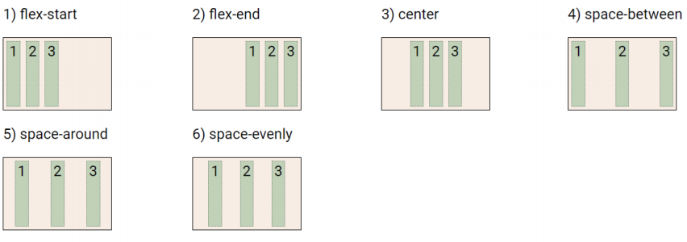

**align-content**

- cross axis를 기준으로 공간 배분 (아이템이 한줄로 배치되는 경우 확인 할 수 없음)

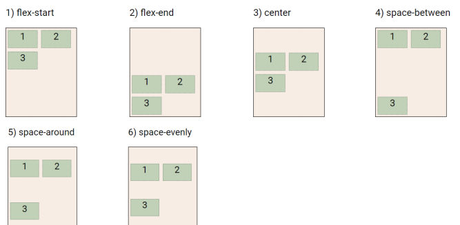

**justify-content & align-content** 정리

- 공간배분
  - flex-start (기본값) : 아이템들을 axis 시작점으로
  - flex-end : 아이템들을 axis 끝 쪽으로
  - center : 아이템들을 axis 중알으로
  - space-between : 아이템 사이의 간격을 균일하게 분배
  - space-around : 아이템을 불러싼 여영ㄱ을 균일하게 분배 (가빌 수 있는 영역을 반으로 나눠서 양쪽에)
  - space-evenly : 전제 영역에서 아이템 간 간젹을 균일하게 분배

**align-items**

- 모든 아이템을 Cross axis를 기준으로 정령

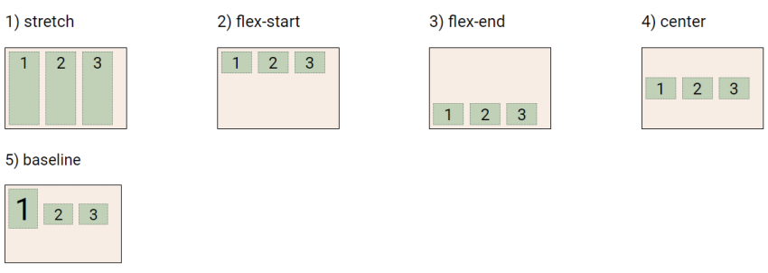

**align-self**

- 개별 아이템을 cross axis 기준으로 정렬
  - 주의!! 해당 속성은 컨테이너에 적용 되는 것이 아니고 개별 아이템에 적용

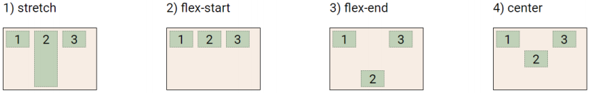

**align-items & align-self**

- Cross axis를 중심으로
  - stretch (기본값) : 컨테이너를 가득 채움
  - flex-start : 위
  - flex-end : 아래
  - center : 가운데
  - baseline : 텍스트 baseline에 지군선을 맞춤
