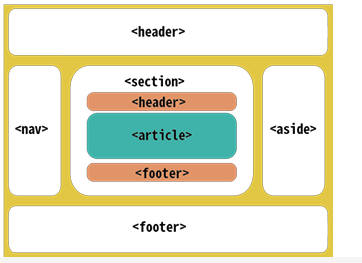
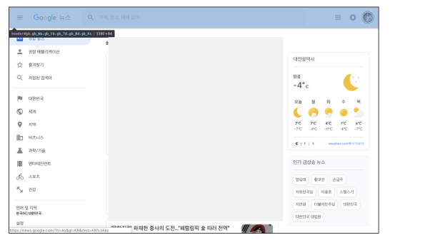

# 시맨틱 태그

- HTML 태그가특정목적, 역할및의미적가치(semantic value)를가지는것
  - h1 태그는“이페이지에서최상위제목”인텍스트를감싸는역할(또는의미)을나타냄
- Non semantic 요소로는div, span 등이있으며a, form, table 태그들도시맨틱태그로볼수있음
- 대표적인시맨틱태그목록
  - header: 문서전체나섹션의헤더(머리말부분)
  - nav: 내비게이션
  - aside: 사이드에위치한공간, 메인콘텐츠와관련성이적은콘텐츠
  - section: 문서의일반적인구분, 컨텐츠의그룹을표현
  - article: 문서, 페이지, 사이트안에서독립적으로구분되는영역
  - footer: 문서전체나섹션의푸터(마지막부분)

- 각 위치에 맞는 시맨틱을 입력 하여 사용

- 구글 뉴스 상단의 메뉴는 Header 태그를 통해서 명확하게 표현하고 있음

### 시맨틱 태그 사용 해야하는 이유

- 의미론적마크업
  - 개발자및사용자뿐만아니라검색엔진등에의미있는정보의그룹을태그로표현
  - 단순히구역을나누는것뿐만아니라‘의미’를가지는태그들을활용하기위한노력
  - 요소의의미가명확해지기때문에코드의가독성을높이고유지보수를쉽게함
  - 검색엔진최적화(SEO)를위해서메타태그,시맨틱태그등을통한마크업을효과적으로활용해야함
