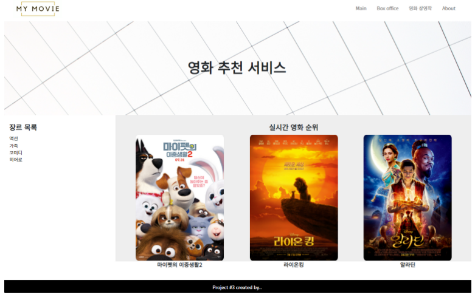

# 영화 추천 서비스 만들기

## 목표

- HTML를 통한 웹 페이지 마크업
- CSS를 통한 선택자 활용 및 속성 부여
- 시맨틱 태그를 활용한 기본 레이아웃 구성
- 영화 추천 사이트 메인 레이아웃 구성

## 요구 사항

> HTML/CSS을 활용하여 목표로 하는 웹사이트의 레이아웃을 구성합니다. 아래의 필수 사항을 제외한 요소는 자유롭게 꾸며 주세요.

### amHTML 기초

- `DOCTYPE`은 html입니다.
- `html`의 언어는 한국어(ko)입니다.
- `meta` 태그에 인코딩 설정을 UTF-8로 설정 해주세요.
- `meta` 태그에 기본 viewport 설정을 해주세요. (width: device-width, initial-scale: 1.0)
- `title` 태그는 영화 추천 사이트 라고 설정 해주세요.

### `header`

웹 사이트의 헤더 부분에는 로고 이미지와 네비게이션 바를 구성합니다.

- 속성
  - 헤더는 항상 상단에 유지 됩니다. **(sticky)**
  - 높이는 80px이며, 좌우 안쪽 여백(padding)은 40px입니다.
- 이미지 배치
  - 로고 이미지는 좌측에 배치합니다.
  - 로고 이미지의 높이는 60px입니다.
  - 로고 이미지는 `images/logo.png` 입니다.
- 네비게이션 바 (**`nav`**)
  - 네비게이션 바의 항목은 우측에 배치합니다.
  - 총 4개의 항목이 배치되며, 각각 임의의 링크(**`#`**) 으로 설정합니다.
    - 수직 정렬을 통해 중앙으로 일치시킵니다.

### `title section`

서비스를 소개하는 문구와 배경 이미지가 있는 섹션을 구성합니다.

- 속성
  - 높이는 320px이며, `header` 의 높이만큼 상단 여백을 설정합니다.
  - 수직 정렬을 통해 중앙으로 일치시킵니다.
  - 배경 이미지는 적절하게 삽입하고, 이미지에 맞게 사이즈와 위치를 조절 합니다.
  - `h1` 태그를 활용하여 사이트의 제목을 작성합니다.

<aside> 👉 aside와 movie는 2:8의 비율을 가집니다.

</aside>

### `aside`

좌측 레이아웃에 장르 목록을 구성합니다.

- 속성
  - 좌측에 위치합니다.
  - 상하좌우 안쪽 여백(padding)은 1rem입니다.
  - `h2` 태그를 활용하여 `장르 목록` 이라고 작성합니다.
  - 개별 장르는 `ul` 태그를 활용 하되 기본 안쪽 여백을 제거합니다.

### **movie `section`**

[우측 레이아웃에 제공된 영화 포스터를 활용하여 실시간 영화 순위 목록을 구성합니다.](https://www.notion.so/2dbf917b4f614ef7a6eebf02c697976b)

<aside> 👉 먼저 3개를 한 줄로 배치하는 것만 진행하고, 추후에 6개로 늘려보세요.

</aside>

- 속성
  - 우측에 위치하며, `aside` 를 제외한 모든 너비를 가집니다.
  - 상하좌우 안쪽 여백(padding)은 24px입니다.
  - 적절한 배경 색상을 적용 시킵니다.
  - `h2` 태그를 활용하여 `실시간 영화 순위` 라고 작성하며, 가운데 정렬을 합니다.
  - 영화는 한 행에 3개씩 배치하며, 각각 너비는 동일합니다.
  - 영화 이미지는 너비를 300px로 설정합니다.
  - 이미지 하단에는 영화명을 작성합니다.

### `footer`

푸터를 구성합니다.

- 속성
  - 푸터는 항상 하단에 유지 됩니다.
  - 높이는 40px이며, 모든 내용은 수직/수평 가운데 정렬을 합니다.
  - 적절한 배경 색상을 적용 시킵니다.

# 페어 후기

- 새로운 프로젝트 하는 거라 같은 팀원들에게 민폐가 될까 정말 고민을 했습니다
  시작을 하면서 초반에 좀 어색 했지만 다들 편하게 대해주시고 칭찬도 많이 해주시고
  규탁님과 가을님이 많이 알고 계셔서 서로 막히는 부분을 집단지성으로 쉽게 벽을 넘을 수
  있었습니다!!
  각자 맡은 파트도 잘 소화하고 가이드 라인에 맞춰서 끝내고 난 후 추가로 효과를 더하는
  작업을 할때는 서로 구글링도 해서 알려주고 서로 처음하는 기능을 공부하면서 같이 예기하며
  코드를 여러가지 방법으로 3명이서 테스트 해보니 정말로 다양한 접근법을 배울 수 있었고
  서로의 의견과 방법을 소통을 통해서 진행하니 재미있었습니다
  앞으로 페어 할때도 재미있게 할 수 있을거 같습니다!~ ㅎㅎ
  아~ 이미지 알라딘 저희는 이미지 파일 사이즈 고정을 위해서 가을님이 손수 크기를 수정해 주셨습니다
  덕분에 사진을 알맞게 사이즈에 맞춰서 넣을 수 있었네요 ㅎㅎ
  오버레이기능은 규탁님의 사전에 경험을 통해 가을님의 리터치와 저의 약간의 기초지식을 첨부하여 완성 했습니다 ㅎㅎ
