# Bootstrap

>Build fast, responsive sites with Bootstrap.
>**Quickly** design and customize **responsive** mobile-first sites with 
>Bootstrap, **the world’s most popular** front-end open source toolkit, 
>featuring Sass variables and mixins, **responsive grid system**, extensive 
>**prebuilt components**, and powerful JavaScript plugins.


## 기본 설정 과 다른 점

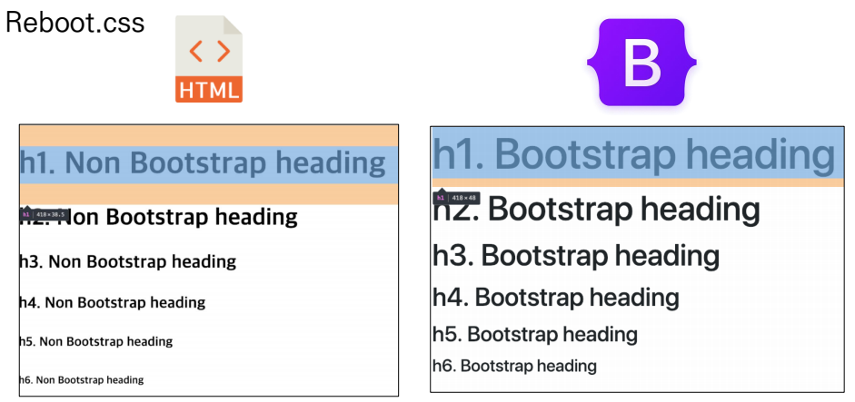

- 마진의 상쇄 되는 현상을 Bootstrap에서는 CSS를 통해서 마진을 없에는 등의 다양한 설정 값을
  개발자와 사용자의 편리성을 위해 오픈 소스로 제공을 하고 있다.

## spacing (Margin and padding)

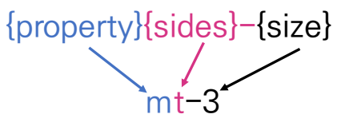

```html
<div class="mt-3 ma-5">bootstrap-spacing</div>
```

- 약어를 통해 마진과 패딩을 조절 할 수 있다
  - property(속성)
    - m - for classes that set margin
    - p - for classes that set padding
  - sides
    - t - margin-top or padding-top 속성 설정 
    - b - margin-bottom or padding-bottom 설정
    - s(start) - **LTR**(margin-left or padding-left), **RLT**(margin-right or padding-right)
                     왼쪽부터, 오른쪽부터 시작하여 여백을 주는 설정
    - e(end)-  s 와 반대되는 개념
    - x - 좌우 둘다 설정 하는 경우
    - y - 상하 둘다 설정 하는 경우

## 기본 단위

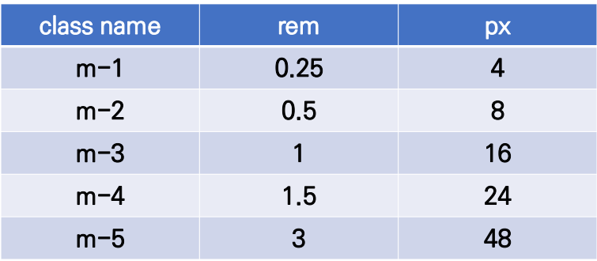

- m, p 간격 단위는 동일
- .mx-auto : 블럭 요소 수평 중앙 정렬 가로 가운데 정렬
- .py-0 : 위 아래 패딩 값이 0


- 종합 표

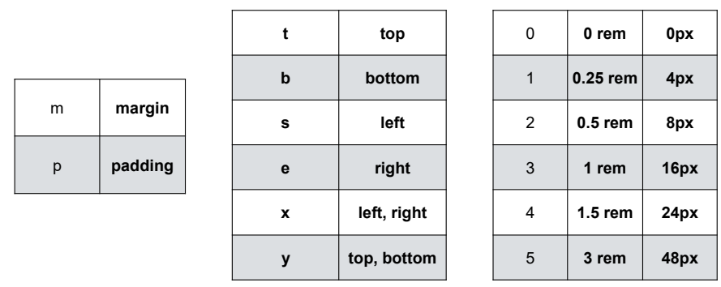

## color

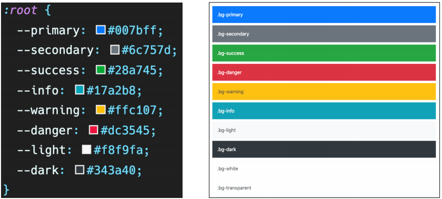


## Bootstrap 사용하기

1. CSS 파일을 다운받아서 사용

2. 설정 URL을 복사하여 HTML문서에 붙여넣어서 바로 사용

   - 3개의 코드를 가져와 바로 사용 가능

     - ```html
       <link href="https://cdn.jsdelivr.net/npm/bootstrap@5.2.0/dist/css/bootstrap.min.css" rel="stylesheet" integrity="sha384-gH2yIJqKdNHPEq0n4Mqa/HGKIhSkIHeL5AyhkYV8i59U5AR6csBvApHHNl/vI1Bx" crossorigin="anonymous">
       ```

       - 헤더 부분에 입렵

     - ```html
       <script src="https://cdn.jsdelivr.net/npm/bootstrap@5.2.0/dist/js/bootstrap.bundle.min.js" integrity="sha384-A3rJD856KowSb7dwlZdYEkO39Gagi7vIsF0jrRAoQmDKKtQBHUuLZ9AsSv4jD4Xa" crossorigin="anonymous"></script>
       <script src="https://cdn.jsdelivr.net/npm/@popperjs/core@2.11.5/dist/umd/popper.min.js" integrity="sha384-Xe+8cL9oJa6tN/veChSP7q+mnSPaj5Bcu9mPX5F5xIGE0DVittaqT5lorf0EI7Vk" crossorigin="anonymous"></script>
       <script src="https://cdn.jsdelivr.net/npm/bootstrap@5.2.0/dist/js/bootstrap.min.js" integrity="sha384-ODmDIVzN+pFdexxHEHFBQH3/9/vQ9uori45z4JjnFsRydbmQbmL5t1tQ0culUzyK" crossorigin="anonymous"></script>
       ```

       - body 부분에 입력 후 사용

# Bootsrtap 파헤치기

## Layout

### Breakpoints

- Breakpoints 는 모니터 또는 뷰포트 크기에 반응하는 반응형 레이아웃의 작동 방식을 결정 하는 방식

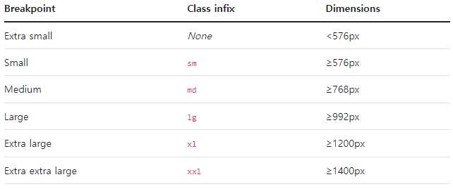

- xl = PC 모니터 & 노트북
- lg or md = 테블릿 & 구형 모니터
- sm, None = 모바일 

> 모니터의 너비가 변화에 따라서 만들어 놓은 페이지가 자동으로 변화 할 수 있도록 사전에 정의 해 놓은
> 클래스이며, 이를 활용하여 페이지 마다 각각의 화면 너비에 맞도록 디자인 할 수 있다

## Content

### Reboot

> CSS변경의 모음 으로 퀵스타트 할 수 있도록 일관된 기준선을 제공하는 콘텐츠

- Reboot는 Normalize를 기반으로 하여 독닥적인 스타일로 많은 HTML 요소를 제공합니다
- \<table>에 더 간단한 기준선을 위해 일부 스타일을 정하여 지원 하고 .table, .table-bordered등을 제공한다


**제목 및 단락**

- 기본 적인 마진율에서 Bootstrap에서 지정한 제목의 마진과 스타일로 새로 정의 됩니다

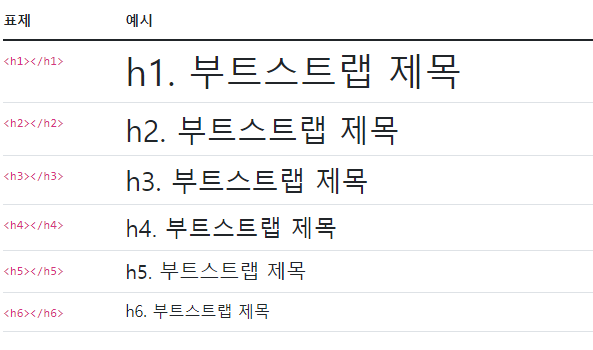

**수평 규칙**

- 수평 선에 대해서 다양항 타입을 지정 할수 있으며, 문서와 비슷한 색상과 굵기, 별도의 컬러와 투명도를
  활용하여 지정 할수 있습니다

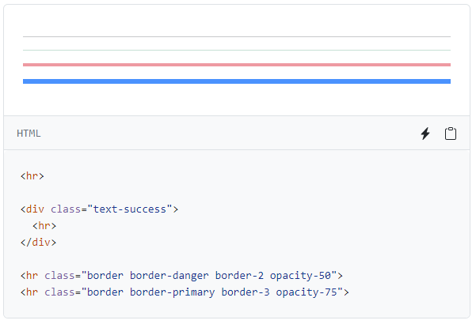

**인라인 코드**

- \<code>를 사용하여 HTML 내용에 꺽쇠 괄호를 이스케이프 처리 할 수 있습니다.
  - &lt = \< , &gt = \>

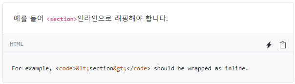


**사용자 입력**

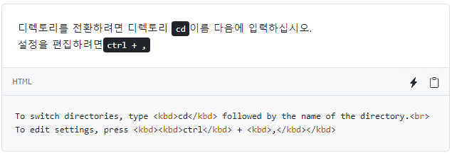


**form**

- 기본적으로 지원하는 폼 양식
  - fieldset : 테두리, 패딩 또는 여백이 없다
  - legend : 제목이 표시되록 만든 스타일
  - label : display: inline-block할 수 있도록 설정, margin을 설정 할 수 있다
  - textarea : 가로의 크기를 수정하면 페이지 레이아웃이 변경 될 수 있어 세로 크기만 조정 된다
  - button 및 input : not(disabled) 기능이 있다


**이미지**

- .img-fluid : 부모 너비에 맞게 크기가 조정되도록 이미지에 max-width: 100%, height: auto로 적용

정렬

​					  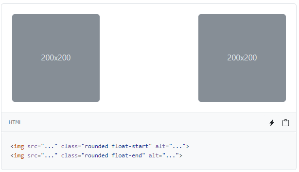	

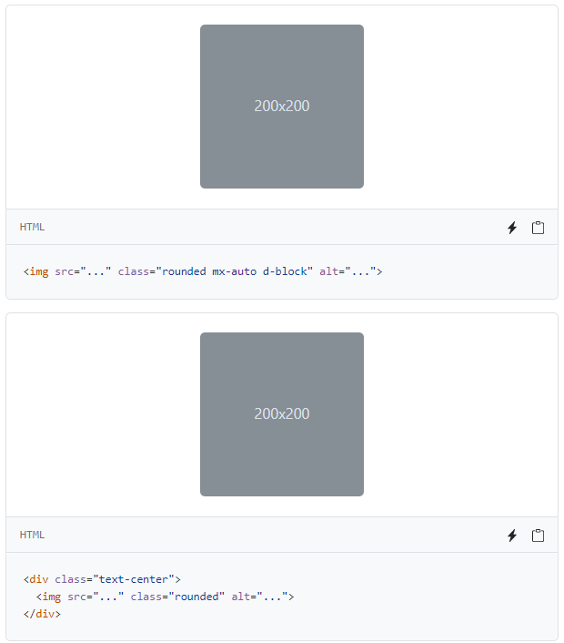

**테이블**

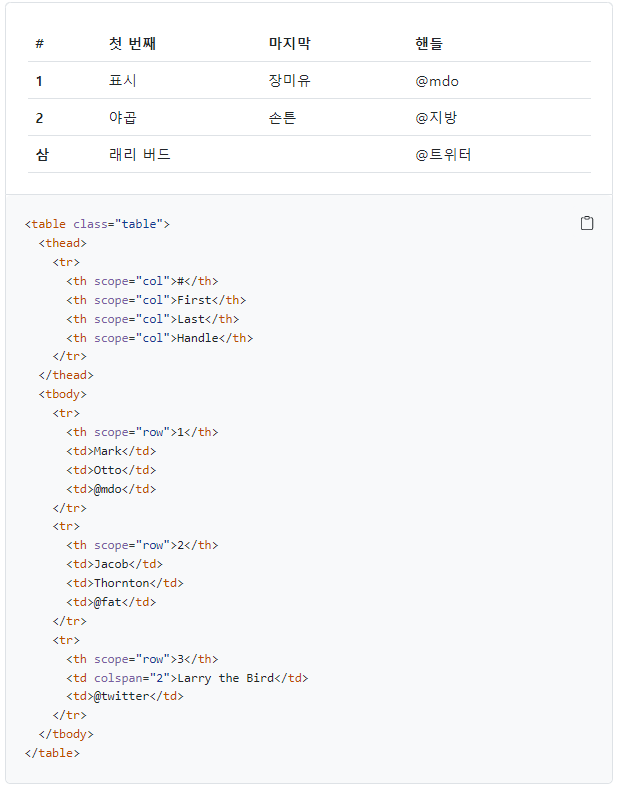

- 줄무늬 행 & 줄무늬 열

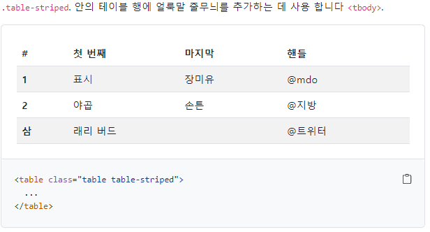

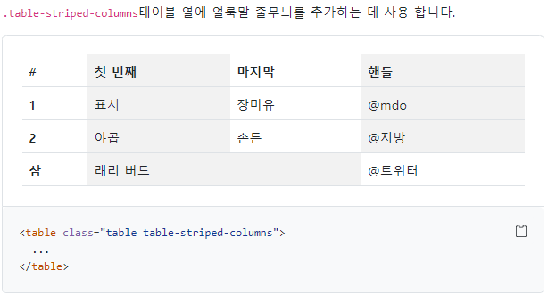

- 어두운 모드 사용 가능

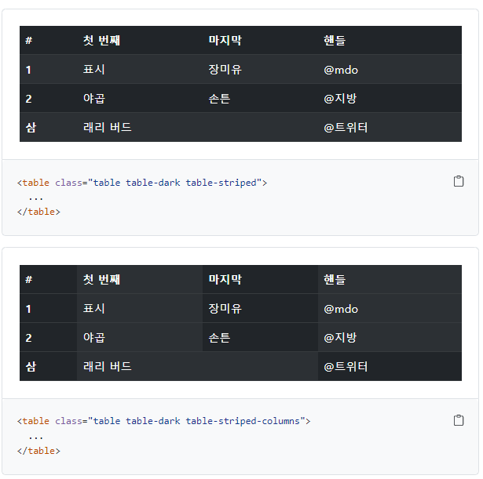

- hover 적용

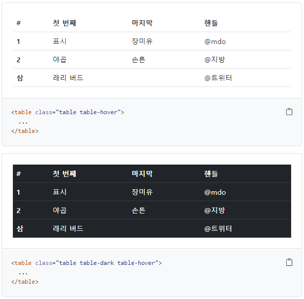

## Form

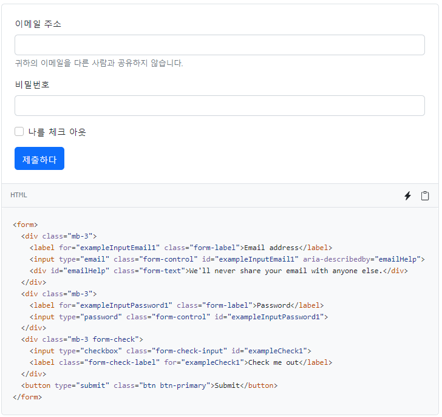

**form control**

- sizing
  - form-control-lg 처럼 클래스를 사용하여  탭의 높이를 설정 할 수 있다


```html
<input class="form-control form-control-lg" type="text" placeholder=".form-control-lg" aria-label=".form-control-lg example">
<input class="form-control" type="text" placeholder="Default input" aria-label="default input example">
<input class="form-control form-control-sm" type="text" placeholder=".form-control-sm" aria-label=".form-control-sm example">
```

**select**

- 리스트 상자를 만들어서 목록을 선택 하도록 만들 수 있다

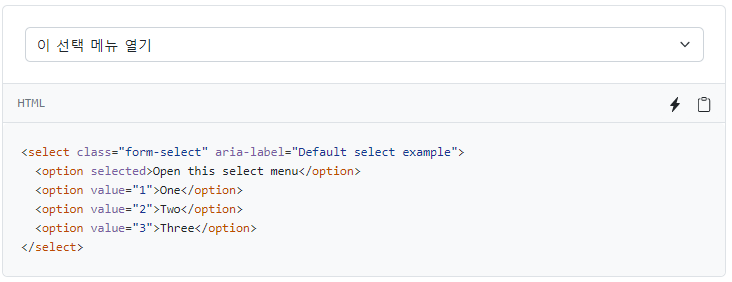

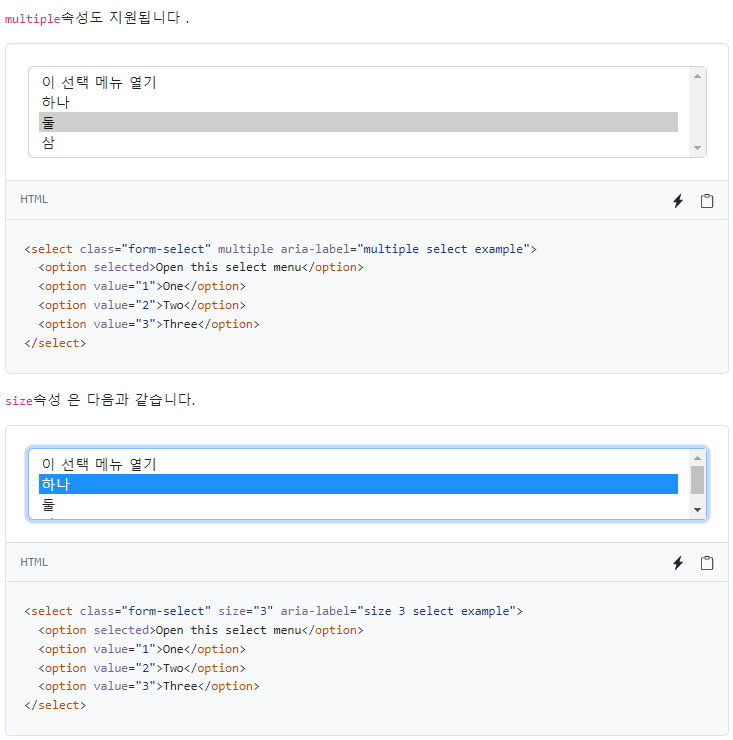

**check box & radio**

- 체크박스와 라디오 버트븐을 지원 하는 기능이 있다
  - checkbox : 중복 선택 가능
  - radio : 단일 선택 가능
- checkbox

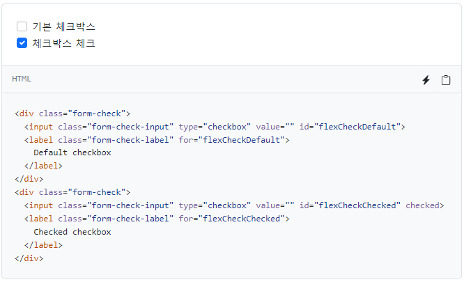

- radio

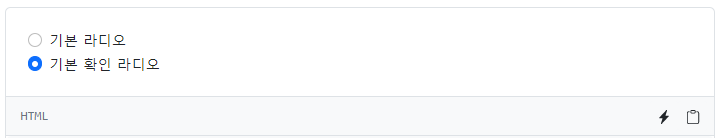

```html
<div class="form-check">
  <input class="form-check-input" type="radio" name="flexRadioDefault" id="flexRadioDefault1">
  <label class="form-check-label" for="flexRadioDefault1">
    Default radio
  </label>
</div>
<div class="form-check">
  <input class="form-check-input" type="radio" name="flexRadioDefault" id="flexRadioDefault2" checked>
  <label class="form-check-label" for="flexRadioDefault2">
    Default checked radio
  </label>
</div>
```

- 스위치

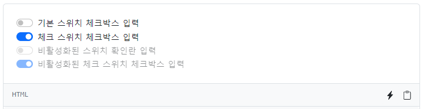

```html
<div class="form-check form-switch">
  <input class="form-check-input" type="checkbox" role="switch" id="flexSwitchCheckDefault">
  <label class="form-check-label" for="flexSwitchCheckDefault">Default switch checkbox input</label>
</div>
<div class="form-check form-switch">
  <input class="form-check-input" type="checkbox" role="switch" id="flexSwitchCheckChecked" checked>
  <label class="form-check-label" for="flexSwitchCheckChecked">Checked switch checkbox input</label>
</div>
<div class="form-check form-switch">
  <input class="form-check-input" type="checkbox" role="switch" id="flexSwitchCheckDisabled" disabled>
  <label class="form-check-label" for="flexSwitchCheckDisabled">Disabled switch checkbox input</label>
</div>
<div class="form-check form-switch">
  <input class="form-check-input" type="checkbox" role="switch" id="flexSwitchCheckCheckedDisabled" checked disabled>
  <label class="form-check-label" for="flexSwitchCheckCheckedDisabled">Disabled checked switch checkbox input</label>
</div>
```


# Bootstrap 컴포넌트

## Compontents

- Bootstrap의 다양한 UI 요소를 활용할 수 있음
- 기본 제공된 Componetnts를 변환해서 활용

### Buttons

- 클릭 했을 때 어떤 동작이 일어나도록 하는 요소


### Dropdowns

- dropdown, dropdown-menu, dropdown-item 클래스를 활용해 옵션 메뉴를 만들 수 있다.

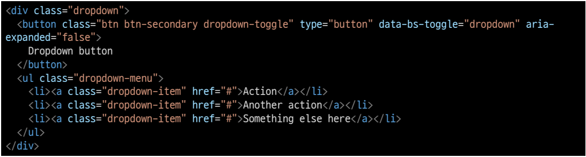

### Navbar

- Navbar 클래스를 활용하면 네비게이션 바를 제작할 수 있다.

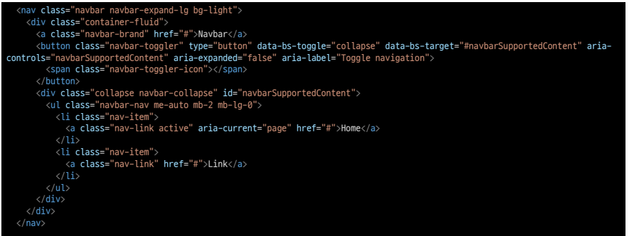

### Carousel

- 콘텐츠(사진)을 순환시키기 위한 슬라이드쇼

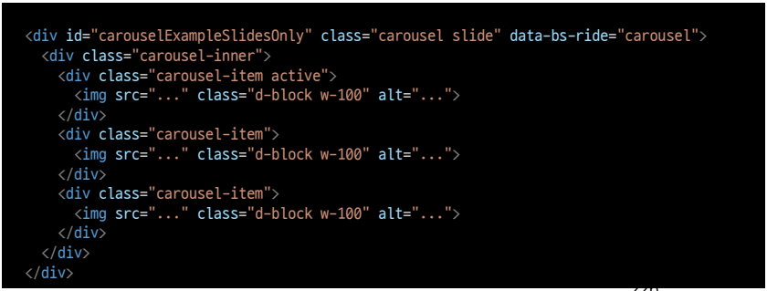

### Modal

- 사용자와 상호작용 하기 위해서 사용하며, 긴급 상황을 알지는 데 주로 사용
- 현재 열려 있는 페이지 위에 또 다른 레이어를 띄움
- 페이지를 이동하면 자연스럽게 사라짐(제거를 하지 않고도 배경 클릭시 사라짐 - 옵션에 따라 다름)

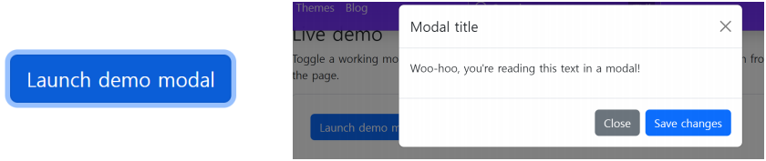


