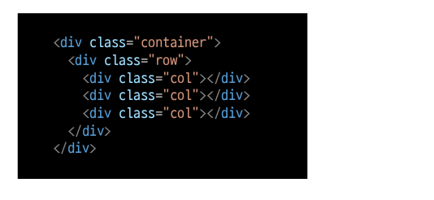
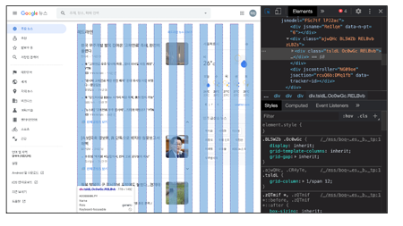
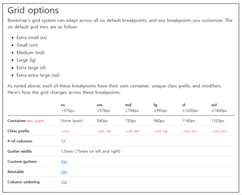

# Bootstrap Grid System

## Grid system (web design)

- 요소들의 디자인 배치에 도움을 주는 시스템
- 기본 요소

  - Column : 실제 컨텐츠를 포함하는 부분
  - Gutter : 칼럼과 칼럼의 사이의 공간 (사이간격)
  - Container : Column들을 담고 있는 공간

## Bootstrap Gild system

- Bootstrap Gild system은 flexbox로 제작됨

- container, rows, column으로 컨텐츠를 배치하고 정렬
- 반드기 기억하기!!!

  1. 12개의 column
     (기본 12개의 column을 가진다)
  1. 6개의 grid breakpoints
     (화면의 너비에 맞게 표현하는 방법이 있다)

## Grid system breakpoints

