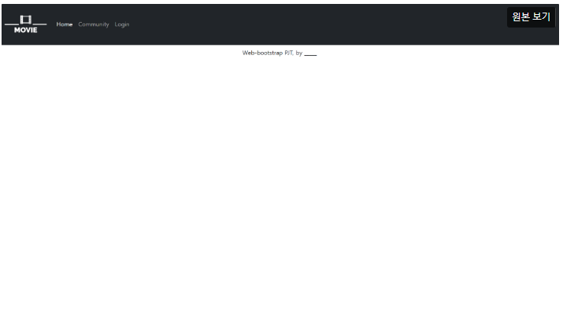
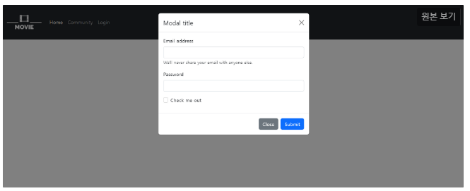
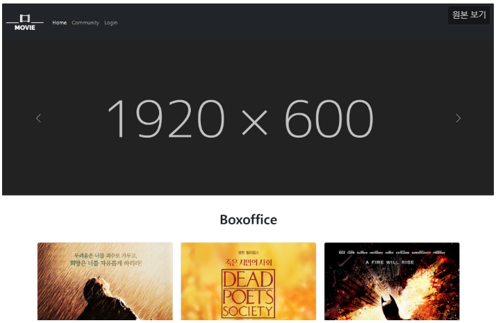
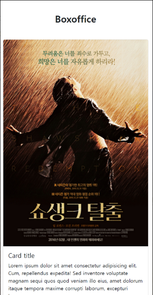
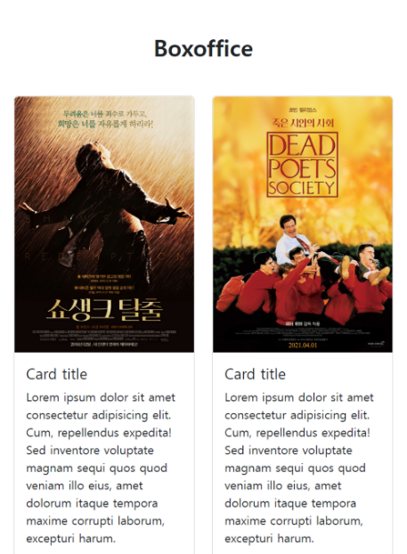
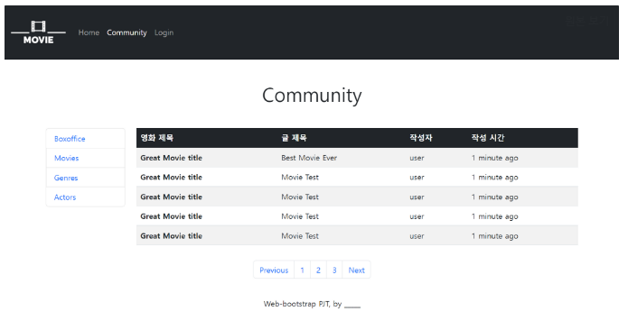
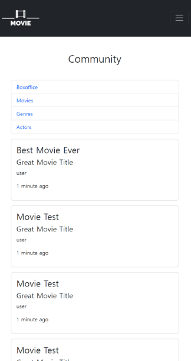

# 페어 프로젝트 1일차

## 목표

- HTML를 통한 웹 페이지 마크업
- CSS를 통한 선택자 활용 및 속성 부여
- 시맨틱 태그를 활용한 기본 레이아웃 구성
- 영화 추천 사이트 메인 레이아웃 구성

## 요구사항

### 01_nav_footer.html

- navbar 좌측에는 영화 로고가 배치됩니다.

- 항목은 Home, Community, Login로 구성되어 있습니다.

  - Home은 02_home.html으로 링크를 구성합니다.

  - Community는 03_community.html으로 링크를 구성합니다.

  - Login은 Modal이 팝업됩니다.

    

- footer는 컨텐츠 최하단에 배치됩니다. 내용은 자유롭게 구성합니다.

### 02_home.html

- 01_nav_footer.html에서 작성한 Navigation bar & Modal & Footer 코드를 적절한 위치에 사용합니다.

- Carousel을 활용하여 이미지가 자동으로 전환될 수 있도록 합니다.

  - 이미지는 적절한 이미지를 찾아 변경 가능합니다.

- Boxoffice 문구는 `h2` 태그를 활용합니다.

- 영화 목록의 카드 배치는 반응형으로 합니다.

  - Viewport의 가로 크기가 576px 미만일 경우 한 행에 1개씩 표시됩니다.

    

  - Viewport의 가로 크기가 576px 이상일 경우 한 행에 2개 이상 표시됩니다.(자유롭게 설정 가능)

    

### 03_community.html

- 992px 이상

  

- 992px 미만

  

- 01_nav_footer.html에서 작성한 Navigation bar & Modal & Footer 코드를 적절한 위치에 사용합니다.

- Community 페이지는 크게 게시판 목록과 게시판으로 이루어져 있으며 반응형입니다.

- 게시판 목록(`aside`)은 클릭 가능하지만 연결된 링크는 없습니다.

  - Viewport의 가로 크기가 992px 미만일 경우 HTML main 요소 영역 전체만큼의 너비를 가집니다.
  - Viewport의 가로 크기가 992px 이상일 경우 HTML main 요소 영역 기준으로 좌측 1/6 만큼의 너비를 가집니다.
  - Viewport의 가로 크기 별 반응형 디자인은 스크린 샷 예시를 참고하여 일치하도록 합니다.

- Section (게시판)

  - 게시판은 Viewport의 가로 크기에 따라 전혀 다른 레이아웃으로 구성됩니다.
  - Viewport의 가로 크기가 992px 미만일 경우 게시판은 카드 형식으로 구성됩니다.
  - Viewport의 가로 크기가 992px 이상일 경우 테이블 형식으로 구성되며, HTML main 요소 영역 기준으로 우측 5/6 만큼의 너비를 가집니다.

# 0913 프로젝트 후기

2차 WEB 페어 프로젝트 (feat. 이상용님)
섹션마다 돌아가면서 진행을 했으며 상용님이 드라이버 하시면서 네비게이터까지 잘해주셨다
내가 알고 있는 내용인지 다시 한번 알려주시고 내가 드라이버 할때도 잘 성멸 해주셨다
마지막 완료 후 디버깅 하는 과정에서 모달이 정상작동 안되는 부분을 nav바 에서 분리시켜
정상 구현 되도록 했으며, 페이지 xs 사이즈에서 영화가 6개 한줄로 나오는 부분을 col-12로
변경해여 하나씩 배치 될 수 있도록 세부적인 부분을 수정했고 큰틀은 상용님이 많이 잡아 주셨다