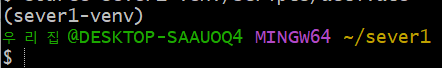

# Django
## 기본 가이드
### 가상환경 만들기
1. git bash를 통해 원하는 장소에서 폴더를 만든다

2. 생성된 폴더에서 pip list 명령어를 통해 설치된 package를 확인한다
3. python -m venv  `프로젝트명 입력` -> 프로젝트 명으로 가상환경을 구성하는 폴더 및 파일이 생성된다
4. 위에서 만든 폴더명 을 통해 가상현실 실행

- 경로 상단에 (sever1-venv)로 나오면 정상 적으로 가상환경 실행 중

5. pip install django==3.2.12 (pip install django 라고 입력 하면 최신 버전 '==3.2.12' 원하는 버전 선택)

- 설치 후 버전 확인 필수 "python --version", "pip --version"

6. django를통해 project 실행하기

7. 서버를 구동 시켜본다

8. 사이트 구동 여부 확인

- 인터넷 주소창 'locallhost:8000' 내부 환경에서 구동 중이기 때문에

### 가상환경 제거

1. 경로의 폴더를 지우는 방법
2. 가상환경 제거
   - rm -r `가상환경명`
