# Django Quick start

## Django 설치

**✨ 설치 전 가상환셩 설정 및 활성화를 마치고 진행 **

- Djagno 4.0 릴리즈로 인해 3.2(LTS) 버전을 명시해서 설치

- 패키지 목록 생성

> **`참고 LTS`**
>
> - Long Term Support (장기 지원 버전)
> - 일반적인 경우보다 장기간에 걸쳐 지원하다록 고안된 소프트웨어의 버전
> - 컴퓨터 소프트웨어의 제품 수명주기 관리 정책
> - 배포자는 LTS 확정을 통해 장기적이고 안정적인 지원을 보장함

- 프로젝트 생성

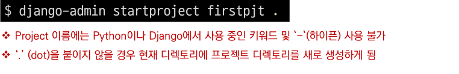

- 서버 실행

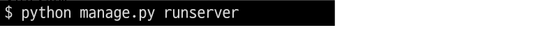

- 서버 실행 후 확인 메인 페이지

## 프로젝트 구조

- **\__init__.py**
  - Ptython에게 이 디렉토리를 하나의 Python 패키지로 다루도록 지시
  - 별도로 추가 코드를 작성하지 않음

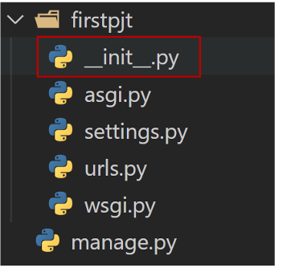

- **asgi.py**
  - Asynchronous Server Gateway Interface
  - Django 애플리케이션이 비동기식 웹 서버와 연결 및 소통하는 것을 도움
  - 추후 배포 시에 사용하며 지금은 사용 하지 않음

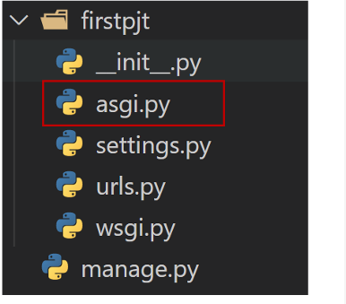

- **settings.py**
  - Django 프로젝트 설정 관리

- **urls.py**
  - 사이트의 urlr과 적절한 views의 연결을 지정

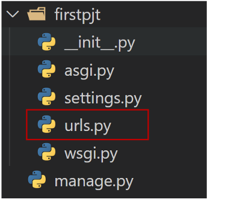

- **wsgi.py**
  - Web Server Gateway Interface
  - Django 애플리케이션이 웹 서버와 연결 및 소통하는 것을 도움
  - 추후 배포 시에 사용

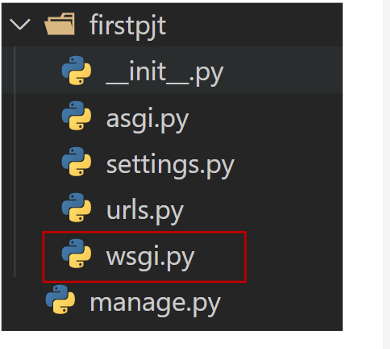

- manage.py
  - Django 프로젝트와 다양한 방법으로 상호작용 하는 커맨드라인 유틸리티

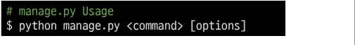

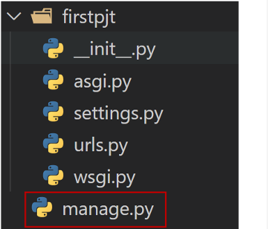

### Django Application

- 애플리케이션(앱) 생성

#### 애플리케이션 구조

- **admin.py**
  - 관리자용 페이지를 설정 하는곳
- **apps.py**
  - 앱의 정보가 적성되는 곳
  - 별도로 추가 코드를 작성하지 않음
- **models.py**
  - 애플리케이션에서 사용하는 Model을 정희하는 곳
  - MTV 패턴의 M에 해당
- **test.py**
  - 프로젝트의 테스트 코드를 작성하는 곳
- **views.py**
  - view 함수들이 정의 되는 곳
  - MTV패턴의 V에 해당
- 프로젝트에서 앱을 사용하기 위해서는 반드시 INSTALLED_APPS 리스트에 **`추가`** 해야함
- **INSTALLED_APPS**
  - django installation에 할성화 된 모든 앱을 지정하는 문자열 목록

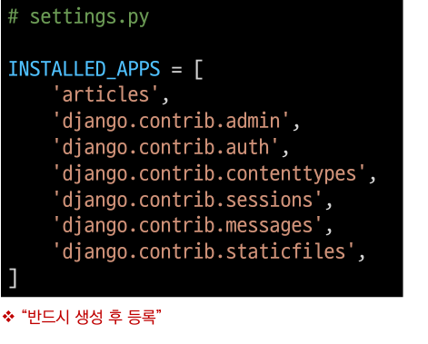

### Project & Application

- Project
  - "collection of apps"
  - 프로젝트는 앱의 집합
  - 프로젝트에는 여러 앱이 포함될 수 있음
  - 앱은 여러 프로젝트에 있을 수 있음
- Application
  - 앱은 실제 요청을 처리하고 페이지를 보여주는 등의 역할을 담당
  - 일반적으로 앱은 하나의 역할 및 기능 단위로 작성하는 것을 권장함

## 요청과 응답

> **URL** → **VIEW** →  **TEMPLATE** 순의 순서로 코드를 작성해 보고 데이터의 흐름 이해하기

#### Urls

- 기초 과정을 작성해보고 데이터 흐름 이해하기

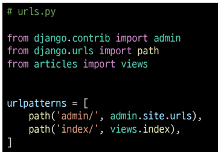

#### Views

- http 요청을 수신하고 http 응답을 반환하는 함수 작성
- Template에게 http 응답 서식을 맡김

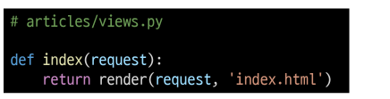

#### render

- 주어진 템플릿을 주어진 컨텍스트 데이터와 결합하고 렌더링 된 텍스트와 함께
  Httpresponse(응답) 객체를 반환하는 함수
  - request
    - 응답을 생성하는 데 사용되는 오청 객체
  - template_name
    - 템플릿의 전체 이름 또는 템플릿 이름의 경로
  - context
    - 템플릿에서 사용할 데이터 (딕셔너리 타입으로 작성)

 

#### Template

- 실제 내용을 보여주는데 사용되는 파일
- 파일의 구조나 레이아웃을 정의
- Template 파일의 기본 경로
  - app 폴더 안의 templates 폴더
  - app_name/templates/

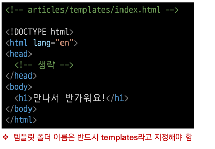

#### 코드작성 순서

- 앞으로 Django에서의 코드 작성은 URL > View > Template 순으로 작성

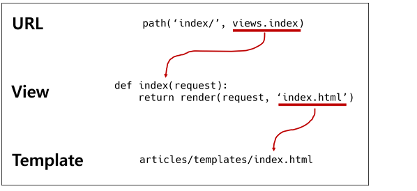

### 참고 설정

- LANGUAGE_CODE
  - 모든 사용자에게 제공되는 번역을 결정
  - 이 설정이 적용 되려면 USE_I18N이 활설화 되어 있어야 함
  - http://www.i18nguy.com/unicode/language-identifiers.html

- TIME_ZONE
  - 데이터베이스 연결의 시간대로 나타내는 문자열 지정
  - USE_TZ가 True이고 이 옵션이 설정된 경우 데이터베이스테 날짜 시간을 읽으면,
    UTC대신 새로 생긴 시간대로 인식 날짜&시간이 반환됨
  - USE_TZ이 False인 상태로 이 값을 설정하는 것은 error가 발생함
  - https://en.wikipedia.org/wiki/List_of_tz_database_time_zones

- USE_I18N 
  - Django의 번역 시스템을 활성화 해야 하는지 여부를 지정
- USE_L10N
  - 데이터의 지역화된 형식(localized formatting)을 기본적으로 활성화 할지 여부를 지정
  - True일 경우, Django는 현재 locale의 형식을 사용하여 숫자와 날짜를 표시
- USE_TZ
  - datetimes가 기본적으로 시간대를 인식하는지 여부를 지정
  - True일 경우 Django는 내부적으로 시간대 인식 날짜/ 시간을 사용

## Django Template

- "데이터 표현을 제어하는 도구이자 표현에 관련된 로직"
- Django Template을 이용한 HTML 정벅 부분과 동적 컨텐츠 삽입
- Template System의 기본 목표 숙지
  - Django Template System 
    - 데이터 표현을 제어하는 도구이자 표현에 관련된 로직을 담당

#### Django Template Language(DTL)

- Django templat에서 사용하는 bulit-in template system
- 조건, 반복, 변수 치환, 필터 등의 기능을 제공
  - Python처럼 일부 프로그래밍 구조(if, for등)를 사용할 수 있지만 이것은
    Python 코드로 실행되는 것이 아님
  - Django 템플릿 시스템은 단순히 Python이 HTML에 포함 된 것이 아니니 주의
- 프로그래밍적 로직이 아니라 프레젠테이션을 표현하기 위한 것임을 명심할 것

#### DTL Syntax

- **Variable**
  - 변수명은 영어, 숫자와 밑줄(_)의 조합으로 구성될 수 있으나 밑줄로 시작 할 수 없음
    - 공백이나 구두점 문자 또한 사용할 수 없음
      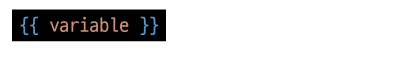\
  - dot(.)를 사용하여 변수 속성에 접근 할 수 있음
  - render()의 세번째 인자로 {'key' : value}와 같이 딕셔너리 형태로 넘겨주며, 여기서
    정의한 key에 해당하는 문자열이 template에서 사용가능한 변수명이 됨	

- **Filters**
  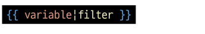
  - 표시할 변수를 수정할 때 사용
  - 예시
    
    - name 변수를 모두 소문자로 출력
  - 60개의 bulit-in template filters를 제공
  - chained가 가능하며 일부 필터는 인자를 받기도 함
    

- **Tags**
  
  - 출력 텍스트를 만들거나, 반복 또는 논리를 수행하여 제어 흐름을 만드는 등 변수 보다
    복잡한 일들을 수행
  - 일부 태그는 시작과 졸료 태그가 필요
    
  - 약 24개의 bulit-in template tages를 제공
- **Comments**
  
  - Django template에서 라인의 주석을 표현하기 위해 사용
  - 한줄 주석에만 사용할 수 있음 (줄 바꿈 허영되지 않음)
  - 여러 줄 주석은 와  사이에 입력
    

