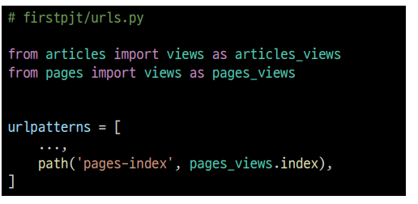
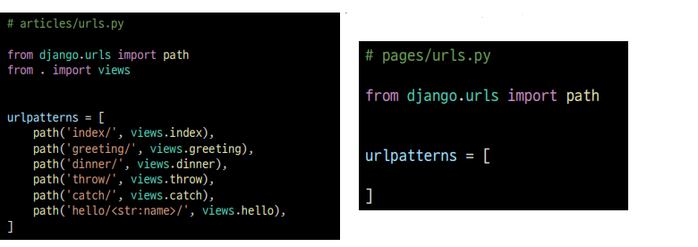
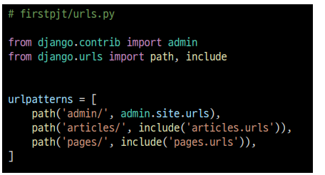
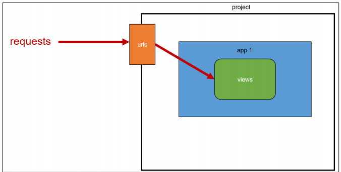
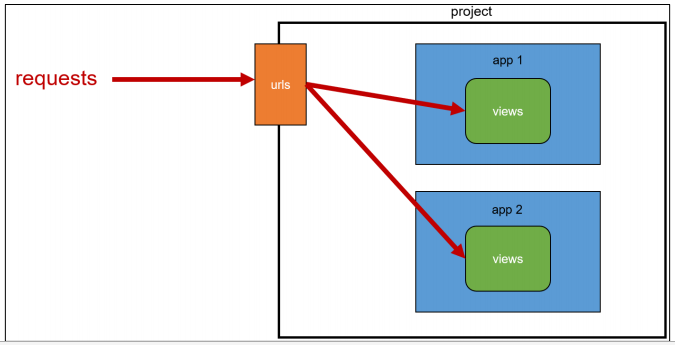
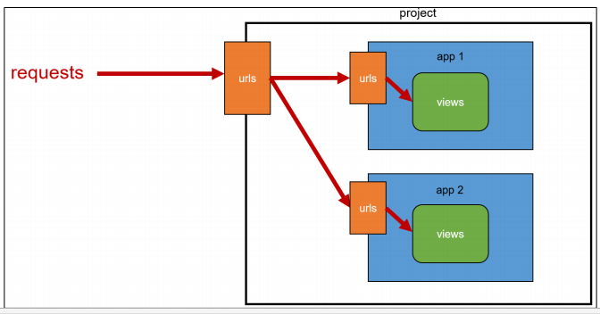
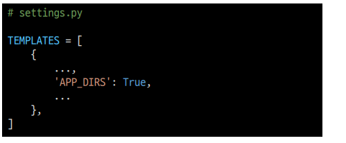
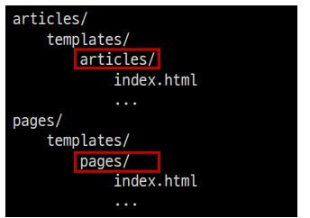
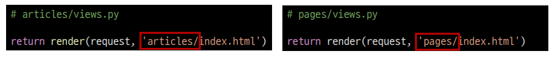

# App URL mapping

- 앱이 많아졌을 때 urls.py를 각 app에 매핑하는 방법을 이해하기
- 두번째 app인 pages를 생성 및 등록 하고 진행
- app의 view 함수가 많아지면서 사용하는 path() 또한 많아지고, app 또한 더 많이 작성되기
  대문에 프로젝트의 urls.py에서 모두 관리하는 것은 프로젝트 유지보수에 좋지 않음

- 각 앱 view 함수를 다른 이름으로 import할 수 있음
- 이런 방식으로 가능 하지만 더 좋은 방식도 알아보자

- 하나의 프로젝트의 여러 앱이 존재한다면, 가각의 앱 안에 urls.py을 만들고 프로젝트 urls.py에서
  각 앱의 urls.py 파일로 URL 매핑을 위탁할 수 있음
- 각각의 app 폴더 안에 urls.py를 작성하고 다음과 같이 수정

- urlpattern은 언제든지 다은 URLconf 모듈을 포함(include)할 수 있음
- include되는 앱의 url.py에 urlpatterns가 작성되어 있지 않다면 에러가 발생
  예를 들어, pages 앱의 urlpatterns가 빈 리스트라도 작성되어 있어야 함

- 메인 페이지의 주소가 변경 된것을 확인 할 수 있다
  - [http://127.0.0.1.:8000/index/]() -> http://127.0.0.1.:8000/artciles/index/

### include()

- 다른 URLconf(app1/urls.py)들을 참조할 수 있도록 돕는 함수
- 함수 include()를 만나게 되면 URL의 그 시점까지 일치하는 부분을 잘라내고,
  남은 문자열 부분을 후속 처리를 위해 include된 URLconf로 전달

## URL 구조의 변화

- 앱의 URL을 project의 urls.py에서 관리

- 복수 개의 앱이 URL을 project의 urls.py에서 관리

- 각각의 앱에서 URL을 관리

# Template namespace

- Django는 기본적으로 app_name/templates/ 경로에 있는 templates 파일들만 찾을 수 있으며,
  settings.py의 INSTALLED_APPS에 작성한 app 순서로 template을 검색 후 렌더링 함
- 이 속성값이 해당 경로를 활성화 하고 있음

### 디렉토리 생성을 통해 물리적인 이름공간 구분

- Django templates의 기본 경로에 app과 같은 이름의 폴더를 생성해 폴더구조를
  app_name/templates/app_name/ 형태로 변경
- Djnago templates의 기본 경로 자체를 변경할 수 는 없기 때문에 물리적으로
  이름 공간을 만드는 것

### 템플릿 경로 변경

- 폴더 구조 변경 후 변경된 경로로 해당하는 모든 부분을 수정하기

#### 꼭 Template namespace를 고려해야 할까??

- 단일 앱으로 구성된 프로젝트라면 상관 없음
- 여러 앱이 되었을 떄에도 템플릿 파일 이름이 겹치지 않게 하면 되지만,
  앱이 많아지면 대부분은 같은 이름의 템플릿 파일이 존재하기 마련
