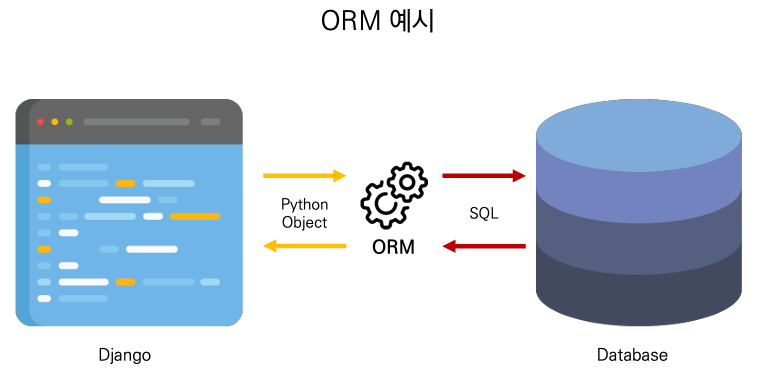
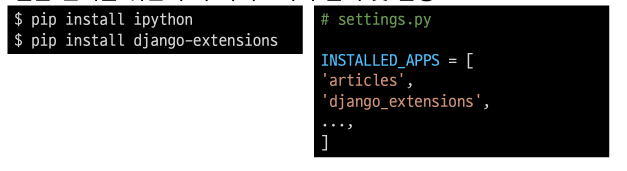
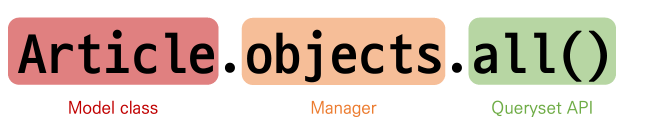
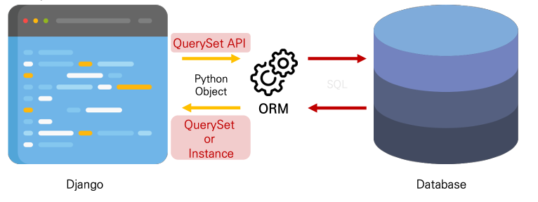

# ORM

- Object-Relational-Mapping

- 객체 지향 프로그래밍 언어를 사용하여 호환괴지 않는 유형의 시스템 간에(Django <-> DB)데이터를
  변환하는 프로그래밍 기술
- 객체 지향 프로그래밍에서 데이터베이스를 연동할 때, 데이터베이스와 객체지향 프로그래밍 언어
  간의 호환되지 않는 데이터를 변환하는 프로그래밍 기술
- Django는 내장 Django ORM을 사용

- 한 마디로 SQL을 사용하지 않고 데이터베이스를 조작할 수 있게 만들어주는 매개체

#### 장점

- SQL을 잘 알지 못해도 객체지향 언어로 DB 조작이 가능
- 객체 지향적 접근으로 인한 높은 생산성

#### 단점

- ORM 만으로 세밀한 데이터베이스 조작을 구현하기 어려운 경우가 있음

#### ORM을 사용 하는 이유

- 생산성
- 현시대 개발에서 가장 중요한 키워드는 바로 생산성
- 우리는 DB를 객체(Object)로 조작하기 위해 ORM을 사용 하는 것

# QuerySet API

## 외부 라이브러리 설치 및 설정

- 실습 편의를 위한 추가 라이브러리 설치 및 설정

- 패키지 목록 업데이트

### Django sheel

- ORM 관련 구문 연습을 위해 파이썬 쉘 환경을 사용
- 다만 일반 파이썬 쉘을 통해서는 장고 프로젝트 환경에 영향을 줄 수 없기 때문에 Django환경 안에서
  진행할 수 있는 Django shell을 사용
- 원래는 다음과 같은 명령어를 통해 Django shell을 사용하지만
  django-extension이 제공하는 더 강력한 shell_plus로 진행
  

## Database API

- Django가 제공하는 ORM을 사용해 데이터베이스를 조작하는 방법
- Model을 정의하면 데이터를 만들고 일고 수정하고 지울 수 있는 API를 제공

- **Database API 구문**
  

### Objacts manager

- Django 모델이 데이터베이스 쿼리 작업을 가능하게 하는 인터페이스
- Django는 기본적으로 모든 Django 모델 클래스에 대해 objects 라는 manager 객체를 자동으로 추가함
- 이 manager를 통해 특정 데이터를 조작 할 수 있음
- DB를 Python Class로 조작할 수 있도록 여러 메서드를 제공하는 manager

### Query

- 데이터베이스에 특정한 데이터를 보여 달라는 요청
  - "쿼리문을 작성한다."
    - 원하는 데이터를 덕이 위해 데이터베이스에 요청을 보낼 코드를 작성한다
- 이 때, 파이썬으로 작성한 코드가 ORM의 의해 SQL로 변환되어 데이터베이스에 전달되며, 데이터베이스의
  응답 데이터를 ORM이 QuerySet이라는 자료 형태로 변환하여 우리에게 전달

### QuerySet

- 데이터베이스에게서 전달 받은 객체 목록(데이머 토음)
  - 순회가 가능한 데이터로 1개 이상의 데이터를 불러와 사용할 수 있음
- Djnago ORM을 통해 만들어진 자료형이며, 필터를 걸거나 정렬 등을 수행할 수 있음
- objects manager를 사용하여 복수의 데이터를 가져오는 queryset method를 사용 할 때 반환되는 객체
- 단, 데이터베이스가 단일한 객체를 반환 할때는 QuerySet이 아닌 모델(Class)의 인스턴스로 반환됨

### QuerySet API

- QuerySet과 상호작용하기 위해 사용하는 도구(메서드, 연산자 등)

