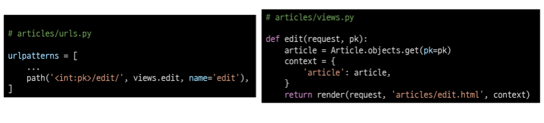
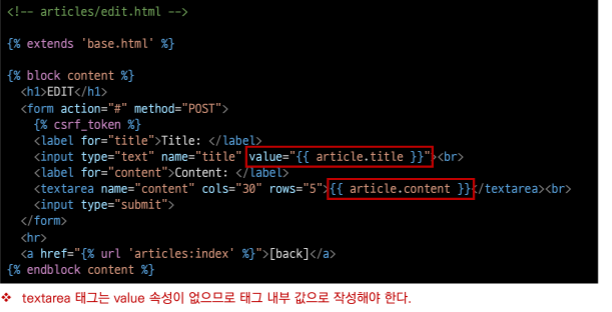
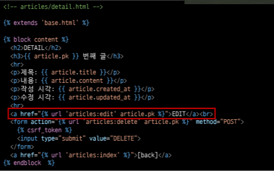

# UPDATE

### 개요

- 수정은 CREATE 로직과 마찬가지로 2개의 view 함수가 필요
- 사용자의 입력을 받을 페이지를 렌더링 하는 함수 1개
  - "edit" view function 
- 사용자가 입력한 데이터를 전송 받아 DB에 저장하는 함수 1개
  - "update" view function

- Edit - urls & views

- html 태그의 value 속성을 사용해 기존에 입력 되어 있던 데이터를 출력

- Edit 페이지로 이동하기 위한 하이퍼 링크 작성

