# Django ModelForm

### 개요

- DB 기반의 어플리케이션을 개발하다보면, HTML Form(UI)은 모델(DB)과 매우 밀접한 관계를 가짐
  - 사용자로부터 값을 받아 DB에 저장하여 활용하기 때문
  - 즉, 모델에 저으이한 필드의 구성 및 종유레 따라 HTML Form이 결정됨
- 사용자가 입력한 값이 DB의 데이터 형식과 일치하는지를 확인하는 유효성 검증이 반드시 필요하며
  이는 서버 사이드에서 반드시 처리애햐 함.

## ModelForm Class

- Model을 통해 Form Class를 만들 수 있는 helper class
- ModelForm은 Form과 똑같은 방식으로 View 함수에 사용

### ModelForm 선언

- forms 라이브러리의 ModelForm 클래스를 상속받음
- 정의한 ModelForm 클래스 안에 Meta 클래스를 선언
- 어떤 모델을 기반으로 Form을 작성할 것인지에 대한 정보를 Meta 클래스에 지정

### ModelForm에서의 Meta Class

- ModelForm의 정보를 작성 하는곳
- ModelForm을 사용할 경우 참조 할 모델이 있어야 하는데, Meta class의
  model 속성이 이를 구성함
  - 참조하는 모델에 정의된 field 정보를 Form에 적용함

- fields 속성에 '\__all__'를 사용하여 모델의 모든 필드를 포함할 수 있음
- 또는 exclude 속성을 사용하여 모델에서 포함하지 않는 필드를 지정할 수 있음

### ModelForm 활용

1. ModelForm 객체를 context로 전달
   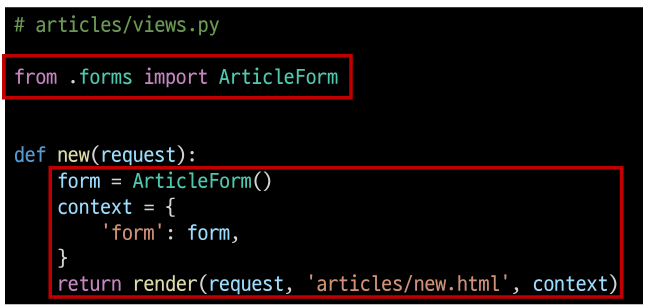
2. Input Field 활용
   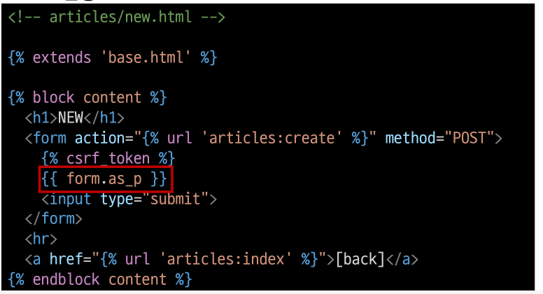

#### From erndering options

- \<label> & \<input> 쌍에 대한 3가지 출력 옵션

  - as_p()
    - 각 필드가 단락(\
 태그)으로 감싸져서 렌더링

  - as_ul()
    - 각 필드가 목록 항목(\<li> 태그)으로 감싸져서 렌더링
    - \<ul> 태그는 직접 작성해야 한다.
  - as_table()
    - 각 필드가 테이블(\<tr> 태그) 행으로 감싸져서 렌더링

### 저장 및 활용

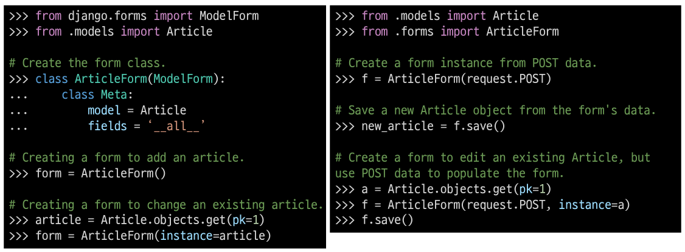

## ModelForm with view functions

#### ModelForm 활용 로직

- 요청 방식에 따른 분기
  - HTML Form전달
  - 사용자 입력 데이터 수신
- 유효성 검사에 따른 분기
  - 유효성 검사 실패시 Form 으로 전달
  - 유요성 검사 성공시 DB 저장

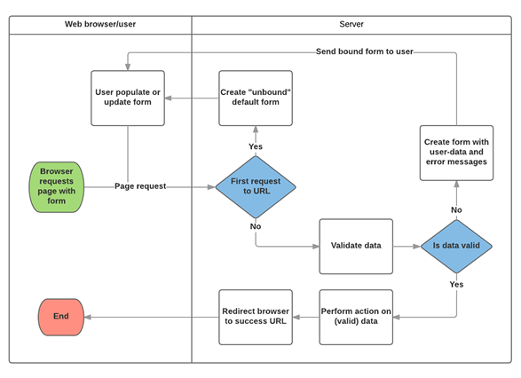

#### CREATE

- 유효성 검사를 통과하면
  - 데이터 저장 후
  - 상세 페이지로 리다이렉트

- 통과하지 못하면
  - 작성 페이지로 리다이렉트

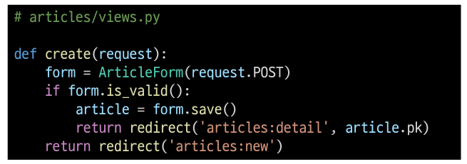

#### "is_valid()" method

- 유효성 검사를 실행하고, 데이터가 유효한지 여부를 boolean으로 반환
- 데이터 유효성 검사를 보장하기 위한 많은 테스트에 대해 Django는 is_valid()제공하여
  개발자의 편의를 도움

#### The "save()" method

- form 인스턴스에 바인딩 된 데이터를 통해 데이터베이스 객체를 만들고 저장
- ModelForm의 하위 클래스는 키워드 인자 instance 여부를 통해 생성할 지 , 수정할지를 결정
  - 제공되지 않는 경우 save()는 지정된 모델의 새 인스턴스를 만듦(CREATE)
  - 제공되면 save()는 해당 인스턴스를 수정(UPDATE)

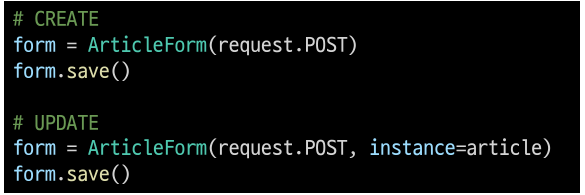

#### form 인스턴스의 errors 속성

- is_valid()의 반환 값이 False인 경우 form 인스턴스의 errors 속성에 값이 작성되는데,
  유효성 검증을 실패한 원인이 되는 딕셔너리 형태로 저장됨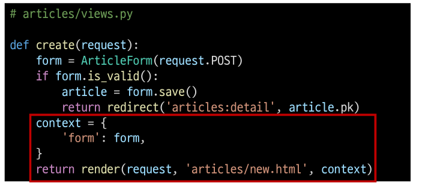

- title에 공백을 넣고 제출해 보기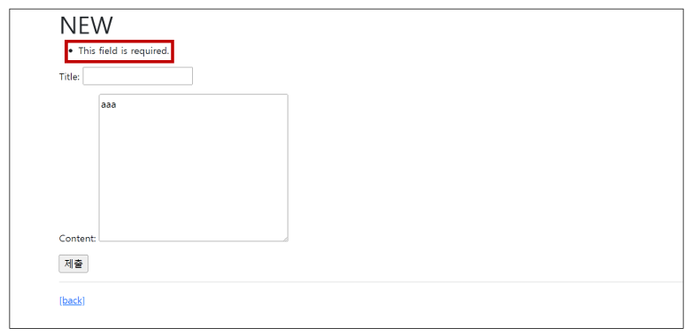

- 이 같은 특징을 통해 다음과 같은 구조로 코드를 작성하면 유효성 검증을 실패 했을 때
  사용자에게 실패 결과 메세지를 출력해줄 수 있음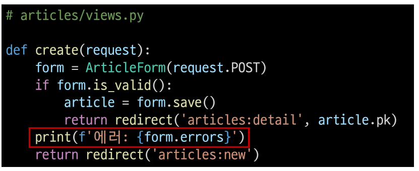

#### UPDATE

- ModelForm의 인자 instance는 수정 대상이 되는 객체(기존 객체)를 지정
- request.POST
  - 사용자가 form을 통해 전송한 데이터(새로운 데이터)
- instance
  - 수정이 되는 대상

- edit - view 수정
  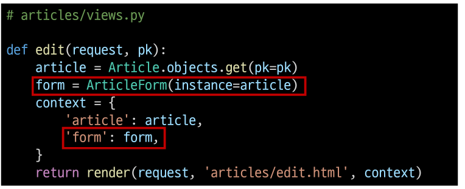

- edit - template 수정
  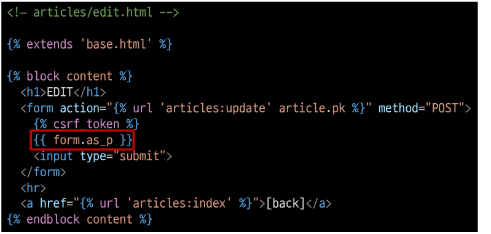

- update - view 수정
  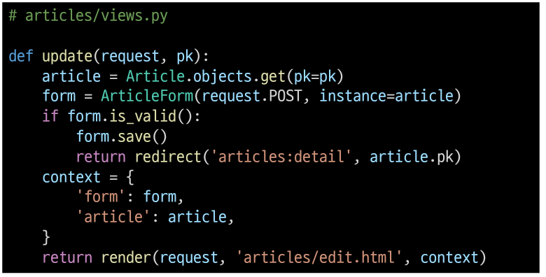

## Handling HTTP requests

### Create 

- new와 create view 함수를 합침
- 각각의 역할은 request.mehtod 값을 기준으로 나뉨

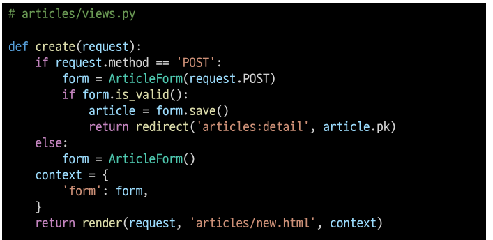

- 이제는 불필요해진 new의 view 함수와 url path를 삭제

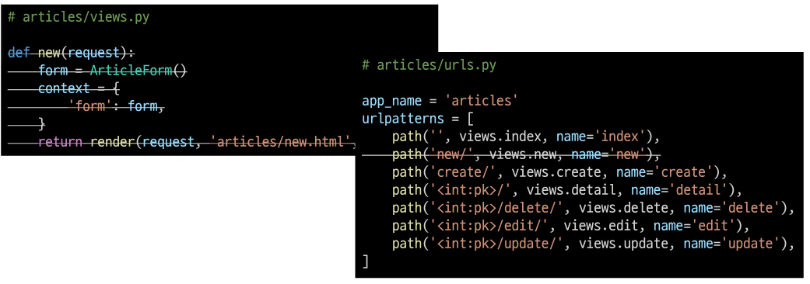

- new.html -> create.html 이름변경 및 action 속성 값 수정

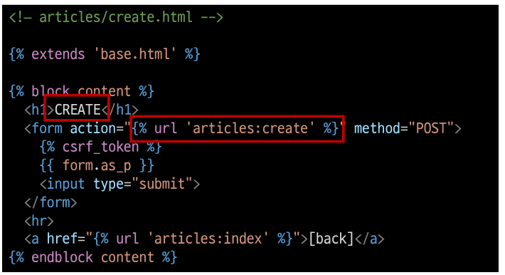

- new.html -> create.html 이름변경으로 인한 템플릿 수정

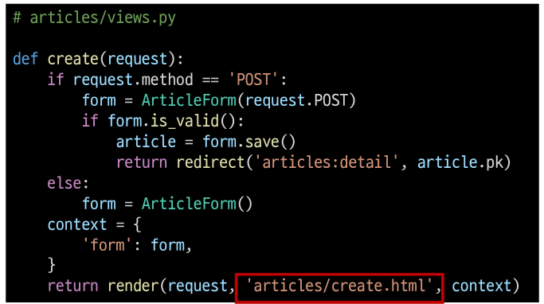

- index 페이지에 있던 new 관련 링크 수정

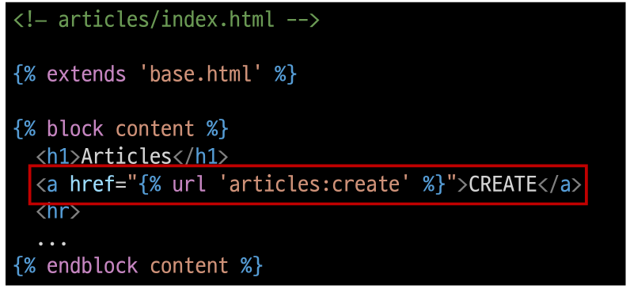

#### 주의!! context의 들여쓰기 위치

- 이렇게 작성하면 if form.is_valid(): 에서 flase로 펼가 받았을 때 이어질 코드가 없음
  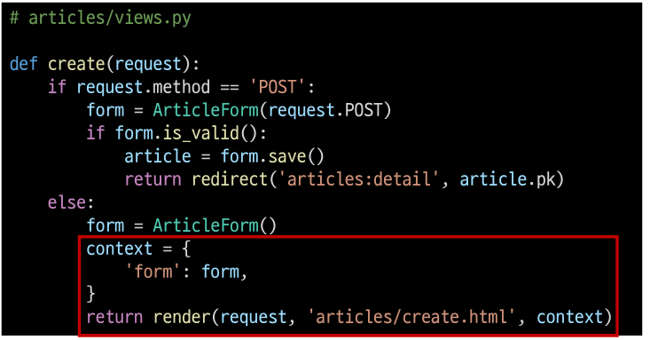

- 반면 다음과 같이 작성하면 if form.is_valid(): 에서 false로 평가 받았을 때 에러 정보가 담긴
  form 인스턴스가 context로 넘어 갈 수 있음
  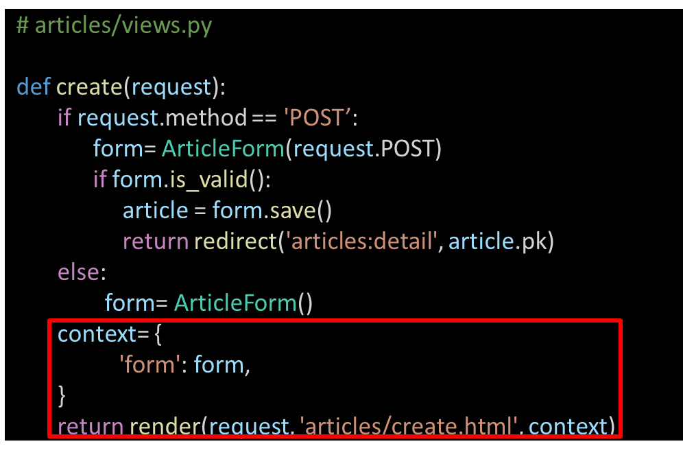

### Update

- edit과 update view 함수를 합침

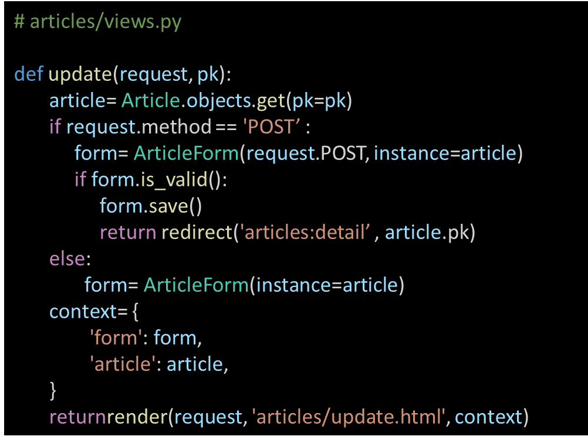

- new와 마찬가지로 불필요해진 edit의 view 함수와 url path를 삭제

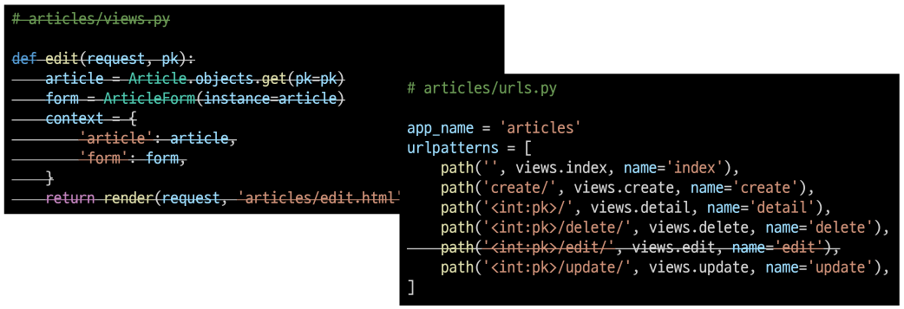

- edit.html -> update.html 이름변경으로 인한 관련 정보 수정

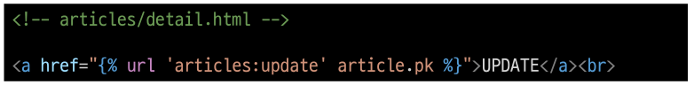
