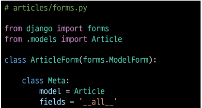
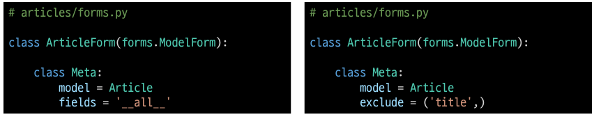

# Django ModelForm

### 개요

- DB 기반의 어플리케이션을 개발하다보면, HTML Form(UI)은 모델(DB)과 매우 밀접한 관계를 가짐
  - 사용자로부터 값을 받아 DB에 저장하여 활용하기 때문
  - 즉, 모델에 저으이한 필드의 구성 및 종유레 따라 HTML Form이 결정됨
- 사용자가 입력한 값이 DB의 데이터 형식과 일치하는지를 확인하는 유효성 검증이 반드시 필요하며
  이는 서버 사이드에서 반드시 처리애햐 함.

## ModelForm Class

- Model을 통해 Form Class를 만들 수 있는 helper class
- ModelForm은 Form과 똑같은 방식으로 View 함수에 사용

### ModelForm 선언

- forms 라이브러리의 ModelForm 클래스를 상속받음
- 정의한 ModelForm 클래스 안에 Meta 클래스를 선언
- 어떤 모델을 기반으로 Form을 작성할 것인지에 대한 정보를 Meta 클래스에 지정

### ModelForm에서의 Meta Class

- ModelForm의 정보를 작성 하는곳
- ModelForm을 사용할 경우 참조 할 모델이 있어야 하는데, Meta class의
  model 속성이 이를 구성함
  - 참조하는 모델에 정의된 field 정보를 Form에 적용함

- fields 속성에 '\__all__'를 사용하여 모델의 모든 필드를 포함할 수 있음
- 또는 exclude 속성을 사용하여 모델에서 포함하지 않는 필드를 지정할 수 있음

