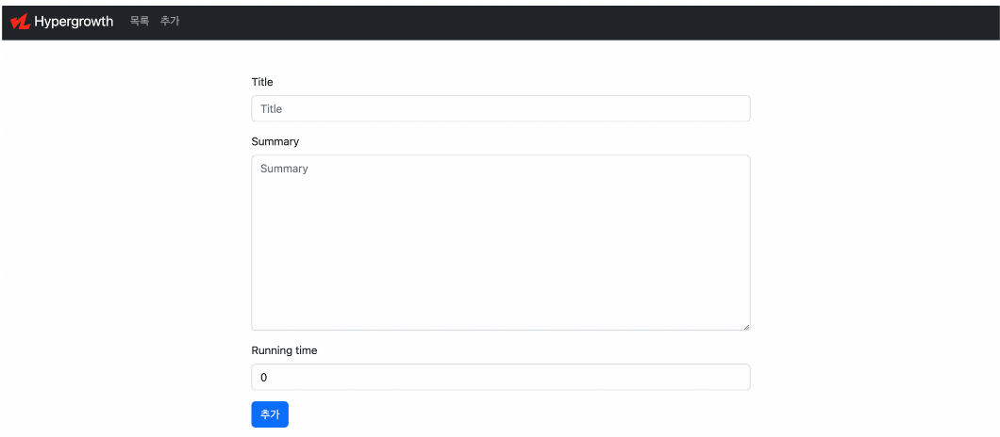
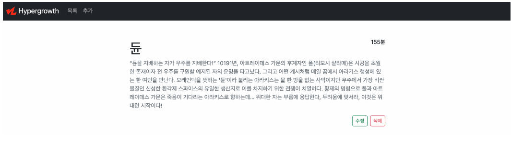

# 오전 질의 응답 시간

# 오후 실습 (STATIC 해보기)

## 목표

ModelForm / Staticfiles를 활용한 영화 정보 제공 서비스를 개발합니다.

## 요구사항

### 모델 Model

모델은 아래 조건을 만족해야하며 적절한 필드와 속성을 설정하세요.

- 모델 이름 : Movie

- 모델 필드

  | 필드 이름    | 역할           | 필드 | 속성 |
  | ------------ | -------------- | ---- | ---- |
  | title        | 영화 제목      |      |      |
  | summary      | 줄거리         |      |      |
  | running_time | 영화 상영 시간 |      |      |

### 기능 View

아래 작성된 기능을 구현합니다.

생성 및 수정은 ModelForm을 사용하여 구현합니다.

- 영화 데이터 목록 조회
  - `GET` http://127.0.0.1:8000/movies/
- 영화 데이터 정보 조회
  - `GET` http://127.0.0.1:8000/movies/[int:pk](int:pk)/
- 영화 데이터 생성
  - `POST` http://127.0.0.1:8000/movies/create/
- 영화 데이터 수정
  - `POST` http://127.0.0.1:8000/movies/[int:pk](int:pk)/update/
- 영화 데이터 삭제
  - `POST` http://127.0.0.1:8000/movies/[int:pk](int:pk)/delete/

### 화면 Template

아래 작성된 페이지를 구현합니다.

1. 네비게이션바, Bootstrap Navbar 컴포넌트
   - 서비스 로고
     - Django Staticfiles 활용
   - 목록 버튼
     - 클릭 시 메인 페이지로 이동
   - 추가 버튼
     - 클릭 시 정보 추가 페이지로 이동
2. 메인 페이지
   - `GET` http://127.0.0.1:8000/movies/
   - 영화 목록 출력
   - 제목을 클릭하면 해당 영화의 정보 페이지로 이동
3. 영화 정보 페이지
   - `GET` http://127.0.0.1:8000/movies/[int:pk](int:pk)/
   - 해당 영화 정보 출력
   - 수정 / 삭제 버튼
4. 영화 작성 페이지
   - `GET` http://127.0.0.1:8000/movies/create/
   - 영화 정보 작성 폼
5. 영화 수정 페이지
   - `GET` http://127.0.0.1:8000/movies/[int:pk](int:pk)/update/
   - 영화 정보 수정 폼

- 참고 화면

