# Django Auth

## 개요 

- Django authentication system(인증 시스템)은 인증(Authentication)과
  권한(Authorization) 부여를 함께 제공(처리)하고 있음
  - User
  - 권한 및 그룹
  - 암호 해시 시스템
  - Form 및 View 도구
  - 기타 적용가능한 시스템
- 필수 구성은 setting.py의 INSTALLED_APPS에서 확인 가능
  - django.contrib.auth

- Authentication(인증)
  - 신원 확인
  - 사용자가 자신이 누구인지 확인하는 것
- Authorization(권한, 허가)
  - 권한 부여
  - 인증된 사용자가 수행할 수 있는 작업을 결정

### 사전 설정

- accounts app 생성 및 등록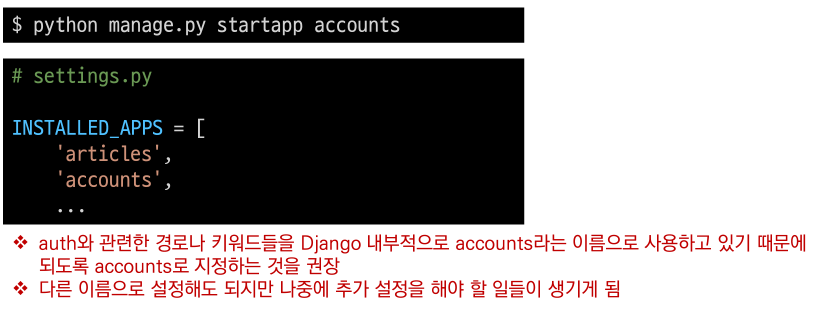

- url 분리 및 매핑
  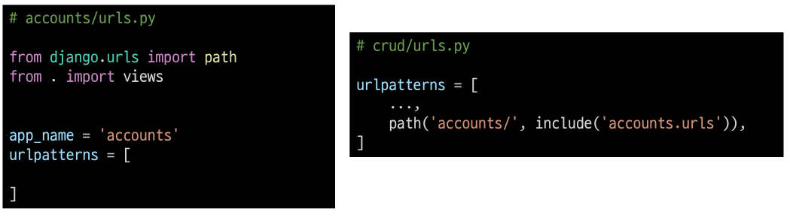

# User model 활용하기

## Django User model

- "Custom User Model로 대체하기"
- Django는 기본적인 인증 시스템과 여러 가지 필드가 포함된 User model을 제공,
  대부분의 개발 환경에서 기본 User Model을 Custom User Model로 대체함

- Django는 새 프로젝트를 시작하는 경우 비록 기본 User 모델이 충분 하더라고 커스텀
  User 모델을 설정하는 것을 강력하게 권장(highy recommended)
- 커스텀 User 모델은 기본 User 모델과 동일하게 작동 하면서도 필요한 경우
  나중에 맞춤 설정할 수 있기 때문
  - 단, User 모델 대체 작업은 프로젝트의 모든 migrations 혹은 첫 migrate를
    실행하기 전에 이 작업을 마쳐야 함
- 개발자들이 작성하는 일부 프로젝트에서는 djangoe에서 제공하는 bulit-in User model의 기본 인증 요구사항이 적절하지 않을 수 있음
  - 예를 들어, 내 서비스에서 회원가입 시 username 대신 email을 식별 값으로 사용하는 것이 더 적합한
    사이트인 경우, Django의 User Model은 기본적으로 username를 식별 값으로 사용하기 때문에 적합하지 않음
- Django는 현재 프로젝트에서 사용할 User Model을 결정하는 AUTH_USER_MODEL 설정 값으로
  Default User Model을 재정의(override)할 수 있도록 함

#### AUTH_USER_MODEL

- 프로젝트에서 User를 나타낼 때 사용하는 모델
- 프로젝트가 진행되는 동안 (모델을 만들고 마이그레이션 한 후) 변경할 수 없음
- 프로젝트가 시작 시 설정하기 위한 것이며, 참조하는 모델은 첫 번째 마이그레이션에서 사용할 수 있어아 함
  - 즉, 첫번째 마이그레이션 전에 확정 지어야 하는 값
- 다음과 같은 기본 갑을 가지고 있음
  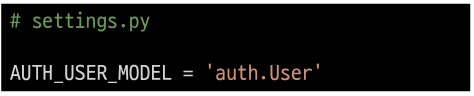

#### [참고] settings의 로드 구조

- AUTH_USER_MODEL은 settings.py에서 보이지 않는데 어디에 기본 값이 작성되어 있는 걸까?
  - 우리가 작성하는 settings.py는 사실 global_settings.py를 상솓받아 재정의하는 파일임
  - https://github.com/django/django/blob/main/django/conf/global_settings.py

### 대체하기 1

- AbstractUser를 상속받는 커스텀 User 클래스 작성
- 기존 User 클래스도 AbstractUser를 상속받기 때문에 커스텀 User 클래스도 완전히
  같은 모습을 가지게 됨
  - https://github.com/django/django/blob/main/django/contrib/auth/models.py#L405

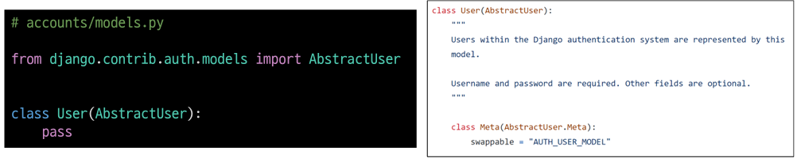

### 대체하기 2

- Django 프로젝트에서 User를 나타내는데 사용하는 모델을 방금 생성한 커스텀 User 모델로 지정
  

### 대체하기 3

- admin.py에 커스텀 User 모델을 등록
  - 기본 User 모델이 아니기 때문에 등록하지 않으면 admin site에 출력되지 않음

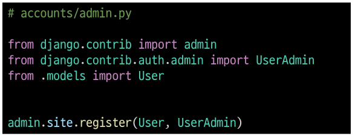

#### [참고]User 모델 상속 관계

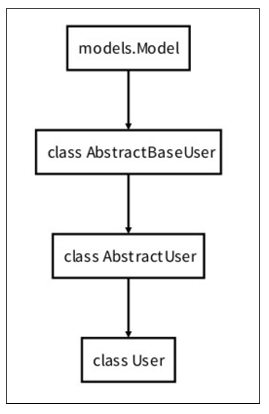

### User 객체 활용

- User 객체는 인증 시스템의 가장 기본
- 기본속성
  - username
  - password
  - email
  - first_name
  - list_name

### 암호 관리

- 회원은 가입시 일반적으로 암호(password)를 저장이 필수적이며, 별도의 처리가 필요
- Django에서는 기본으로 PBKDF2를(password-based key derivation function) 사용하여 저장
  - 단방향 해시함수를 활용하여 비밀번호를 다이제스트로 암호화하며, 이는 복호화가 불가능 함
    - 단방향 해시함수는 MD5, SHA-1, SHA-256 등이 존재하며, Django는 SHA256 활용
  - 단방향 해시삼후의 경우 레인보우 공격 및 무차별 대입 공격 등의 문게자 발생 가능함
  - 이를 보완하기 위하여 아래의 기법을 추가적으로 활용함
    - 솔팅(Salting) : 패스워드에 임의의 문자열인 salt를 추가하여 다이제스트를 생성
    - 키 스트레칭(Key Stretching) : 해시를 여러 번 반복하여 시간을 늘림

### User 객체 활용

- User 생성
  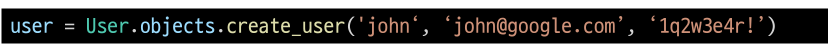

- User 비밀번호 변경
  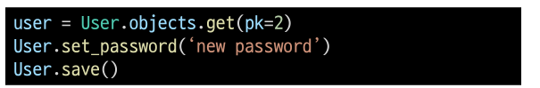

- User 인증(비밀번호 확인)
  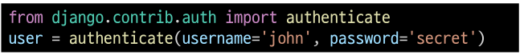

# 회원 가입

## UserCreationForm

- 주어진 username과 password로 권한이 없는 새 user를 생성하는 ModelForm
- 3개의 필드를 가짐
  - username(form the user model)
  - password1
  - password2
- https://github.com/django/django/blob/stable/3.2.x/django/contrib/auth/forms.py#L75

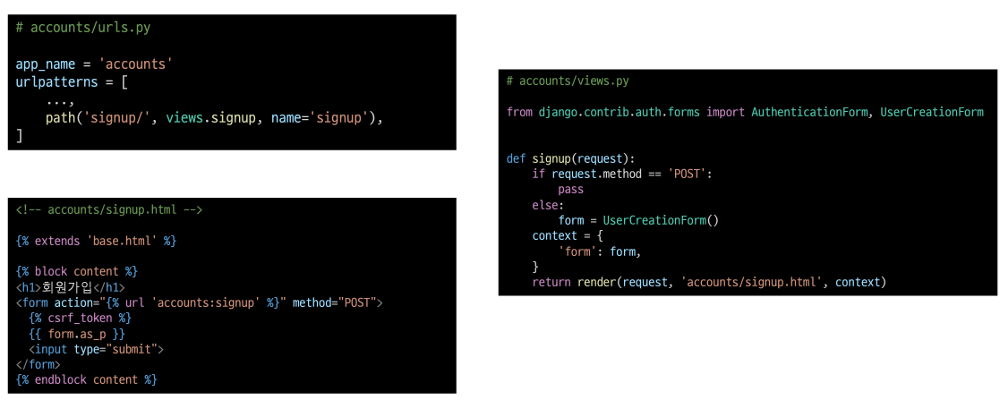

- 회원가입 링크 작성 후 페이지 확인
  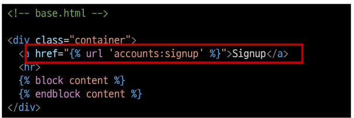

- 회원가입 로직 작성
  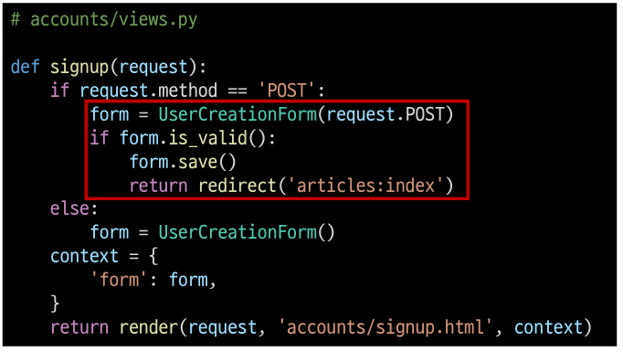

#### 회원가입 진행 후 에러 페이지를 확인

- 회원가입에 사용하는 UserCreationForm이 우리가 대체한 커스텀 유저 모델이 아닌 기존
  유저 모델로 인해 작성된 클래스이기 때문
- https://github.com/django/django/blob/main/django/contrib/auth/forms.py#L106

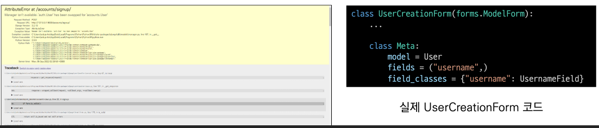

### UserCreationForm() 커스텀하기

- 기본 UserCreationForm을 상속받아 User 모델 재정의

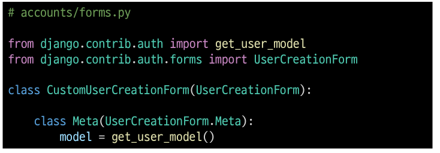

- get_user_model()
  - 현재 프로젝트에서 활용된 사용자 모델(active user model)을 반환
  - Django에서는 User 클래스 커스텀을 통해 변경 가능하며, 직접 참고하는 대신 
    get_user_model()을 사용할 것을 권장함
- **CustomUserCreationForm() 으로 대체하기**
  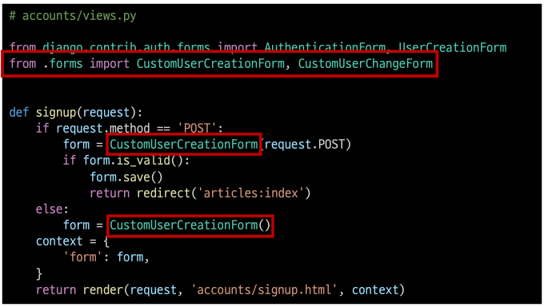

