# 이미지 업로드(기본 설정)

### 미디어 파일

- 사용자가 웹에서 업로드하는 정적 파일(user-uploaded)
- 유저가 업로드 한 모든 정적 파일

### Media 관련 필드

- ImageField
  - 이미지 업로드에 사용하는 모델 필드
  - FileField를 상속받는 서브 클래스이기 때문에 Filefield의 모든 속성 및 메서드를 사용 가능하며
    더해서 사용자에 의해 업로드 된 객체가 유요한 이미지인지 검사함
  - ImageField 인스턴스는 최대 길이가 100자인 문자열로 DB에 생성되며, mac_length 인자를
    사용하여 최대 길이를 변경 할 수 있음
  - [주의] 사용하려면 반드시 [Pillow](https://pillow.readthedocs.io/en/latest/) 라이브러리가 필

- FileField
  - 파일 업로드에 사용하는 모델 필드
  - 2개의 선택 인자를 가지고 있음
    - upload_to
    - storage

### 모델 설정

- upload_to argument
  - 문자열 경로 지정 방식
    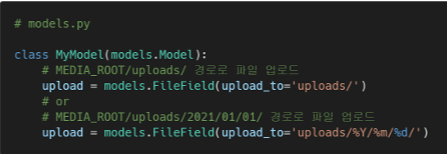

- 함수 호출
  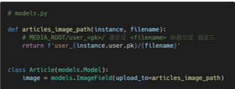

### URL 설정

- settings.py에 MEDIA_ROOT, MEDIA_URL 설정
- upload_to 속성을 정의하여 업로드 된 파일에 사용 할 MEDIA_ROOT의 하위 경로를 지정
- 업로드 된 파일의 경로는 django가 제공하는 'url' 속성을 통해 얻을 수 있음
  

- MEDIA_ROOT
- 사용자가 업로드 한 파일(미디어 파일)들을 보관할 디렉토리의 절대경로
- django는 성능을 위해 업로드 파일은 데이터베이스에 저장하지 않음
  - 실제 데이터베이스에 저장되는 것은 파일의 경로

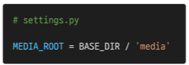

- MEDIA_ROOT에서 제공되는 미디어를 처리하는 URL
- 업로드 된 파일의 주소(URL)를 만들어 주는 역할
  - 웹 서버 사용자가 사용하는 public URL

- 비어 있지 않은 값으로 설정 한다면 반드시 slash(/)로 끝아냐 함

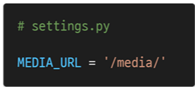

- 개발 단계에서 사용자가 업로드 한 파일 제공하기

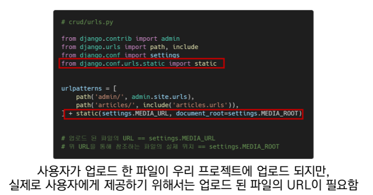

## 이미지 업로드(CREATE)

#### 모델 설정

- ImageField
  - upload_to='images/'
    - 실제 이미지가 저장되는 경로를 지정
  - blank=True
    - 이미지 필드에 빈 값(빈 문자열)이 허용되도록 설정 (이미지를 선택적으로 업로드 할 수 이도록)

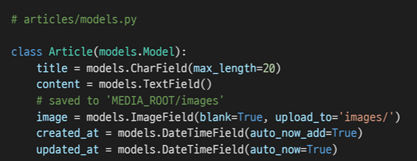

- **Model field option - "blank"**
  - 기본 값 : False
  - True인 경우 필드를 비워둘 수 있음
    - DB에는 ''(빈 문자열)이 저장됨
  - 유효성 검사에서는 상요 됨(is_valid)
    - 필드에 blank=True가 있으면 form 유효성 검사에서 빈 값을 입력할 수 있음

- **Model field option - "null"**
  - 기본 값 : False
  - True면 django는 빈 값을 DB에 NULL로 저장
  - **주의사항**
    - CharField, TextField와 같은 문자열 기반 필드에는 사용하는 것을 피해야함
    - 문자열 기반 필드에 True로 설정 시 '데이터 없음(no date)'에 "빈 문자열(1)"과 "NULL(2)"의 
      2가지 가능한 값이 있음을 의미하게 됨
    - 대부분의 경우 "데이터 없음"에 대해 두 개의 가능한 값을 갖는 것은 중복되며, Djanog는
      NULL이 아닌 빈 문자열을 사용하는 것이 규칙

- **blank & null 비교 **
  - blank
    - Validation-related
  - null
    - Database-related
  - 문자열 기반 및 비문자열 기반 필드 모두에 대해 null option은 DB에만 영향을 미치므로,
    form에서 빈 값을 허용하려면 blank=Ture를 설정해야 함

- 마이그레이션 실행
  (단, ImageField를 사용하기 위해서는 Pillow 라이브러리 설치 필요)

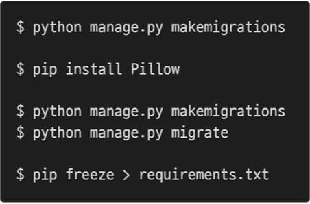

#### HTML 설정

- 게시글 작성 form enctype 속성 지정

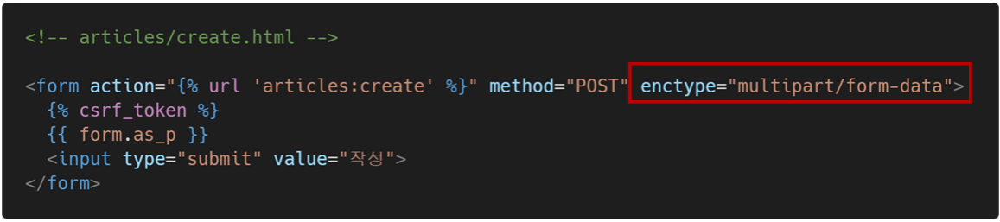

- form 요소 - enctype(인코딩) 속성

  - multipart/form-data
    - 파일/이미지 업로드 시에 반드시 사용해야 함 (전송되는 데이터의 형식을 지정)
    - <input type="file">을 사용할 경우에 사용
  - application/x-www-form-urlencoded
    - (기본값) 모든 문자 인코딩
  - text/plain
    - 인토딩을 하지 않는 문자 상태로 전송
    - 공백은 '+'기호로 변환하지만, 특수 문자는 인코딩 하지 않음

  

- input 요소의 accept 속성 확인

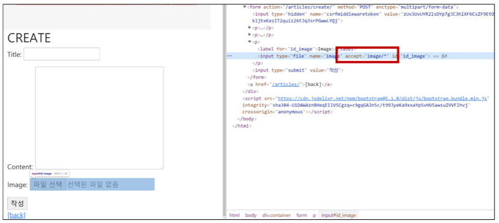

- input 요소 - accept 속성

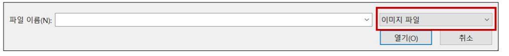

#### View 설정

- 업로드 한 파일 request.FILES 객체로 전달됨

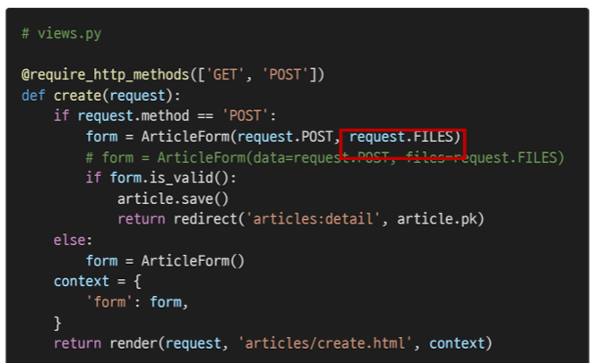

- DB및 파일 트리 확인
  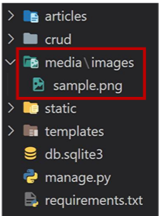

- 실제 파일 위치 확인
  - MEDIA_ROOT/images/

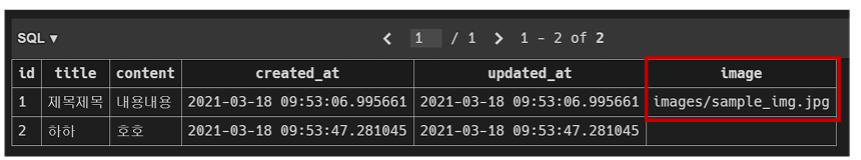

## 이미지 업로드(READ)

### img 태그 활용

- article.image.url == 업로드 파일의 경로
- article.image == 업로드 파일의 파일 이름

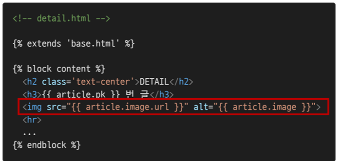

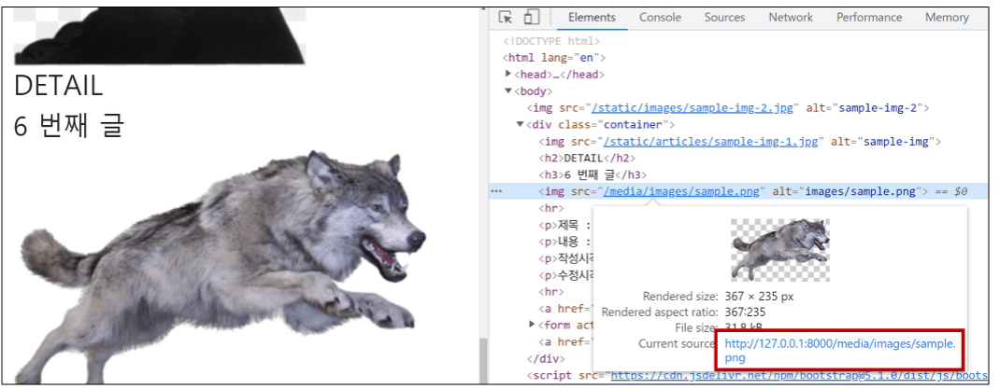

## 이미지 업로드(UPDATE)

### 이미지 수정하기

- 이미지는 바이너리 데이터(하나의 덩어리)이기 때문에 텍스트처럼 일부만 수정 하는 것 은 불가능하고,
  새로운 사진으로 덮어 씌우는 방식을 사용

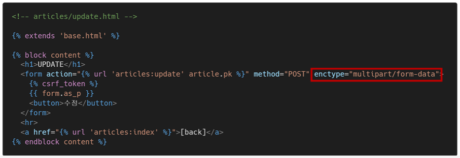

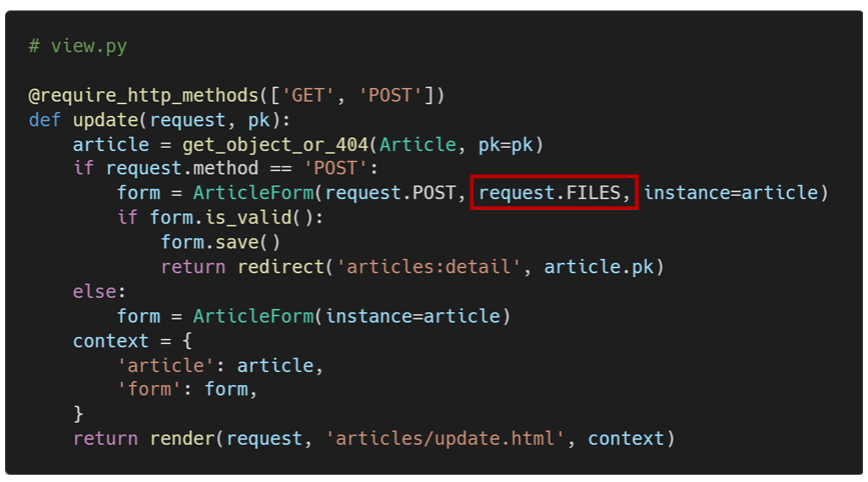

## 이미지 Resizing

#### Django-imagekit

- 실제 원본 이미지를 서버에 그대로 업로드 하는 것은 서버의 부담이 큰 작업
-  태그에서 직접 사이즈를 조정할 수도 있지만(width 와 height), 업로드 될 때
  이미지 자체를 resizing 하는 것을 사용해 볼 것
- [참고] [django-imagekit](https://github.com/matthewwithanm/django-imagekit/) 라이브러리

##### Django-imagekit 설정

1. django-imagekit 설치
   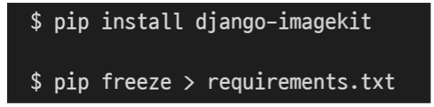
2. INSTALLED_APPS에 추가
   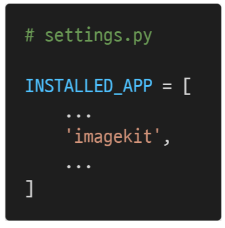

- 이미지 크기 변경하기

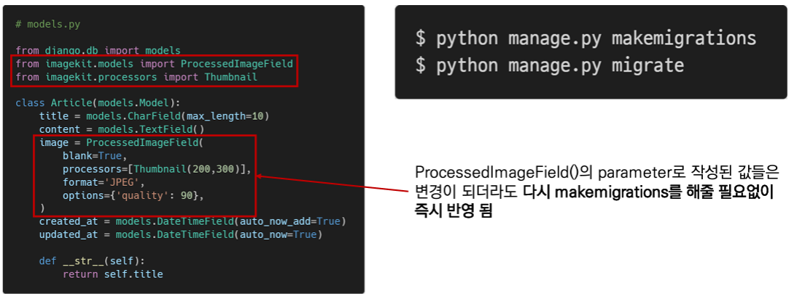