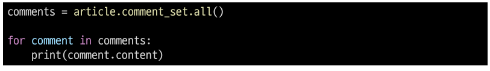
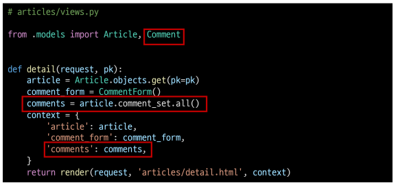
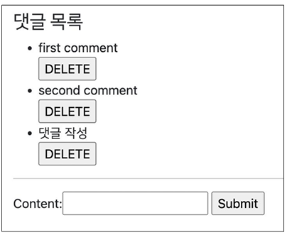

# A one-to-many relationship

### RDB(관계형 데이터베이스) 복습

- 데이터를 테이블, 행, 열 등으로 나누어 구조화하는 방식
- RDB의 모든 테이블에는 행에서 고유하게 식별 가능한 기본 키라는 속성이 있으며,
  외래 키를 사용하여 각 행에서 서로 다른 테이블 간의 관계를 만드는 데 사용할 수 있음

##### 테이블 간 관계 예시

- 주문서비스 데이터베이스 : 고객 테이블, 주문 테이블
  - 고객 테이블 : 고객정보(이름, 주소 정보)
  - 주문 테이블 : 주문 정보(제품, 주문/배송 정보)

- 고객이 제품을 주문하는 경우 주문 테이블에 레코드가 생성됨
- 주문 정보가 아래의 테이블처럼 기록이 되어 있을 때 고객 정보는 어떻게 표현할까?

- 고객 정보(이름) 기록
  - 하지만 이렇게 이름으로 저장할 경우 이름이 같은 다른 사용자를 구분할 수 없음
  - 그렇다면 고객 정보의 어떤 데이터를 사용하는 것이 적합할까?

- 고객 정보(id)를 기록
  - 외래 키(Foreign Key, FK) : 관계형 데이터베이스에서 다른 테이블의 행을 식별할 수 있는 필드(키)

#### RDB에서의 관계

- **1:1**
  - One-to-one relationships
  - 한 테이블의 레코드 하나가 다른 테이블의 레토드 단 한 개와 관련된 경우
- **1:N**
  - One-to-many relationships
  - 한 테이블의 0개 이상의 레코드가 다른 테이블의 레코드 한 개와 관련된 경우
  - 기준 테이블에 따라 (1:N, One-to-many relationships)이라고 함
- **M:N**
  - Many-to-many relationships
  - 한 테이블의 0개 이상의 레코드가 다른 테이블의 0개 이상의 레코드와 관련된 경우
  - 양쪽 모두에서 1:N 관계를 가짐

## Foreign Key

### 개념

- 외래 키(외부키)
- 관계형 데이터베이스에서 다른 테이블의 행을 식별할 수 있는 키
- 참조되는 테이블의 기본 키(Primary Key)를 가리킴
- 참조하는 테이블의 행 1개의 값은, 참조되는 측 테이블의 행 값에 대응됨
  - 이때문에 참조하는 테이블의 행에는 참조되는 테이블에 나타자니 않는 값을
    포함할 수 없음
- 참조하는 테이블 행 여러 개가, 참조되는 테이블의 동일한 행을 참조할 수 있음

### 특징

- 키를 사용하여 부모 테이블의 유일한 값을 참조(참조 무결성)
  - 참조 무결성 : 데이터베이스 관계 모델에서 관련된 2개의 테이블 간의 일관성
    - 외래 키가 선언된 테이블의 외래 키 속성(열)의 값은 해당 테이블의 기본 키 값으로 존재
- 외래 키의 값이 반드시 부모 테이블의 기본 키 일 필요는 없지만 유일한 값이어야 함

# 1:N(Article - Comment)

## 모델 관계 설정

- 게시판의 게시글과 1:N 관계를 나타낼 수 있는 댓글 구현
- 1:N 관계에서 댓글을 담당할 Article 모델은 1, Comment 모델은 N이 될것
  - 게시글은 댓글을 0개 이상 가진다.
    - 게시글(1)은 여러 개의 댓글(N)을 가진다.
    - 게시글(1)은 댓글을 가지지 않을 수도 있다.
  - 댓글은 반드시 하나의 게시글에 속한다.

- 만약 comment 테이블에 데이터가 다음과 같이 작성되었다면 1번 게시글에는 1개의 댓글이,
  3번 게시글에는 2개의 댓글이 작성된 것

##### Django Relationship fields 종류

- OneToOneField()
  - A one-to-one relationship
- ForeignKey()
  - A one-to-many relationship
- ManyToManyField()
  - A many-to-many relationship

#### ForeignKey(to, on_delete, **options)

- A one-tomany relationship을 담당하는 Django의 모델 필드 클래스
- Djnago 모델에서 관계형 데이터베이스의 외래 키 속성을 담당
- 2개의 필수 위치 인자가 필요
  - 참조하는 model class
  - one_delate 옵션
- https://docs.djangoproject.com/en/3.2/ref/models/fields/#foreignkey

##### ForeignKey arguments - on_delete

- 외래 키가 참조하는 객체가 사라졌을 때, 외래 키를 가진 객체를 어떻게 처리할 지를 정의
- 데티어 무결성을 위해 매우 중요한 설정
- on_delete 옵션 값
  - CASCADE : 부모 객체(참조 된 객체)가 삭제 됐을 때 이를 참조하는 객체도 삭제
  - PROTECT, SET_NULL, SET_DEFAULT ... 등 여러 옵션 값들이 존재

#### Comment 모델 정의

- 외래 키 필드는 ForeignKey 클래스를 작성하는 위치와 관계없이 필드의 마지막에 작성됨
- ForeignKey() 클래스의 인스턴스 이름은 참조하는 모델 클래스 이름의 단수형(소문자)으로
  작성하는 것을 권장

#### Migration 과정 진행

- models.py에서 모델에 대한 수정사항이 발생했기 때문에 migrtaion 과정을 진행
  

- 마이그레이션 파일 0002_comment.py 생성 확인

- migrate 진행
  

- migrate 후 Comment 모델 클래스로 인해 생성된 테이블 확인
  
- ForeignKey 모델 필드로 인해 작성된 컬럼의 이름이 article_id인 것을 확인
- 만약 ForeignKey 인스턴스를 article이 아닌 abcd로 생성 했다면 abcd_id로 만들어 짐
  - 이처럼 명시적인 모델 관계 파악을 위해 참조하는 클래스 이름의 소문자(단수형)로 작성하는 것이
    권장 사항

#### Shell_plus 활용 댓글 생성 연습

- shell_plus 실행
  

- 댓글 생성
  

- 댓글 속성 확인
  

- comment 인스턴스를 통한 article 값 접근하기
  

- 두번째 댓글 작성하기
  

- 작성된 댓글 확인 하기
  

# 관계 모델 참조

### Related manager

- Related manager는 1:N 혹은 M:N 관계에서 사용하는 문맥(context)
- Django는 모델 단 1:N 혹은 M:N 관계가 설정되면 역참조할 떄에 사용할 수 있는 manager를 생성
  - 우리가 이전에 모델 생성 시 objects라는 매니저를 통해 queryset api를 사용했던 것처럼
    related manager를 통해 quertset api를 사용할 수 있게 됨
- 지금은 1:N 관계에서 related manager 만을 학습 하는 것
- https://docs.djangoproject.com/en/3.2/ref/models/relations/

#### 역참좀

- 나를 참조하는 테이블(나를 외래 키로 지정한)을 참조하는 것
- 즉, 본인을 외래 키로 참조 중인 다른 테이블에 접근하는 것
- 1:N 관계에서는 1이 N을 참조한는 상황
  - 외래 키를 가지지 않는 1이 외래 키를 가진 N을 참조

- Article 모델이 comment 모델을 참조(역참조)할 때 사용하는 매니저
- article.comment 형식으로는 갯들 객체를 참조할 수 없음
  - 실제로 Article 클래스에는 Comment와의 어떠한 관계도 작성되어 있지 않음
- 대신 Django가 역참조 할 수 있는 comment_set manager를 자동으로 생성해 article.comment_set 형태로
  댓글 객체를 참조할 수 있음
  
- 반면 참조 상황(Comment -> Article)에서는 실제 ForeignKey 클래스로 작성한 인스턴스가 Comment 클래스의 클래스 변수기이 때문에 comment.article 형태로 작성 가능

##### Related manager 연습

- shell_plus 실행
  

- 1번 게시글 조회하기
  

- dir() 함수를 사용해 클래스 객체가 사용할 수 있는 메서드를 확인 하기
  

- 1번 게시글에 작성된 모든 댓글 조회(역참조)
  

- 1번 게시글에 작성된 모들 댓글 출력하기
  

#### ForeignKey arguments - related_name

- ForeignKey 클래스의 선택 옵션

- 역참조 시 사용하는 매니저 이름(model_set manager)을 변경할 수 있음

- 작성 후, migration 과정이 필요

- 선택 옵션이지만 상황에 따라 반드시 작성해야 하는 경우가 생기기도 함

- 작성 후 다시 원래 코드로 복구
  

  
  

#### admin site 등록

- 새로 작성한 Comment 모델을 admin site에 등록하기
  

# Comment 구현

#### CREATE

- 사용자로부터 댓글 데이터를 입력 받기 위한 CommentForm 작성
  

- detail 함수 에서 CommentForm 데이터를 context로 반환(view 함수)
  

- detail 페이지에서 CommentForm 출력 (템플릿)
  

- detail 페이지에 출력된 CommentForm을 살펴 보면 아래 이미지와 같이 출력됨
- 실 서비스에서는 댓글을 작성할 대 댓글을 어떤 게시글에 작성하는지 직접 게시글 번호를
  선택 하지 않음
- 실제로는 해당 게시글에 댓글을 작성하면 자연스럽게 그 게시글에 댓글이 작성되어야 함
- 다음과 같이 출력되는 이유는 Comment 클래스의 외래 키 필드 article 또한 데이터 입력이
  필요하기 때문에 출력 되고 있는 것
- 하지만, 외래 키 필드는 사용자의 입력으로 받는 것이 아니라 view 함수 내에서 받아 별도로
  처리되어 저장되어야 함
  

- 외래 키 필드를 출력에서 제외 후 확인
  

- 출력에서 제외된 외래 키 데이터는 어디서 받아와야 할까?
- detail 페이지의 url을 살펴보면 path('<int:pk>/', view.detail, name='detail') url에 해당 게시글의
  pk 값이 사용 되고 있음
- 댓글의 외래 키 데이터에 필요한 정보가 바로 게시글의 pk 갑
- 이전에 학습 했던 url을 통해 변수를 넘기는 variable routing을 사용

- 작성을 마치고 보면 article 객체를 저장하지 못함
- 그래서 save() 메서드 데이터베이스에 저장하기 전에 객체에 대한 추가적인 작업을
  진행할 수 있도록 인스턴스만을 반환해주는 옵션 값을 제공

___

##### The asve() method

- save(commit=False)
  - "Create, but don`t save the new instance."
  - 아직 데이터베이스에 저장되지 않은 인스턴스를 반환
  - 저장하기 전에 객체에 대한 사용자 지정 처리를 수행할 때 유용하게 사용
- https://docs.djangoproject.com/en/3.2/topics/forms/modelforms/#thesavemethod

___

- save 메서드의 commit 옵션을 사용해 DB에 저장되기 전 article 객체 저장하기
  

- 댓글 작성 후 테이블 확인
  

#### READ

- 작성한 댓글 목록 출력하기
- 특정 article에 있는 모든 댓글을 가져온 후 contect에 추가
  

- detail 템플릿에서 댓글 목록 출력하기
  

- detail 템플릿에서 댓글 목록 출력 확인하기
  

#### DELETE

- 댓글 삭제 구현하기(url, view)

  

  

- 댓글을 삭제할 수 있는 버튼을 각각의 댓글 옆에 출력 될 수 있도록 함
  

- 댓글 삭제 버튼 출력 확인 밑 삭제 해보기
  

### Comment 추가 사항

#### 개요

- 댓글에 관련된 아래 2가지 사항을 작성하면서 마무리 하기
  - 댓글 개수 출력 하기
    - DTL fiter - length 사용
    - Queryset API - count() 사용
  - 댓글이 없는 경우 대체 컨텐츠 출력하기

##### 댓글 개수 출력 하기

- DTL fiter - length 사용
  

- Queryset API - count() 사용
  

- detail 템플릿에 작성하기
  
- 작성 후 출력 확인
  

##### 댓글이 없는 경우 대체 컨텐츠 출력하기

- DTL for empty 활용하기
  
- 새로운 게시글을 작성하거나 모든 댓글을 삭제 후 확인
  