# 1:N(User - Comment)

### 개요

- User(1) - Comment(N)
- User 모델과 Comment 모델 간 관계 설정
- "0개 이상의 댓글은 1개의 회원에 의해 작성 될 수 있음"

## 모델 관계 설정

- Comment 모델에 User 모델을 참조하는 외래키 작성
  

##### Migration 진행

- 이전에 User와 Article 모델 관계 설정 때와 마찬가지로 기존에 존재하던 테이블에 새로운 컬럼이
  추가외더야 하는 상황이기 때문에 migrations 파일이 곧바로 만들어지지 않고 일련의 과정이 필요
  

- **첫번째 화면**
  - 기본적으로 모든 컬럼은 NOT NULL 제약조건이 있기 때문에 데이터가 없이는 새로 추가되는
    외래 키 필드 user_id가 생성되지 않음
  - 기본값을 어떻게 작성할 것인지 선택애햐 함
  - 1을 입력하고 Enter 진행(다음 화면에서 직접 기본 값 입력)
    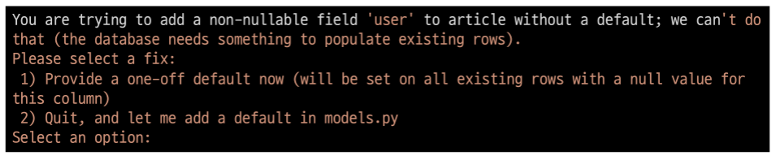

- **두번째 화면**
  - comment의 user_id에 어떤 데이터를 넣을 것인지 직접 입력해야 함
  - 마찬가지로 1 입력하고 Enter 진행
  - 기존에 작성된 댓글이 있다면 모두 1번 회원이 작성한 것으로 처리됨
    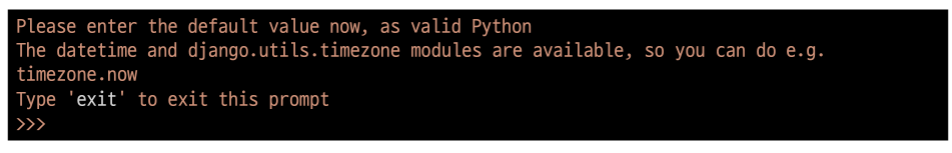

- migrations 파일 생성 후 migrate 진행
  

- comment 테이블 스키마 변경 및 확인
  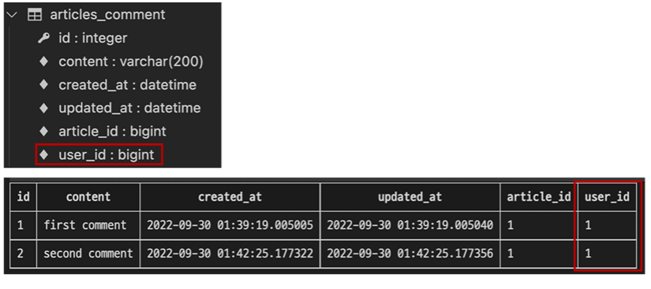

## CREATE

#### 개요

- 인증된 회원의 댓글 작성 구현하기
- 작성하기 전 로그인을 먼저 진행한 상태로 진행

##### CommentForm

- CommentForm 출력을 확인해보면 create 템플릿에서 불필요한 필드(user)가 출력  됨
- user 필드에 작성해야 하는 user 객체는 view 함수의 request 객체를 활용해야 함

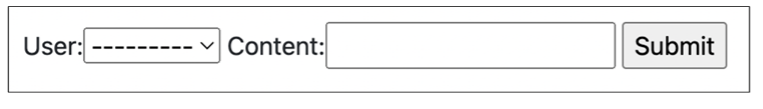

- CommentForm의 출력 필드 수정
  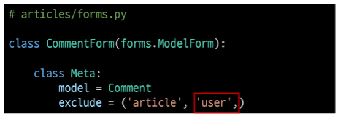

- 수정 확인 후 댓글 작성하기
  

#### 외래 키 데이터 누락

- 댓글 작성 시 NOT NULL constraint failed: articles_comment.user_id에러 발생
  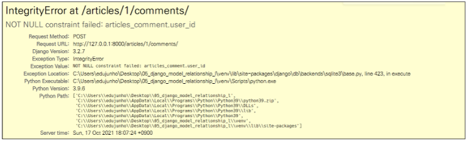

- "NOT NULL 제약 조건이 실패했다. articles_comment 테이블의 user_id 컬럼에서"
- 댓글 작성 시 외래 키에 저장되어야 할 작성자 정보가 누락 되었기 때문
- 댓글 작성 시 작성자 정보가 함께 저장될 수 있도록 save의 commit 옵션을 활용
  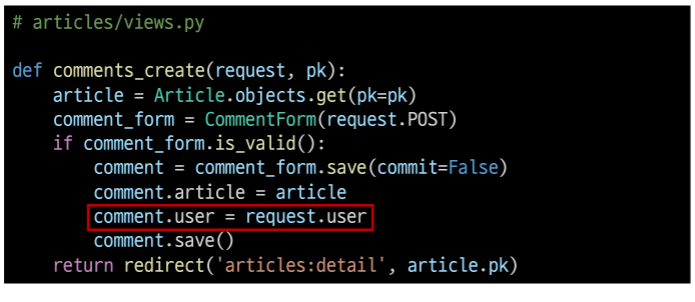

- 수정 후 댓글이 잘 작성 되는지 확인
  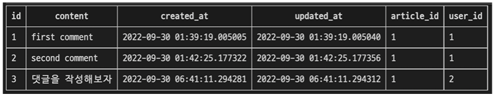

## READ

### 댓글 작성자 출력

- detail 템플릿에서 각 게시글의 작성자 출력
  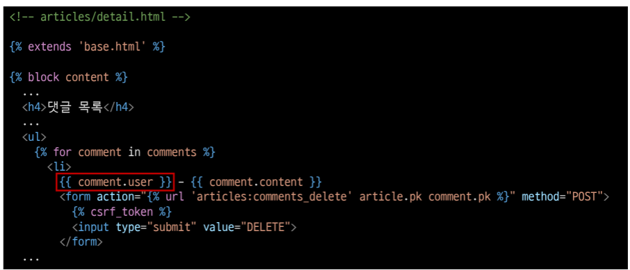

- 출력 확인하기
  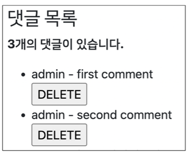

## DEELETE

### 댓글 삭제 시 작정자 확인

- 이제 댓글에는 작성자 정보가 함께 들어있기 때문에 현재 삭제를 요청하려는 사람과 댓글을 작성한
  사람을 비교하여 본인의 댓글만 삭제 할 수 있도록 함
  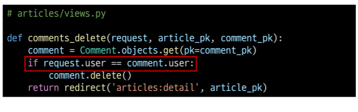

- 추가로 해당 댓글의 작성자가 아니라면, 삭제 버튼을 출력하지 않도록 함
  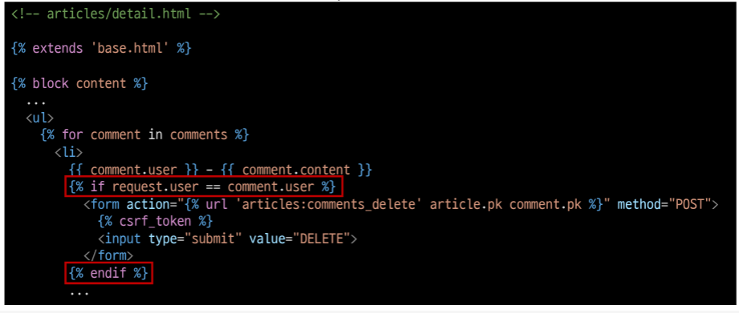

- 다른 계정으로 접속하여 detail 템플릿에서 다른 회원이 작성한 댓글을 확인
  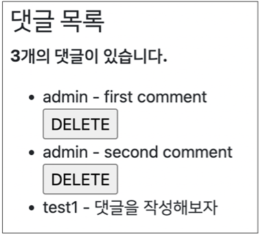
