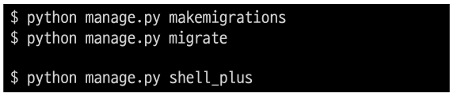
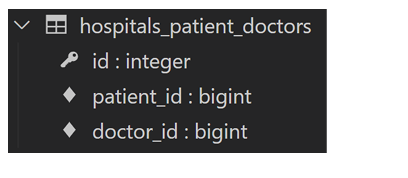

# Many to many relationship

### RDB에서의 관계 복습

- 1:1

  - One-to-one relationships
  - 한 테이블의 레코드 하나가 다른 테이블의 레코드 단 한 개와 관련된 경우

- N:1

  - Many-to-one relationships
  - 한 테이블의 0개 이상의 레코가 다른 테이블의 레코드 한 개와 관련된 경우
  - 기준 테이블에 따라(1:N, One-to-many relationships)이라고도 함

- M:N

  - Many-to-many relationships

  - 한 테이블의 0개 이상의 레코드가 다른 테이블의 0개 이상의 레코드와 관련된 경우
  - 양쪽 모두에서 N:1 관계를 가짐

## 개요

- 병원 예약 시스템 구축을 위한 데티어 베이스 모델일을 진행 한다면??

### N:1의 한계

- 의사와 환자간 예약 시스템을 구현
- 지금까지 배운 N:1 관계를 생각해 한 명의 의사에게 여러 환자가 예약할 수 있다고 모델 관계를 설정
  

- Migration 진행 및 shell_plus 실행
  

- 각각 2명의 의사와 환자를 생성하고 환자는 서로 다른 의사에게 예약을 했다고 가정
  

- 1번 환자(carol)가 두 의사 모두에게 방문하려고 함
  

- 동시에 예약 할 수는 없을까?
  

- 동일한 환자지만 다른 의사에게 예약하기 위해서는 객체를 하나 더 만들어서 예약을 진행해야 함

  - 새로운 환자 객체를 생성할 수 밖에 없음

- 외래 키 컬럼에 '1, 2' 형태로 참조하는 것은 Integer 타입이 아니기 때문에 불가능

  

- 그렇다면 "예약 테이블을 따로 만들자"

#### 중개 모델

- 환자 모델의 외래 키를 삭제하고 별도의 예약 모델을 새로 작성
- 예약 모델은 의사와 환자에 각가 N:1 관계를 가짐
  

- 데이터베이스 초기화 후 Migrations 진행 및 shell_plus 실행
  - migrations 파일 삭제
  - 데이터베이스 파일 삭제

- 의사와 환자 생성 후 예약 만들기
  

- 예약 정보 조회
  

- 1번 의사에게 새로운 환자 예약이 생성된다면
  

- 1번 의사의 예약 정보 조회
  

### Django ManyToManyField

- 환자 모델에 Django ManyToManyField 작성
  

- 데이터베이스 초기화 후 Migration 진행 및 shell_plus 실행
  - migration 파일 삭제
  - 데이터베이스 파일 삭제
    

- 생성된 중개 테이블 hospitals_patient_doctors 확인
  

- 의사 1명과 환자 2명 생성
  

- 예약 생성 (환자가 의사에게 예약)
  

- 예약 생성 (의사가 환자를 예약)
  

- 예약 현황 확인
  

- 예약 취소하기(삭제)
- 기존에는 해당하는 Ressrvation을 찾아서 지워야 했다면, 이제는 .remove() 사용
  

- Django는 ManyToMantField를 통해 중개 테이블을 자동으로 생성함

#### 'related_name' argument

- target model이 source model을 참조할 때 사용할 manager name
- ForeignKey()의 related_name과 동일
  

- Migration 진행 및 shell_plus 실행
  

- related_name 설정 값 확인하기
  

#### 'through' argument

- 그렇다면 중개 모델을 직접 작성하는 경우는 없을까?

  - 중개 테이블을 수동으로 지정하려는 경우 through 옵션을 사용하여 사용하려는 중개 테이블을
    나타내는 Django 모델을 지정할 수 있음

- 가장 일반적인 용도는 중개테이블에 추가 데이터를 사용해 다대다 관계와 연결하려는 경우

- though 설정 및 Reservation Class 수정

  - 이제는 예약 정보에 증상과 예약일이라는 추가 데이터가 생김

  

#### 정리

- M:N 관계로 맺어진 두 테이블에는 변화가 없음
- Django의 ManyToManyFeild는 중개 테이블을 자동으로 생성함
- Django의 ManyToManyFeild는 M:N 관계를 가진 모델 어디에 위치해도 상관 없음
  - 대신 필드 작성 위치에 따라 참조화 역참조 방향을 주의할것

## ManyToManyField

- ManyToManyField(to, **options)
- 다대다 (M:N, many-tomany) 관계 설정 시 사용하는 모델 필드
- 하나의 필수 위치인자(M:N 관계로 설정할 모델 클래스)가 필요
- 모델 필드의 RelatedManager를 사용하여 관련 개체를 추가, 제거 또는 만들 수 있음
  - add(), remove(), create(), clear()....

### 데이터베이스에서의 표현

- Django는 다대다 관계를 나타내는 중개 테이블을 만듦
- 테이블 이름은 ManyToManyField 이름과 이를 포함하는 도멜 테이블 이름을 조합하여 생성됨
- 'db_table' arguments을 사용하여 중개 테이블의 이름을 변경할 수도 있음

### ManyToMantField's Arguments

- related_name

  - target mode이 source model을 참조할 때 사용할 manager name
  - ForeignKey의 related_name과 동

- through

  - 중개 테이블을 직접 작성하는 경우, through 옵션을 사용하여 중개테이블을 나타내는
    Django 모델을 지정
  - 일반적으로 중개 테이블에 추가 데이터를 사용하는 다대다 관계와 열견하려는 경우
    (extra data with a many-to-many relationship)에 사용됨

- symmetrical

  - 기본 값 : True
  - ManyToManyField가 동일한 모델(on self)을 가리키는 정의에서만 사용
    

  - True일 경우
    - _set 매니저를 추가하지 않음
    - source 모델의 인스턴스가 target 모델의 인스턴스를 참조하면 자동으로 target 모델
      인스턴스도 source 모델 인스턴스를 자동으로 참조하도록 함(대칭)
    - 즉, 내가 당신의 친구라면 당신도 내 친구가 됨
  - 대칭을 원하지 않는 경우 False로 설정
    - Follow 기능 구현에서 다시 확인할 예정

### Related Manager

- N:1 혹은 M:N 관계에서 사용 가능한 문맥(context)
- Django는 모델 간 1:N 혹은 M:N 관계가 설정되면 역참조시에 사용할 수 있는 mansger를 생성
  - 우리가 이전에 모델 생성시 objects 라는 매니저를 통해 queryset api를 사용했던 것처럼
    related manager를 통해 queryset api를 사용할 수 있게됨
- 같은 이름의 메서드여도 각 관계(N:1, M:N)에 따라 다르게 사용 및 동작됨
  - N:1 에서는 target 모델 객체만 사용 가능
  - M:N 관계에서는 관련된 두 객체에서 모두 사용 가능
- 메서드 종류
  - add(), remove(), create(), clear(), set() 등

### methods

- add()
  - "지정된 객체를 관련 객체 집합에 추가"
  - 이미 존재하는 관계에 사용하면 관계가 복제되지 않음
  - 모델 인스턴스, 필드 값(PK)을 인자로 허용
- remove()
  - "관련 객체 집합에서 지정된 모델 객체를 제거"
  - 내부적으로 QuerySet.delete()를 사용하여 관계가 삭제됨
  - 모델 인스턴스, 필드 값(PK)을 인자로 허용

### 중개 테이블 필드 생성 규칙

- 소스(source model) 및 대상(target model) 모델이 다른 경우	

  - id
  - <containing_model>_id
  - <other_model>_id

  

- ManyToManyField가 동일한 모델을 가리키는 경우
  - id
  - from\_<model>_id
  - to\_<model>_id

## M:N (Article-User)

### LIKE

#### 모델 관계 설정

- ManyToManyField 작성
  

- Migration 진행 후 에러 확인
  

- like_users 필드 생성 시 자동으로 역참조에는 .article_set 매니저가 생성됨
- 그러나 이전 N:1 (Article-User) 관계에서 이미 해당 매니저를 사용 중
  - user.article_set.all() -> 해당 유저가 작성한 모든 게시글 조회
  - user가 작성한 글들(user.article_set)과 user가 좋아요를 누른 글(user.article_set)을
    구분할 수 없게 됨
- user와 관계된 ForeignKey 혹은 ManyToManyField 중 하나에 related_name을 작성해야 함
- ManyToManyField에 related_name 작성 후 Migration
  

- 생성된 중개 테이블 확인
  

- User -Articel간 사용 가능한 realted manager 정리
  - article.user
    - 게시글을 작성한 유저 - N:1
  - user.article_set
    - 유저가 작성한 게시글(역참조) - N:1
  - article.like_users
    - 게시글을 좋아요한 유저 - M:N
  - user.like_article
    - 유저가 좋아요한 게시글(역참조) - M:N

### LIKE 구현

- url 및 view 함수 작성
  

___

##### .exists()

- QuerySet에 결과가 포함되어 있으면 True를 반환하고 그렇지 않으면 False를 반환
- 특히 큰 QuerySet에 있는 특정 개체의 존재와 관련된 검색에 유용

___

- index 템플릿에서 각 게시글에 좋아요 버튼 출력하기
  

- 좋아요 버튼 출력 확인
  

- 좋아요 버튼 클릭 후 좋아요 테이블 확인
  