# M:N (User -User)

## Profile

### Profile 구현

- url 및 view 함수 작성
  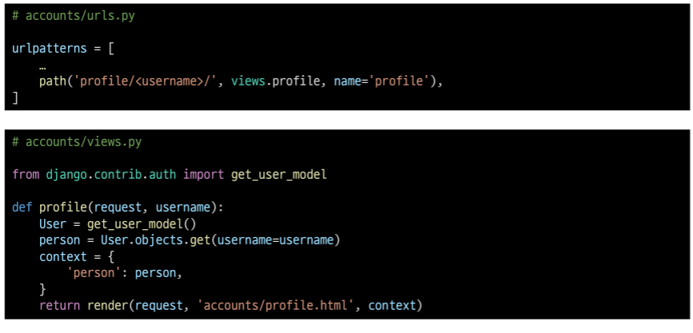

- profile 템플릿 작성
  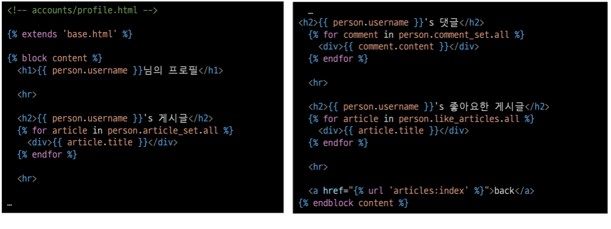

- profile 템플릿으로 이동할 수 있는 하이퍼링크 작성
  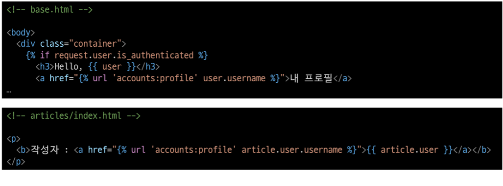

- profile 템플릿으로 이동할 수 있는 하이퍼링크 출력 확인
  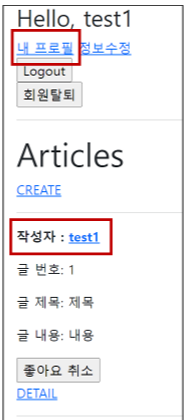

## Follow

### 모델 관계 설정

- ManyToManyField 작성 및 Migration 진행
  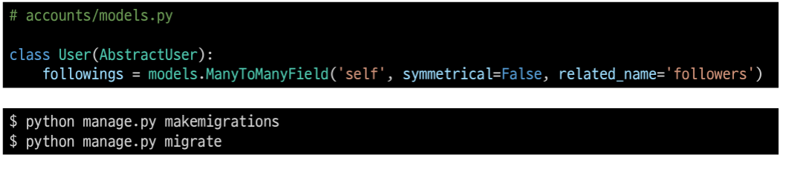

- 생성된 중개 테이블 확인
  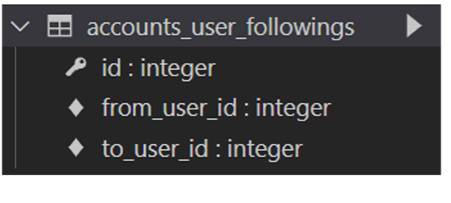

- url 및 view 함수 작성
  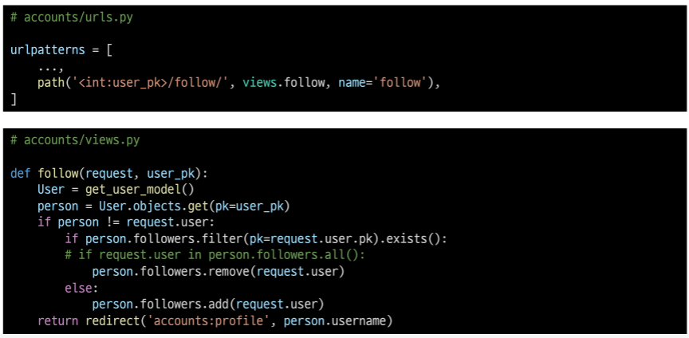

- 프로필 유저의 팔로잉, 팔로워 수 & 팔로우, 언팔로우 버튼 작성
  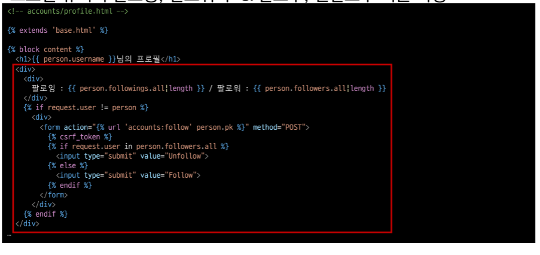

- 팔로우 버튼 클릭 후 팔로우 버튼 변화 및 테이블 확인
  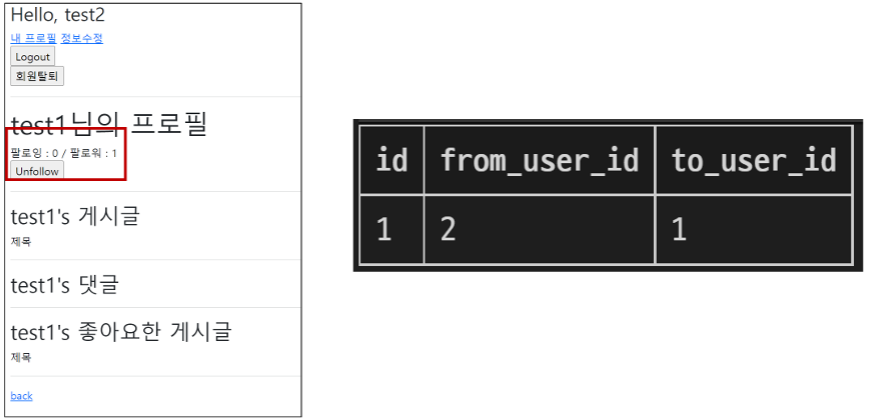

- 데코레이터 및 is_authenticated 추가
  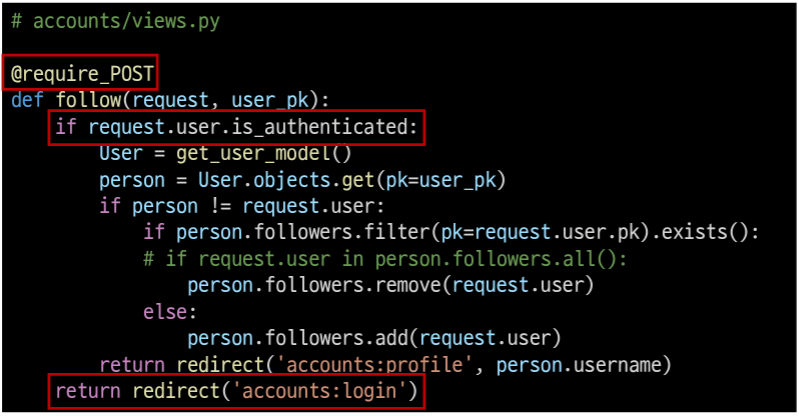

## View decorators & functions

### 데코레이터(Decorator)

- 기존 함수를 수정하기 않고 기능을 추가해주는 wrapper 함수
- Django는 HTTP 처리를 위해 view 함수에 적용 할 수 있는 데코레이터를 제공
  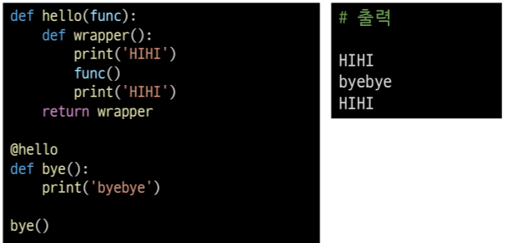

#### 개요

- django.view.decorators.http의 데코레이터를 사용하며 요청 메서드를 기반으로
  접근을 제한할 수 있음
- 일치하지 않는 메서드 요청이라면 405 Method Not Allowed를 반환
- 메서드 목록
  1. require_http_methods()
     - View 함수가 특정한 요청 method만 허용하도록 하는 데코레이터
       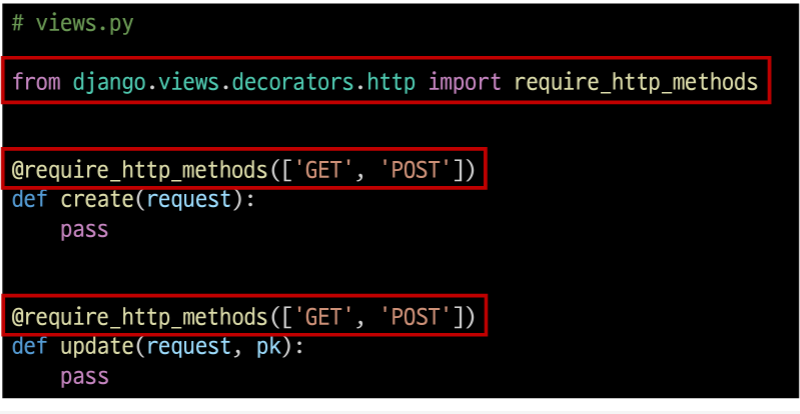
  2. require_POST()
     - View 함수가 POST 요청 method만 허용하도록 하는 데코레이터
       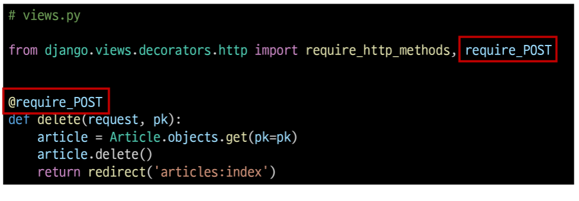
     - url로 delete 시도 후 서버 로그에서 405 http status code 확인 해보기
       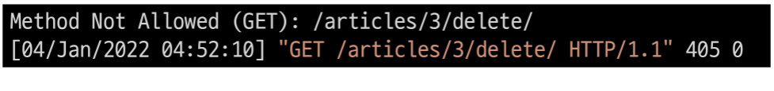
  3. require_safe()
     - require_GET이 있지만 Django에서는 require_safe를 사용하는 것을 권장
       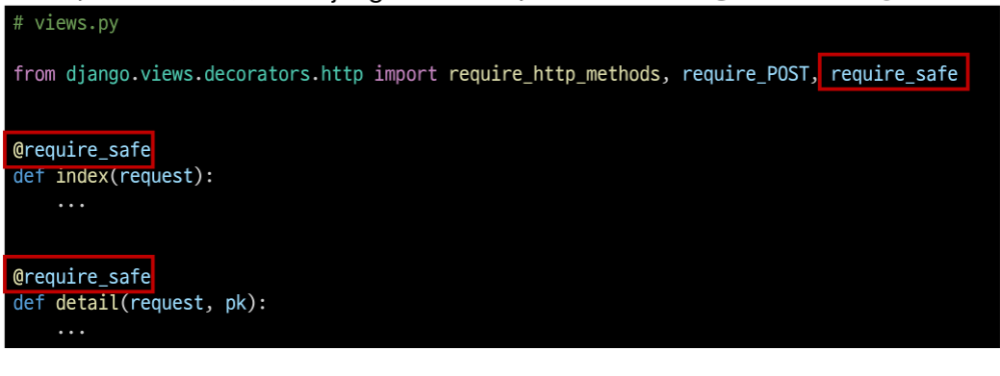

**(참고) @login_require와 require_POST**

- 상황
  - 비로그인 상태로 detail 페이지에서는 게시글 삭제 시도
  - delete view 함수의 @login_required로 인해 로그인 페이지로 리다이렉트
    - http://127.0.0.1:8000/accounts/login/?next=/articles/1/delete/
  - redirect로 이동한 로그인 페이지에서 로그인 징행
    - redirect는 반드시 GET요청으로만 가능
  - delete view 함수의 @require_POST로 인해 405 상태 코드를 받게 됨
    - 405(Method Not Allowed) status code 확인
- **@login_required는 GET 요청을 처리하는 View함수 에서만 사용해야 함**

- 로그인 성공 이후 GET method로 next 파라미터 주소에 리다이렉트
  

- POST method만 허용하는 delete 같은 함수는 내부에서는 is_authenticated
  속성 값을 사용해서 처리
  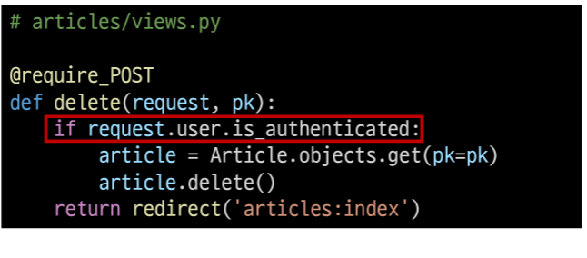

### Django Shortcut functions

- 아래의 함수를 활용하면, 해당하는 객체가 존재하지 않을 경우 404 상태코드를 반환
  - get_object_or_404(klaxx, *args, **kwargs)
    - Call get() on a given model manager, but it raises Http404 instead of the model's
      DoesNotExist exception.
  - get_list_or_404(klass, *args, **kwargs)
    - Returns the result of fiter() on a given model manager cast to a list, raising Http404
      if the resulting list is empty