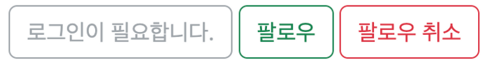

# 1024 폴더 추가로 기능 구현

## 목표

1. 이전에 진행한 실습에 **유저(User)와 유저(User)**가 **N : M** 관계로 매핑된 팔로우 기능을 추가로 개발합니다.
2. 내일 진행 할 비동기 처리 학습을 위해 자바스크립트 이벤트 처리에 대해 복습합니다. 특히 아래 내용은 꼭 한 번 다시 봐주세요.
   1. 클릭 이벤트
   2. HTML Document 생성
   3. HTML Document 수정

## 요구사항

### 모델 Model

- 모델 이름 : User

  Django AbstractUser 모델 상속

  모델 필드

  | 필드 이름  | 역할   | 필드       | 속성                                        |
  | ---------- | ------ | ---------- | ------------------------------------------- |
  | followings | 팔로우 | ManyToMany | symmetrical=False, related_name='followers’ |
  |            |        |            |                                             |

- 모델 이름 : Article

  모델 필드

  | 필드 이름 | 역할      | 필드       | 속성                     |
  | --------- | --------- | ---------- | ------------------------ |
  | title     | 글 제목   | Char       | max_length=80            |
  | content   | 글 내용   | Text       |                          |
  | user      | 글 작성자 | ForeignKey | on_delete=models.CASCADE |

### 기능 View

회원관리 **accounts**

회원 팔로우 & 팔로우 취소

- `POST` http://127.0.0.1:8000/accounts/[int:user_pk](int:user_pk)/follow/
- 로그인한 유저만 팔로우 기능을 사용할 수 있습니다.

### 화면 Template

회원 정보 페이지(프로필 페이지)

- `GET` http://127.0.0.1:8000/accounts/[int:user_pk](int:user_pk)/

- 팔로우 목록

  해당 회원의 팔로우 목록

- 팔로잉 목록

  해당 회원의 팔로잉 목록

- 다른 회원의 프로필 페이지

  - 팔로우 버튼

    스스로를 팔로우 할 수 없습니다.

    로그인한 유저만 팔로우 기능을 사용할 수 있습니다.

    로그인 상태 / 팔로우 상태에 따라 다르게 표현 합니다.

    예시 이미지

