# Axios

- "Promise based HTTP client for the browser and Node.js"

- 브라우저를 위한 Promise 기반의 클라이언트

- 원래는"XHR"이라는 브라우저 내장 객체를 활용해 AJZX 요철을 처리하는데, 이보다 편리한 AJZX 요청이 가능하도록 도움을 줌

  - 확장 가능한 인터페이스와 함게 패키지로 사용이 간편한 라이브러리를 제공

  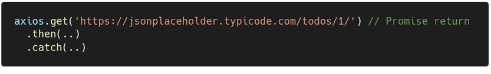

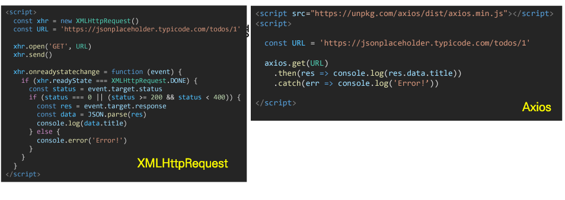

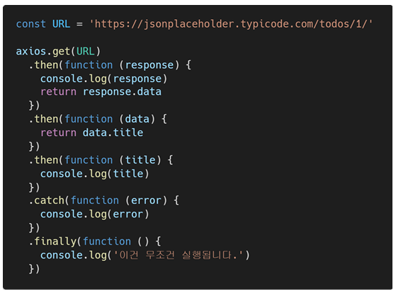

### Promise

- 비동기 작업을 관리하는 객체
  - 미래의 완료 또는 실패와 그 결과 값을 나타냄
  - 미래의 어떤 상솽에 대한 약속
- 성공(이행)에 대한 약속
  - .then()
- 실패(거절)에 대한 약속
  - .catch()

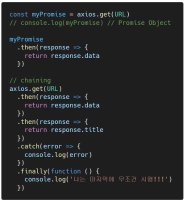

- .then(callback)
  - 이전 작업(promise)이 성공했을 때(이행했을 때) 수행할 작업을 나타내는 callback 함수
  - 그리고 각 callback 함수는 이전 작업의 성공 결과를 인자로 전달받음
  - 따라서 성공했을 때의 코드를 callback 함수안에 작성
- .catch(callback)
  - .then이 하나라도 실패하면(거부 되면) 동작 (동기식의 'try - except' 구문과 유사)
  - 이전 작업의 실패로 인해 생성된 error 객체는 catch 블록 안에서 사용할 수 있음

- 각각의 .then() 블록은 서로 다른 promise를 반환
  - 즉, .then()을 여러 개 사용(chaining)하여 연쇄적인 작업을 수행할 수 있음
  - 결국 여러 비동기 작업을 차례대로 수행할 수 있다는 뜻
- .then()과 .catch() 메서드는 모두 promise를 반환하기 때문에 chaining 가능
- **주의**
  - 반환 값이 반드시 있어야 함
  - 없다면 callback 함수가 이전의 promise 결과를 받을 수 없음

- .finaly(callback)
  - promise 객체를 반환
  - 결과와 상관없이 무조건 지정된 callback 함수가 실행
  - 어떠한 인자도 전달받기 않음
    - promis가 성동되었는지 거절되었는지 판단할 수 없기 때문
  - 무조건 실행되어야 하는 절에서 활용
    - .then()과 .catch() 블록에서의 코드 중복을 방지

- callback Hell -> Promise

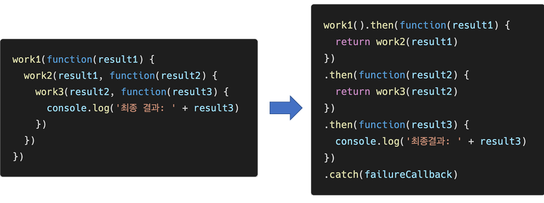

- .then()을 여러 번 사용하여 여러 개의 callback 함수를 추가할 수 있음 (Chaining)
- Callback 함수는 JavaScript의 Event LOOP가 현재 실행 중인 Call Stack을 완료하기 이전에는
  절대 호출되지 않음
  - Promise callback 함수는 Event queue에 배치되는 염격한 순서로 호출됨
  - 비동기 작업이 성공하거나 실패한 뒤에 .then() 메서드를 이용한 경우도 마찬가지

### 비동기 적용하기

#### 팔로우(Follow)

- 각각의 템플릿에서 csrtipt 코드를 작성하기 위한 block tag 영역 작성
  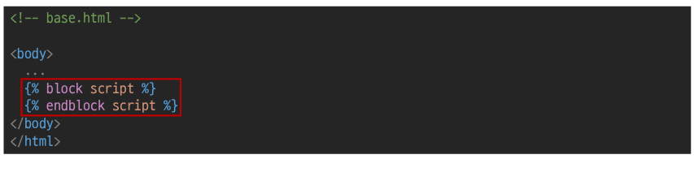

- axios CDN 작성
  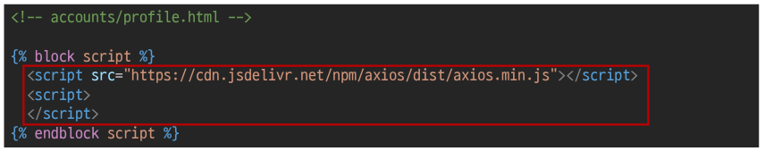

- form 요소 선택을 위해 id 속성 지정 및 선택

- 불필요해진 action과 method 속성은 삭제(요청은 axios로 대체되기 때문)

  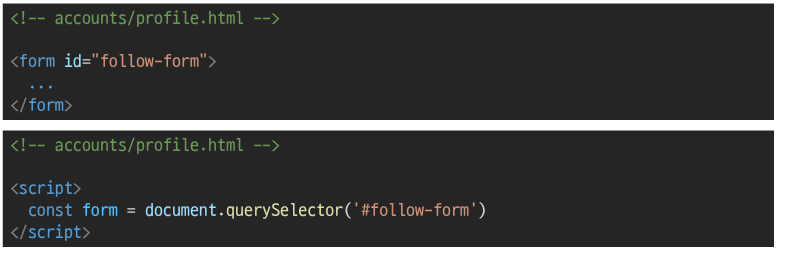

- form 요소에 이벤트 핸들러 작성 및 submit 이벤트 취소
  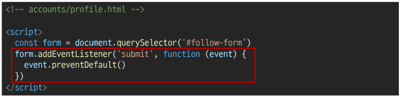

- axios 요청 준비
  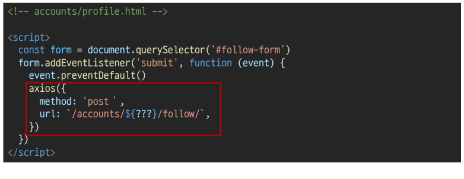

- 현재 axios로 POST 요청을 보내기 위해 필요한것
  1. url에 작성할 user pk는 어떻게 작성 할까?
  2. csrftoken은 어떻게 보내야 할까?

##### 1. url에 작성할 user pk는 어떻게 작성 할까?

- url에 작성할user pk 가져오기 (HTML -> JavaScript)

  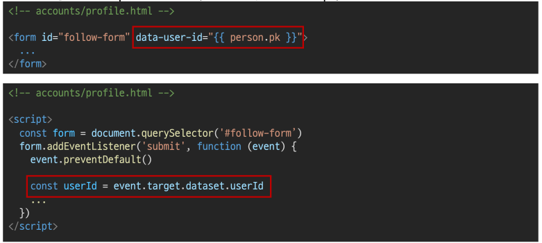

#### data - *attributes

- 사용자 지정 데이터 특성을 만들어 임의의 데이터를 HTML과 DOM사이에서 교환 할 수 있는 방법
- 사용예시
  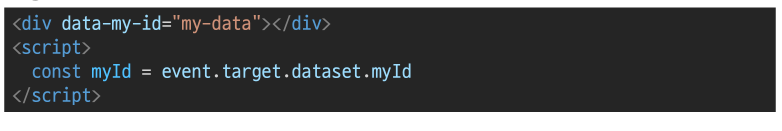

- 모든 사용자 지정 데이터는 dataset 속성을 통해 사용할 수 있음
  [https://developer.mozilla.org/ko/docs/Web/HTML/Global_attributes/data-*](https://developer.mozilla.org/ko/docs/Web/HTML/Global_attributes/data-*)

- 예를 들어 data-tset-value라는 이름의 특성을 지정했다면 JavaScript에서는
  element.dataset.testValue로 접근할 수 있음
- **속성명 작성시 주의사항**
  - 대소문자 여부에 상관없이 xml로 시작하면 안됨
  - 세미콜론을 포함해서는 안됨
  - 대문자를 포함해서는 안됨

- url 작성 마치기
  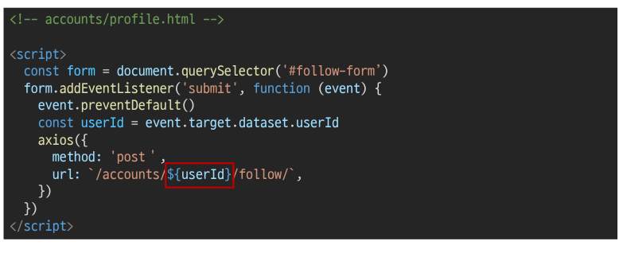

##### 2. csrftoken은 어떻게 보내야 할까?

- 먼저 hidden 타입으로 숨겨져있는 csrf값을 가진 input 태그를 선택해야 함
  [https://docs.djangoproject.com/en/3.2/ref/csrf/](https://docs.djangoproject.com/en/3.2/ref/csrf/)
  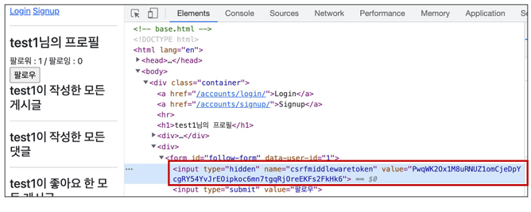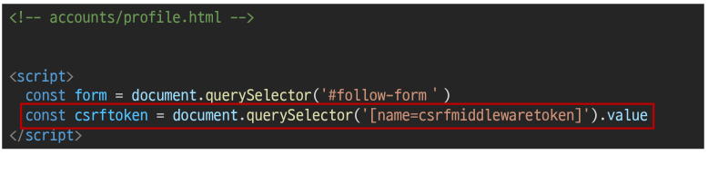

- AJAX로 csrftoken을 보내는 방법
  [https://docs.djangoproject.com/en/3.2/ref/csrf/#setting-the-token-on-the-ajaxrequest](https://docs.djangoproject.com/en/3.2/ref/csrf/#setting-the-token-on-the-ajaxrequest)
  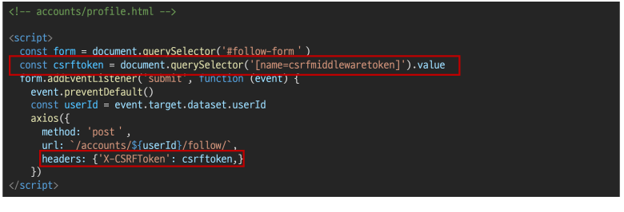

- 팔로우 버튼 토글하기 위해서는 현재 팔로우가 된 상태인지 여부 확인이 필요
- axios 요청을 통해 받는 response 개체를 활용해 view 함수를 통해서 팔로우 여부를 파악 할 수
  있는 변수를 담아 JSON 타입으로 응답하기

- 팔로우 여부를 확인하기 위한 is_followed 변수 작성 및 JSON 응답
  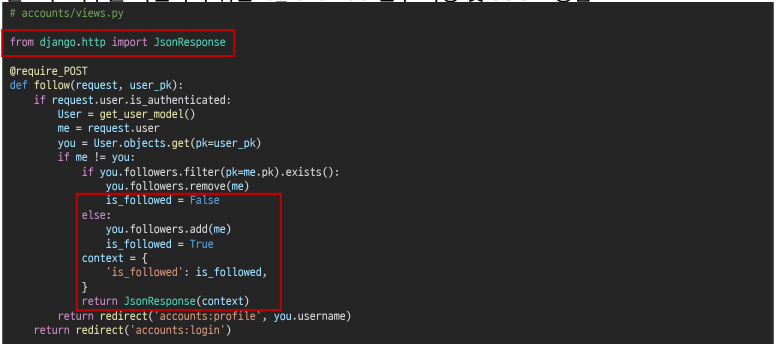
  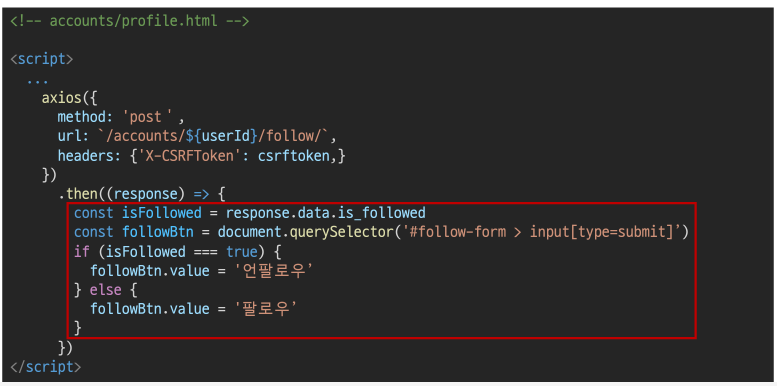

- 결과 확인 (개발자 도구 - Network)
  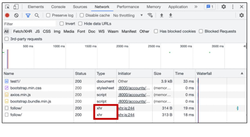
  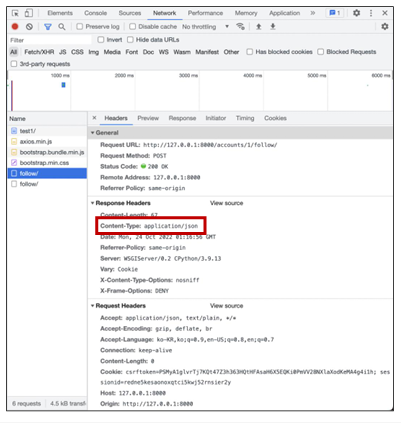

### 팔로워 & 팔로잉 수 비동기 적용

- 해당 요소를 선택할 수 있도록 span 태그와 id 속성 작성
  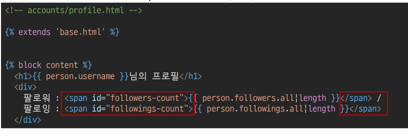

- 직전에 작성한 span 태그를 각각 건택
  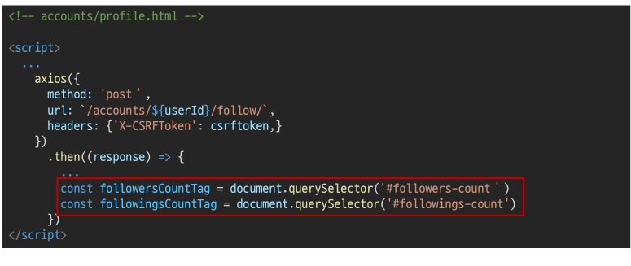

- 팔로워, 팔로잉 인원 수 연산은 view 함수에서 진행하여 결과를 응답으로 전달
  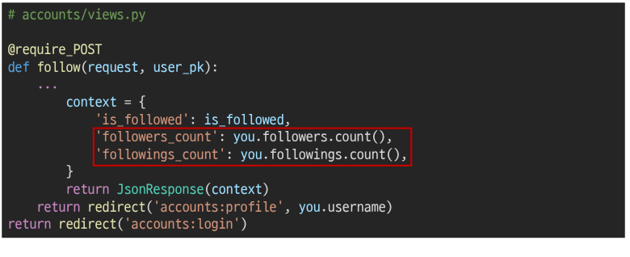

- view 함수에서 응답한 연산 결과를 사용해 각 태그의 인원 수 값 변경하기
  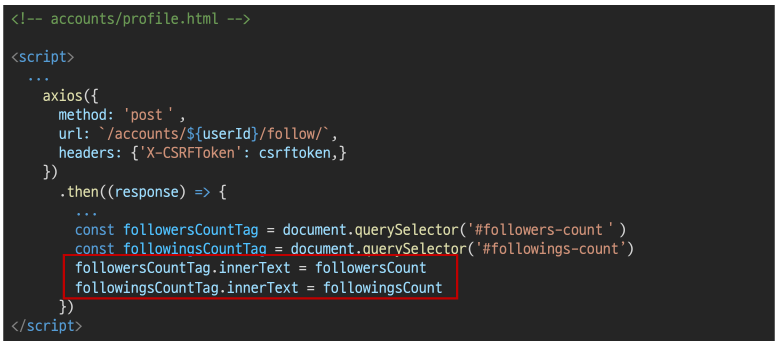

- HTML 코드
  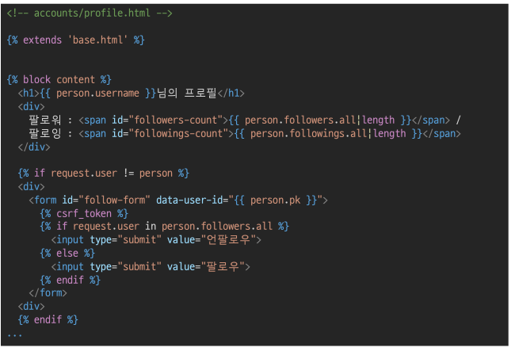

- Python 코드
  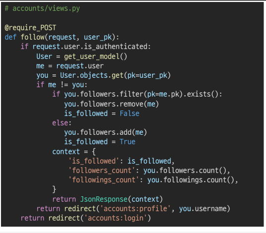

#### 좋아요(LIKE)

- HTML 코드
  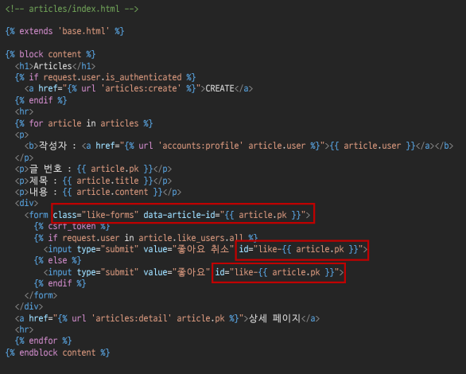

- Python 코드
  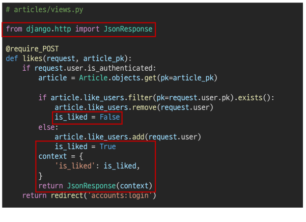

- JavaScript 코드
  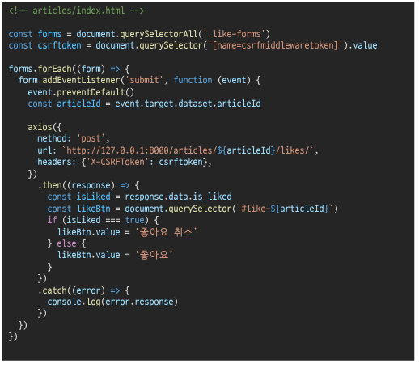