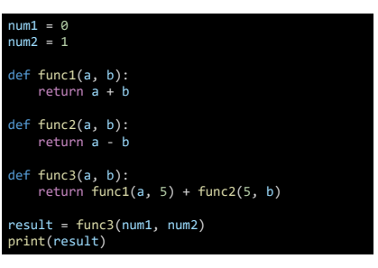
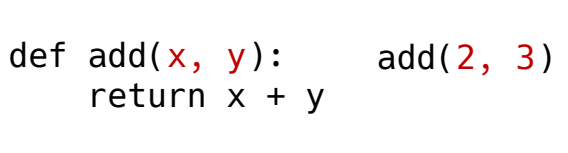
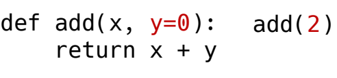
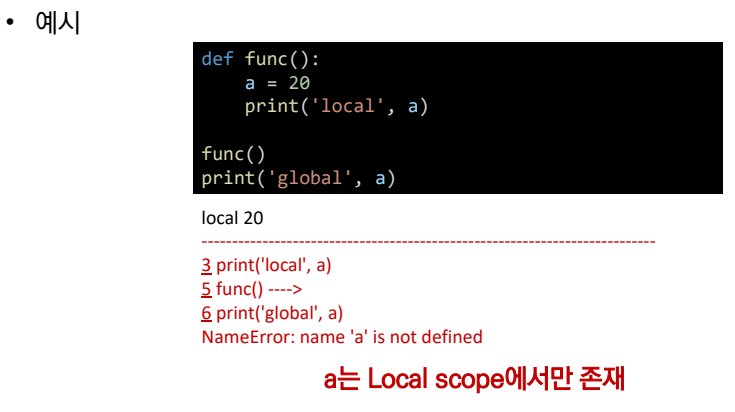
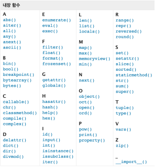
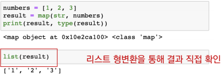
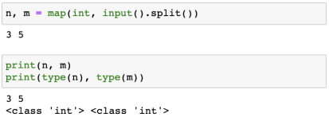

## 7월 13일 강의 정리

## 함수

## 함수의 기초

> 함수 란?
> 
> 함수(Function)
> 
> - 특정한 기능을 가는 코드의 조각(묶음)
> - 특정 명령을 수행하는 코드를 매번 작성할 필요 無, 필요 시 호출 하여 사용

1. 사용자 함수(Custom Function)
   
   - 구현되어 있는 함수가 없을 경우, 사용자가 직접 함수를 정의 할 수 있다
     
     ```python
     def function_name
         # code block
         return returning_value
     ```

2. 함수 기본 구조
   
   - 선언과 호출(define & call)
     - 함수의 선언은 def 키워드를 활용
     - 들여쓰기를 통해 Function body(실행코드 블록)를 작성
     - 함수는 parameter를 넘겨줄 수 있음
     - 함수는 동락 후에 return을 통해 결과값을 전달
     - 함수명()로 호출


**< 예시 >**



**결과값(Output)**

- 함수는 반드시 값을 하나만 return한다.
  - 명시적 return이 없는 경우에도 None을 반환한다
- 함수는 return과 동시에 실행이 종료된다.

**return vs print**

``` 
return은 함수 안에서 값을 반환하기 위해 사용되는 키워드 
print는 출력을 위해 사용되는 함수
```

**입력(input)**

- Parameter : 함수를 실행할 때 , 함수 내부에서 사용되는 식별자

- Argument : 함수를 호출 할 때, 넣어주는 값

  > Argument 란?
  > 
  > - 함수 호출 시 함수의 parameter를 통해 전달되는 값
  > - Arguments는 소괄호 안에 할당 func_name(argument)
  >   - 필수 Argument : 반드시 전달되아야 하는 argument
  >   - 선택 Argument : 값을 전달하지 않아도 되는 경우는 기본 값이 전달

- positional arguments

  - 기본적으로 함수 호출 시 Argument는 위치에 따라 함수 내에 전달됨

  

- Keyword Arguments

  - 직접 변수의 이름으로 특정 Argument를 전달 할수 있음
  - Keyword Argument 다음에 Positional Argument를 활용할 수 없음

  

- Default Arguments Values

  - 기본값을 지정하여 함수 호출시 argument 값을 설정하지 않도록 함
    - 정의된 것 보다 더 적은 개수의 argument들로 호출될 수 있음

  

**범위(Scope)**

- 함수는 코드 내부에 local scope를 생성하며, 그 외 공간인 gobal scope로 구분

- scope
  - global scope : 코드 어디에서든 참조할 수 있는 공간
  - local scope : 함수가 만든 scope, 함수 내부에서만 참조 가능
- variable
  - gloabl variable : global scope에 정의된 변수
  - local variable : local scope에 정의된 변수
- 객체 수명주기
  - 객체는 각자의 수명주기(lifecycle)가 존재
    - built-in scope
      - 파이썬이 실행된 이후부터 영원히 유지
    - global scope
      - 모듈이 호출된 시점 이후 혹은 인터프리터가 끝날 때까지 유지
    - local scope
      - 함수가 호출될 때 생성되고, 함수가 종료될 때까지 유지



- 이름 검색 규칙(Name Resolution)
  - 파이썬에서 사용되는 이름(식별자)뜰은 이름공간(namespace)에 저장되어 있음
  - 아래와 같은 순서로 이름을 찾아 나아가며, LEBG Rule이라고 부름
    - Local scope : 함수
    - Enclosed scope : 특정 함수의 상위 함수
    - Global scope : 함수 밖의 변수, inport 모듈
    - Bult-in scope : 파이썬 안에 내장외더 있는 함수 또는 속성
  - 즉, 함수 내에서는 바깥 scope의 변수에 접근 가능 하나 수정은 할 수 없음

​				


## 함수 응용

**내장 함수 응용**

- 파이썬 인터프리터에는 사용할 수 있는 많은 함수와 형(type)이 내장되어 있음

​		

**MAP**

- map(function, iterable)
  - 순회 가능한 데이터구조(iterable)의 모든 요소에 함수(function)적용하고, 그결과를
    map object로 변환



- 알고리즘 문제 풀이시 input 값들을 숫자로 바로 활용 하고자 할때



