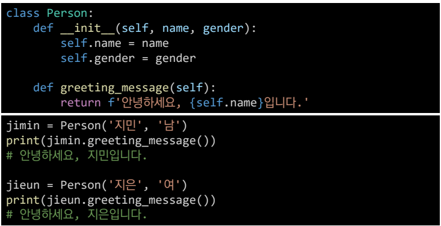
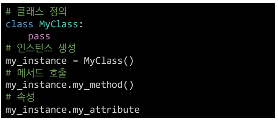
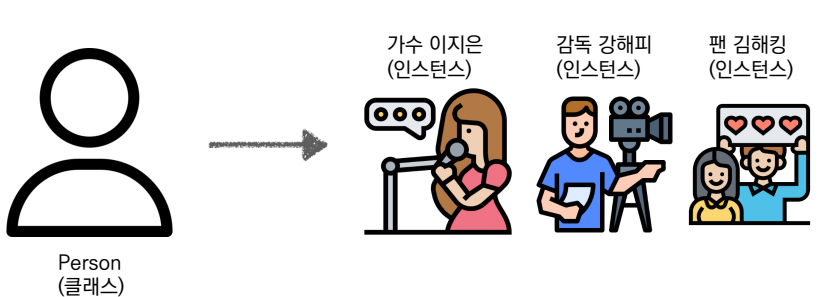
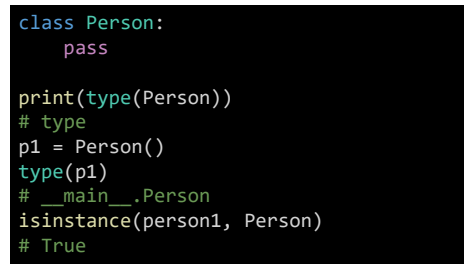
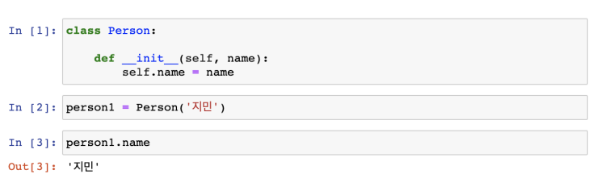
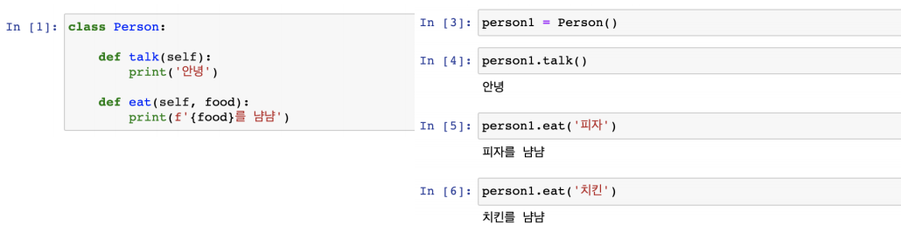
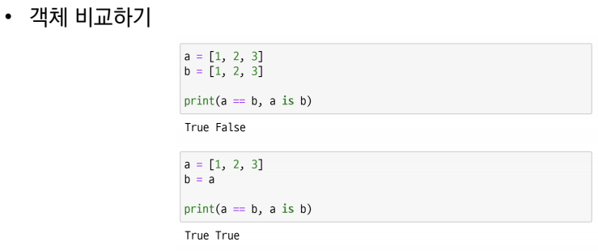
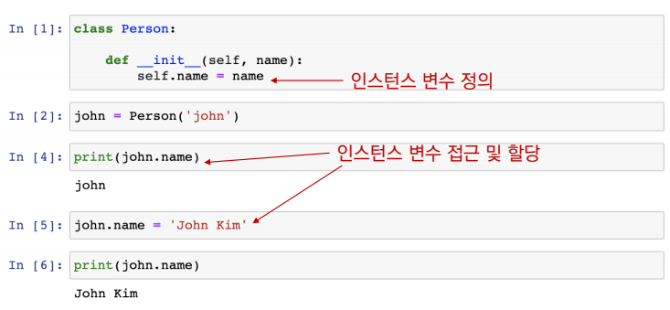
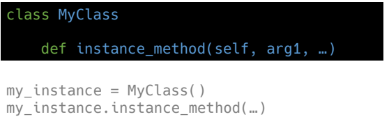
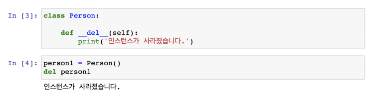

## 객체지향프로그래밍(OOP)
> object oriented progrmming

**객체**
 - 메모리에 할당된 것

## 파이썬은 모든 것이 객체이다

> 객체는 특정 타입(class)의 인스턴스(instance(사례,예시))이다
>
> 123, 900, 5는 모두 int의 인스턴스
> 'hello', 'bye'는 모두 string의 인스턴스
> [232, 89, 1], []은 모두 list의 인스턴스

**객체**
- 객케의 특징
  - 타입(Type) : 어떤 연산자(operator)와 조작(method)이 가능한가?
  - 속성(attribute) : 어떤상태를 가지는가?
  - 조작법(method) : 어떤 행위(함수)를 할 수 있는가?

- 객체지향 프로그래밍이란?
  - 프로개름을 여러 개의 독릭된 객체들과 그 객체들 간의 상호박용으로 
    파악하는 프로그래밍 방법

 - 이전 프로그래밍은 `절차지향 프로그래밍`

## 객체 지향 프로그래밍

- 현실 세계를 프로그램 설계에 반영(**추상화**)

- 사각형 - 클래스(class)
- 각 사각형(R1, R2) - 인스턴스(instance)
- 사각형의 정보 - 속성(attribute)
  - 가로 길이, 세로 길이
- 사각형의 행동/기능 - 메서드(method)
  - 넓이를 구한다. 높이를 구한다.

**객체지향의 장점(위키디피아)**

- 객체 지향 프로그래밍은 프로그램을 유연하고 변경이 용이하게 만들기 때문에 대규모
  소프트웨어 개발에 많이 사용됩니다.
-  또한, 프로그래밍을 더 배우기 쉽게 하고 소프트웨어 개발과 보수를 간편하게 하며,
  보다 직관적인 코드 분석을 가능하게 하는 장점을 가지고 있습니다.

## OOP 기초

​                  	**기본 문법**

- 객체의 틀(클래스)을 가지고, 객체(인스턴스)를 생성한다

- 클래스와 인스턴스
  - 클래스 : 객체들의 분류(class)
  - 인스턴스 : 하나하나의 실체/예(intstance)

- 속성
  - 특정 데이터 타입/클래스의 객체들이 가지게 될 상태/데이터를 의미

- 메소드
  - 특정 데이터 타입/클래스의 객체에 공통적으로 적용 가능한 행위(함수)

**객체 비교하기**

 - ==

   - 동등한(equal)
   - 변수가 참조하는 객체가 동등한(내용이 같은)경우 True
   - 두 객체가 같아 보이지만 실제로 동일한 대상을 가리키고 있다고 확인해 준것은 아님

 - is

   - 동일한(identical)

   -  두 변수가 동일한 객체를 가리키는 경우 True

 **인스턴스**

- 인스턴스 변수

  - 인스턴스가 개인적으로 가지고 있는 속성(attribute)
  - 각 인스턴스들의 고유한 변수

- 생성자 메소드에서 self.<name>으로 정의

- 인스턴스가 생성된 이후 <instance>.<name>으로 접근 및 할당

  

- 인스턴스 메소드

  - 인스턴스 변수를 사용하거나, 인스턴스 변수에 값을 설정하는 메소드
  - 클래스 내부에 정의되는 메소드의 기본
  - 호출 시, 첫번째 인자로 인스턴스 자기자신(self)이 전달됨

  

- self
  - 인스턴스 자기자신
  - 파이썬에서 인스텀스 메소드는 호출 시 첫번째 인자로 인스턴스 자신이 전달되게 설계
    - 매개변수 이름으로 self를 첫번째 인자로 정의
    - 다른 단어로 써도 작동하지만 파이썬의 암묵적인 규칙
- 생성자(constructor) 메소드
  - 인스턴스 객체가 생성될 때 자동으로 호출되는 메소드
  - 인스턴스 변수들의 초기값을 설정
    - 인스턴스 생성
    - \__init__메소드 자동호출

- 소멸자(destructor) 메소드
  - 인스턴스 객체가 소멸(파괴)되기 직전에 호출되는 메소드

