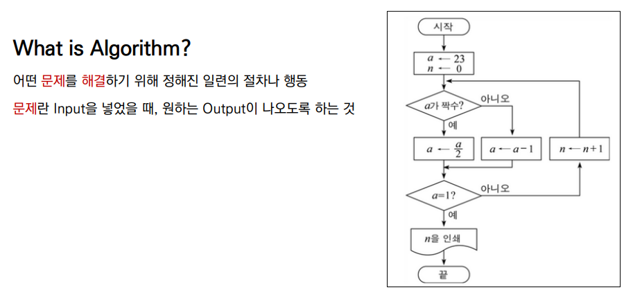
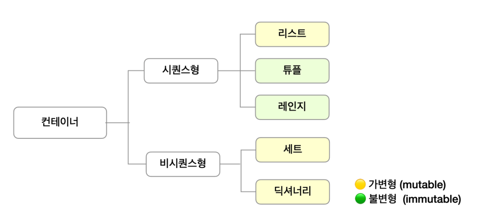
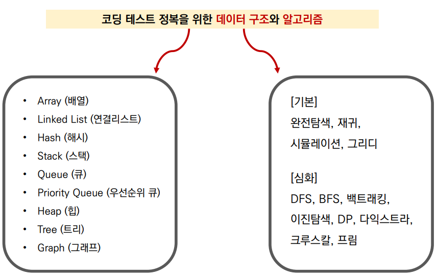
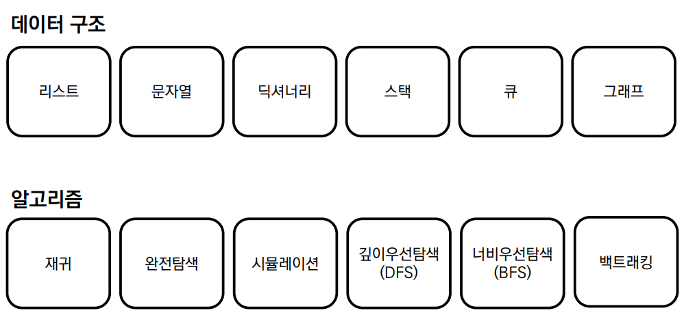

# 오전 자료구조 강의

### 알고리즘?

### 코딩테스트?

- 기업에서 지원자를 대상으로 코딩을 통한 __문제 해결__ 능력을 테스트 하는것
- 코딩테스트에서 평가하는 두 가지 사항
  - 문제 __의도__를 정확히 파악하고, 적절한 __해결__ 방법을 적용할 수 있는가?
  - 해결 방법을 __프로그래밍__을 통해 능숙하게 __구현__ 할수 있는가?

## 데이터구조

> **프로그램** = 데이터구소 + 알고리즘

### Data Structure 데이터 구조

- 데이터를 다양한 방식으로 저장하고 + 조회, 삽입, 변경, 삭제와 같은 조작 기능 제공

### 파이썬의 기본 데이터 구조

- 도구의 특성을 알아야 제대로 활용 할 수 있다!
- 코딩테스트를 위한 데이터 구조와 알고리즘

# 오후 알고리즘 문제 풀이 & 코드리뷰

## 문제 풀이 후기

지금 까지 배운걸 조금은? 쓸 수 있었던거 같았다....
어떤 문제는 두시간 가까이 고민을 하다 결국 다른분 코드를 좀 참고 했고
어떤 문제는 혼자서 5분만에 풀이했다....
아직 까지는 문제의 접근법을 좀더 많은 연습을 통해서 경험을
늘려야 할거같다고 느꼈다