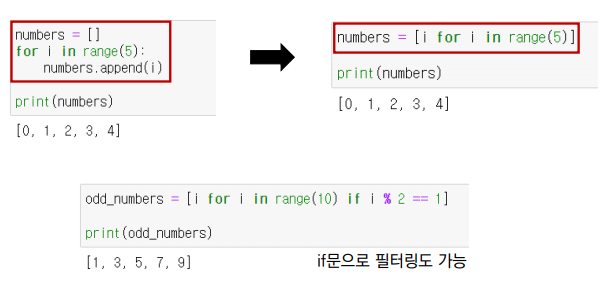

# 오전 자료구조2 강의

## 1. 시간복잡도

 - 좋은 알고리즘이란 무엇일까?
    == 효율성이 좋은 알고리즘?
    == 성능이 좋은 알고리즘?
    == input을 넣은 후 Output이 나오는 `시간`이 짧은 알고리즘!!

## 알고리즘의 소요 시간 측정하기(1)
  - 개개인의 컴퓨팅 환경에 따라 같은 알고리즘이라도 측정 시간이 다르다.
  - 환경에 영향을 받지 않는 `객관적인 틀`이 필요
## 알고리즘의 소요 시간 측정 하기(2)
  - 알고리즘 내부에서 `기본연산`이 `몇 번` 일어나는지 살펴본다.
    `기본연산의 총 횟수` == `알고리즘의 소요 시간` (!!!연산의 횟수!!!)
  - 입력 n개에 따른 소요 시간을 수식으로 세울 수 있다. == 시간복잡도(Itme Complexity)
## 시간복잡도
> 단순하게 `알고리즘의 수생 시간`을 의미한다
**시간 복잡도가 높다** > **느린 알고리즘**
**시간 복잡도가 낮다** > **빠른 알고리즘**

## 2. 빅오(Big-O) 표기법
- 빅오 표기법이란 무엇일까?
 - 입력 n이 `무한대`로 커진다고 가정하고 시간 복잡도를 간단하게 표시하는 것
 - `최고차항`만 남기고 계수와 상수 제거
 - 매 입력에 따라 정확한 수식을 구하는 것은 불필요!
 - 정확한 수치보다는 `증가율`에 초점을 맞춘다.

 ## 리스트
 1. **배열 vs 연결리스트**
  1) 배열(Array)

    - 여러 데이터들이 연속된 메모리 공간에 저장되어 있는 자료구조
      - 인덱스를 통해 데이터에 빠르게 접근
      - 배열의 길이는 변경 불가능 -> 길이를 변경하고 싶다면 새로 생성
      - 데이터 타입은 고정
  2) 연결리스트

    - 데이터가 담긴 여러 노트들이 순차적으로 연결된 형태의 자료구조
      - 맨 처음 노드부터 순차적으로 탐색
      - 연결리스트의 길이 자유롭게 변경 가능 -> 삽입, 삭제 편리
      - 다양한 데이터 타입 저장
      - 데이터가 메모리에 연속적으로 저장되지 않음
  **파이썬 리스트**
   - 배열 과 연결리스트 모두를 포함한 기능
      *파이썬 리스트 메서드*
      1. .append() - 리스트 맨 끝에 새로운 __원소__ 삽입
      2. .pop() - 특정 인덱스에 있는 원소를 __삭제 및 반환__
      3. .count() - 리스트에서 해당하는 원소의 __개수__를 반환
      4. .index() - 리스트에서 처음으로 원소가 등장하는 __인덱스__ 반환
      5. .sort() - 리스트를 오름차순으로 __정렬__, __reverse=True__를 통해 내림차순 절렬 가능
      6. .reverse() - 리스트의 원소들의 순서를 거꾸로 __뒤집기__

- 자주 쓰이는 리스트 관련 내장 함수
  1. len() - 리스트의 __길이__(원소의 개수)를 반환
  2. sum() - 리스트의 모든 원소의 __합__을 반환
  3. max() - 리스트의 원소 중 __최대값__을 반환
  4. min() - 리스트의 원소 중 __최소값__을 반환
  5. sorted() - 오름차순으로 __정렬__된 새로은 리스트 반환(원본 리스트는 변화 없음)
  6. reversed() - 리스트의 순서를 거꾸로 __뒤집은__ 새로운 객체 반환(원본 리스트는 변화 없음)

## 3.리스트 컴프리헨션

List Comprehension(리스트 컴프리헨션, 리스트 내포)란 코드 __한 줄__만으로 새로운 리스트를 만드는 방법이다.

# 오후 알고리즘 문제풀이 & 코드리뷰

## 문제풀이 후기 작성

알고리즘 문제를 풀면서 벽을 느끼고 있다.... 내가 생각해서 푼 문제들은 다른 분들도
풀었다는 느낌이고 내가 못푼 문제경우 다른사람은 풀이를 한 사람들이 많은거 같다
상대적으로 문제를 푸는데 있어서 내가 할 수 있는 문제들은 쉬웠나? 하는 생각이 들고
다른 분들은 풀었는데 나는 못푼 문제 들을 보면 내가 많이 부족하다고 매일 느끼는 하루 같다....

