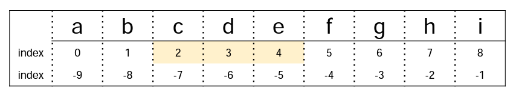
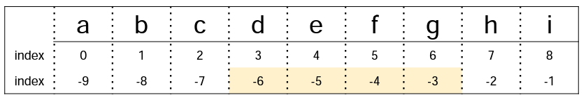
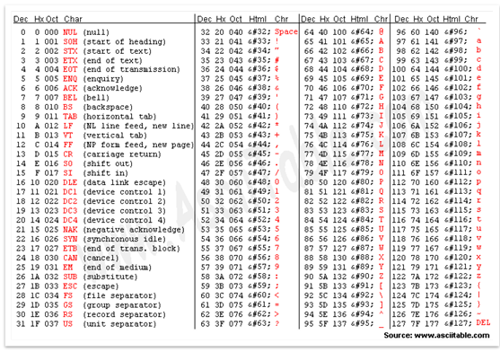

# 오전 자료구조3 강의

## 문자열(string)

### 1. 문자열 슬라이싱

> 문자열은 immutable(**변경 불가능한**) 자료형

- s = 'abcdefghi'
- s[2:5] = 'cde'

- s[-6:-2] = 'defg'

- 연습문제
  - [팰린드롬 10988번 풀어보기](https://www.acmicpc.net/problem/10988)

### 2. 문자열 메서드

1) .split() = 문자열 자르기
2) .strip() = 양쪽의 공백 제거, 문자 입력으로 문자열 제걱 가능
3) .find() = 특정 문자가 나타나는 위치(인덱스)를 반환 값이 없으면 -1 출력(실행 o)
4) .index() = 특정 문자가 나타나는 위치(인덱스)를 반환 값이 없으면 오류(실행 x)
5) .count() = 문자열에서 특정 문자가 `몇 개` 인지 반환, 문자 뿐만 아니라 문자열의 개수도 확인 가능
6) .replace() = 기존 문자열을 새로문 문자로 변환
7) .join() = 각각의 원소 사이에 특정 문자를 삽입, 공백 출력, 콤마 출력 등 `출력 형태`를 위해 사용

- 연습문제
  - [17249번 풀어 보기](https://www.acmicpc.net/problem/17249)

### 3. 아스키(ASCII) 코드

> 미국 정보교환 표준 부호 `American Standard Code for Information Interchange`

- 알파벳을 표현하는 대표 인코딩 방식

- 각 문자를 표현하는데 1byte(8bits) 사용
  - 1bit : 통신 에러 검출용
  - 7bit : 문자 정보 저장(총 128개)

1. ord(문자)
   - 문자를 아스키코드 값으로 반환
2. chr(아스키코드)
   - 아스키코드에서 문자 값을 찾아 반환

- 연습문제
  - [10809번 문제 풀이](https://www.acmicpc.net/problem/10809)
  
    

# 오후 알고리즘 문제풀이 & 코드리뷰

## 실습 후기

어제보다 오늘 문제는 난이도가 나한테는 좀더 어렵게 느껴졌다 아직까지 문제를 이해하는 부분이 더 연습이 필요한거 같아 나름 문제를 이해했다고 생각하고 코드를 짜는데 내가 생각한대로 코드를 구현할 수 없는 부분도 있고 내 생각 대로 코드를 구현 했다고 해도 문제 해결이 안되는 경우가 다반사다....
