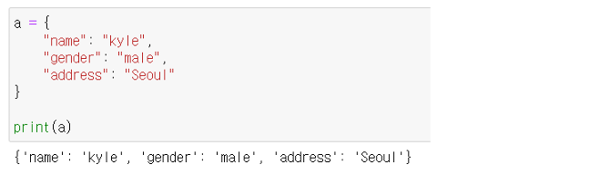

# 오전 자료구조4 강의

## 딕셔너리

### 1. 해시 테이블

> 파이썬에는 딕셔너리(dict) 자료구조가 내장 되어 있다.

- key는 immutable(변경 불가능)
- 해시 함수 : 임의 길이의 데이터를 고정 길이의 데이터로 매핑하는 함수
- 해시 : 해시 삼후를 통해서 얻어진 값

**파이썬 딕셔너리 특징**

> 해시 함수와 해시 테이블을 이용하기 때문에
> 삽입, 삭제, 수정, 조회 연산의 속도가 리스트보다 빠르다

**언제 사용할까?**

- 리스트를 사용하기 힘든 경우
- 데이터에 대한 빠른 접근 탐색이 필요한 경우
- 현실 세계의 대부분의 데이터를 다룰 경우

### 2. 딕셔너리 기본문법

- 변수 = {key1:value1, key2:value2,...}

- 삽입/수정 : 딕셔너리[key] = value
  - 내부에 key가 있으면 수정, 없으면 삽입
- 삭제 : 딕셔너리.pop(key)
  - 내부에 존재하는 key에 대한 value 삭제 및 반환, 존재하지 않는 key에 대해서는
    KeyError
- 조회 : 딕셔너리[key], 딕셔너리.get(key)

### 3. 딕셔너리 메서드

    1) .keys()
      - key 값을 추출한다
    2) .values()
      - value 값을 추출한다
    3) .items()
      - key, value 모두 추출

# 오후 알고리즘 문제풀이 & 코드리뷰

## 실습 후기

난이도에 따라 문제 풀이 편차가 큰편인거 같다 내일 있을 모의고사가 심희 걱정이 된다.....
문제 이해도에 따라 많은 영향을 받는다 코드를 구현하는것도 어렵지만 문제 자체를 이해하는게 먼저 일거 같다..
