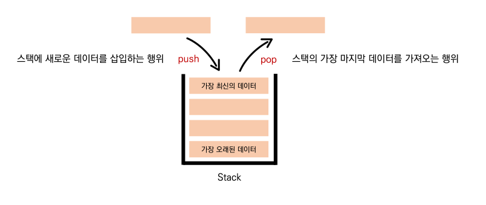
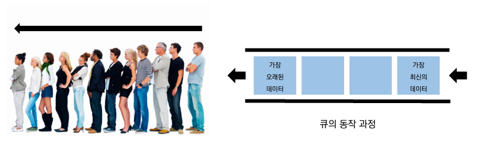
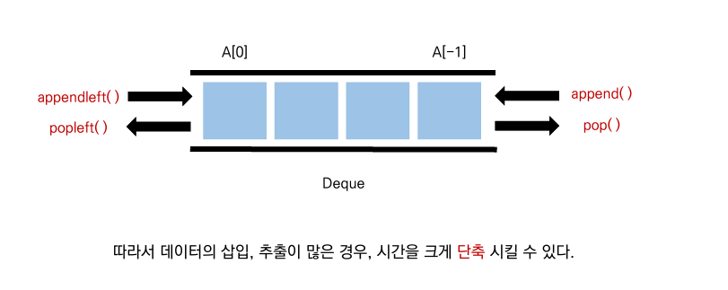

# 오전 자료구조5 강의

## 스택, 큐(Stack, Queus)

### 1. 스택(Stacjk)

> 스택은 쌓은 다는 의미로써, 마치 접시를 쌓고 뺴듯이 데이터를 한쪽에서만 넣고 빼는 자료 구조
> 가장 마지막에 들어온 데이터가 가장 먼저 나가므로 `LIFO(Last-in First-out, 후입선출)` 방식
> 

- 후입선출 : 마지막에 들어 간 것이 제일 처음 나온다

  1. 뒤집기, 되돌리기, 되돌아가기
     - 브라우저 히스토리 / 실행 취소(ctrl + z) / 단어 뒤집기
  2. 마무리 되지 않은 일을 임시 저장

     - 괄호 매칭

     - 함수 호출(재귀 호출)

     - 백트래킹

     - DFS(깊이 우선 탐색)

     - [예제 백준10773](https://www.acmicpc.net/problem/10773)

### 2. 큐(Queue )

> 차례대로 들어오는 줄 같은 의미
> 한 쪽 끝에서 데이터를 넣고, 다른 한 쪽에서만의 데이터를 뺄 수 있는 자료구조
> 가장 먼저 들어온 데이터가 가장 먼저 나가므로`FIFO(Fist-in Fist-out,선입선출)` 방식

- enqueue : 가장 최근의 데이터를 넣는 것 == pop(0)

- dequeue : 가장 먼저 들어온 데이터를 뺴낸다 > == append()
  - [예제 백준2161](https://www.acmicpc.net/problem/2161)

**리스트를 이용한 큐 자료구조의 단점**

- **데이터를 뺄때** 큐 안에 있는 데이터가 많은 경우 **비효율적**이다.
  (맨 앞 데이터가 빠지면서, 리스트의 인덱스가 하나씩 당겨 시지 때문)

**덱(Deque, )**

- 양방향 삽입, 추출이 모두 큐보다 훨씬 빠르다
  (appendleft(), popleft()오래된 데이터 빼기) 사용한다

# 오후 알고리즘 문제풀이 & 코드리뷰

## 실습 후기

이해는 되는거 같지만 문제를 풀여보며 이해를 다시 한번 해야 했다 앞으로도 생각보다 쉽지 않다는 생각이 든다..

별로 문제 풀이를 많이 못했다...문제 이해와 코드 작성에 많은 시간을 들였지만 풀지 못했다...
