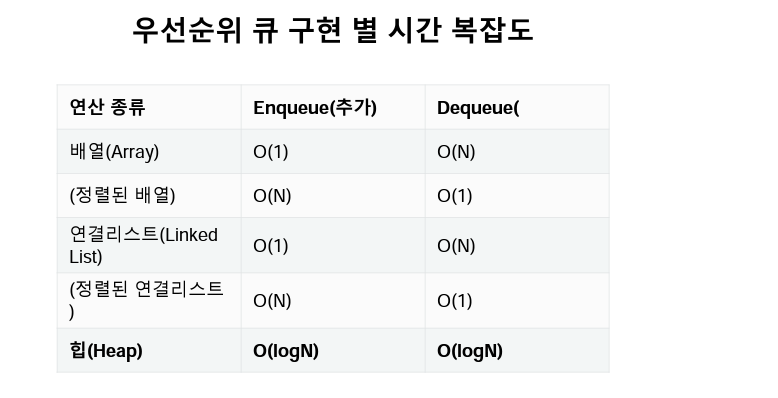

# 오전 자료구조5 강의

## 힙(Heap), 셋(Set)

**순서가 아닌 다른 기준으로는?**

- 우선순위 큐는 `우선순위(중요도, 크기 등 순서 이외의 기준)를 기준` 으로
  가장 우선순위가 높은 데이터가 가장 먼저 나가는 방식

**우선순위 큐**

1. 가중치가 있는 데이터
2. 작업 스케줄링
3. 네트워크

**우선순위 큐를 구현하는 방법**

1. 배열
2. 연결 리스트
3. 힙

## 힙의 특징

> _`최대값`_ 또는 *`최소값`*을 빠르게 찾아내도록 만들어진 데이터 구조
> 완전 이진 트리의 형태로 **느슨한 정렬 상태를 지속적으로 유지** 한다.
> 힙 트리에서는 *`중복값`*을 허용한다.

- 언제 사용 할까?

1. 데이터가 지속적으로 정렬되야 하는 경우
2. 데이터 삽입/삭제가 빈번 할때

- 파이썬의 heapq 모듈
- minheap(최소 힙)으로 구현되어 있음(가장 작은 값이 먼저 옴)
- 삽입, 삭제, 수정, 조회 **연산의 속도가 리스트보다 빠르다.**

- 메서드

1. heapq.heapify()
2. heapq.heappop()
3. heapq.heappush(heap, itme)

## 2. 셋(Set)

> 셋은 수학에서의 `집합`을 나타내는 데이터 구조로 python에서는 기본적으로 제공되는
> 데이터구조이다

**셋의 연산**

1. .add()
2.  .remove()
3.  |(합)
4.  \- (차)
5.  & (교)
6.  ^ (대칭차)

**셋은 언제 사용 할까?**

1. 데어트의 중복이 없어야 할때
2. 정수가 아닌 데이터의 `삽입`/`삭제`/`탐색`이 빈번히 필요할때
   - [예제 BOJ14425](https://www.acmicpc.net/problem/14425)
   - [예제 BOJ1269](https://www.acmicpc.net/problem/1269)

# 오후 알고리즘 문제풀이 & 코드리뷰

## 실습 후기

내가 생각한 문제풀이와 구글링해서 답을 찾아보면 너무 다른 방식으로 돼있고 내가 코드는 너무 정리가 안되고

풀이 코드가 너무 길다 생각을 하면서 코드도 좀 더 정리하면서 작성을 하는 부분도 더욱 신경 써야 겠다..
