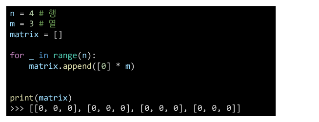
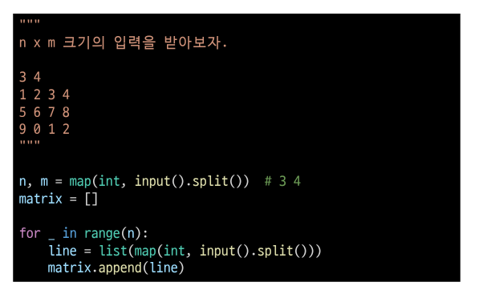

# 오전 알고리즘1 강의

## 1. 이차원 리스트

> 이차원 리스트는 __리스트를 원로소 가지고 지는 리스트__일 뿐이다.

- 리스트를 변경하면 __행렬(matrix)__의 형태로 나타낼 수 있다!!

**이차원 리스트는 행렬(matrix)이다.**

- 특정 갑승로 초기화 된 이차원 리스트 만들기

1. 직접 작성(4X3 행렬)

2.  반복문으로 작성(100x100 행렬)

3. 반복문으로 작성 2 (n x m 행렬)

4. 리스트 컴프리헨션으로 작성(n x m 행렬)

## 2. 입력 받기

1. 행렬의 크기가 미리 주어지는 경우

2. 행렬의 크기가 입력으로 주어지는 경우

**# 오후 알고리즘 문제풀이 & 코드리뷰**

**## 실습 후기**

이차원리스트 시작부터 쉽지 않다... 이전 까지는 어렵더라도 어느정도 따라가고 50%라도 이해를 할 수 있는 느낌이였지만 이차원리스트 하면서 새로운 어려움을 느끼고 있고 이해가 조금이라도 된거 같았는데 문제를 풀며보니 20%도 이해를 못하고 있었다..... 이차원리스트는 다른 부분보다 시간을 몇배 투자를 해야 할거 같다....

