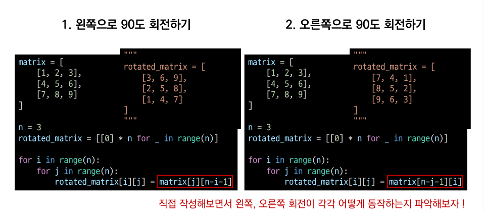

# 오전 알고리즘2 강의

## 알고리즘

### 1. 순회

- 행렬의 값을 순차적으로 순회하며 출력을 하려면??

- 인덱스를 통해 각각 출력 하면 가능 하다

**하지만 원소의 개수가 많다면...???**

- 이중 for문을 이용한 __행 후선 순회__

- 이중 for문을 이용한 __열 우선 순회__

- 행 우선 순회 Vs 열 우선 순회

- 행 우선 순회를 이용해 이차원 리스트의 __총합__ 구하기

- 행 우선 순회를 이용해 이차원 리스트의 __최대값, 최소값__ 구하기

### 2. 전치

> 전치(transpose)란 행렬의 행과 열을 서로 맞바꾸는 것을 의미한다.

## 3. 회전

> 문제에서 이차원리스트를 __왼쪽, 오른쪽으로 90도 회전__ 하는 경우가 존재한다.

# 오후 알고리즘 문제풀이 & 코드리뷰

## 실습 후기

이차원 리스트 2일차 오늘 배운건 몇일 공부가 필요할거 같다.... 풀이를 보기 전까지 제대로 된 접근법도 찾지 못하고 이해도 전혀 하지 못했다.... 
