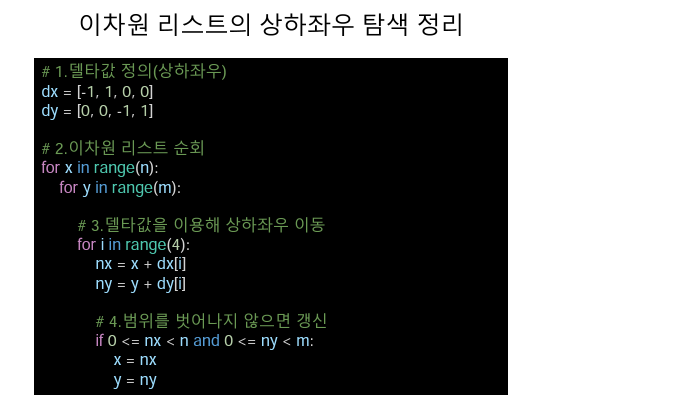

# 오전 알고리즘3 강의

## 완전탐색 I

### 1. 무식하게 풀기(Brute-force)

- 모든 경우의 수를 탐색하여 문제 해결 방식
- 무식하게 밀어 붙인다는 뜻
- 가장 단순한 풀이 기법, 단순 조건문과 반복문을 이용해서 풀 수 있다
- 복잡한 알고리즘 보다는 아이디어를 어떻게 코드로 구현할 것인지 중요
  - 예시문제 : [BOJ2798 블랙잭](https://www.acmicpc.net/problem/2798)

### 2. 델타 검색(Delta Search)

  - 각 지점에서 상하좌우에 위치한 다른 지점을 조회하거나 이동 하는 방식
  - 이때 행과 열의 변량인 -1, +1을 델타값이라 한다.

# 오후 알고리즘 문제풀이 & 코드리뷰

## 후기

너무 어렵다... 이차원 리스트 순회도 이제 이해하기 시작했는데 갑자기 탐색은 완전히 다른 범주다

실습시간에 문제를 푸는게 아니라 코드를 따라서 그냥 쓰고 작동여부만 보고 있는것같다.. 한줄 한줄 코드를

천천히 공부해 봐야겠다...
