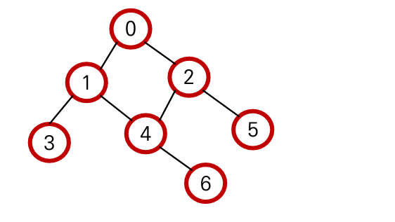
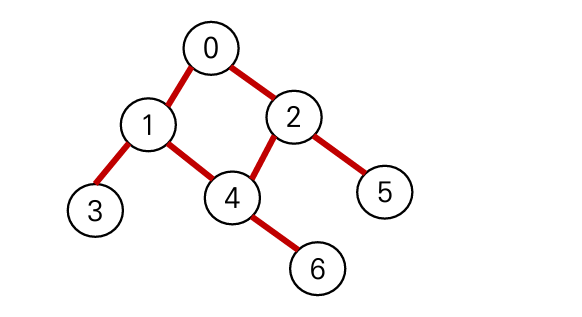
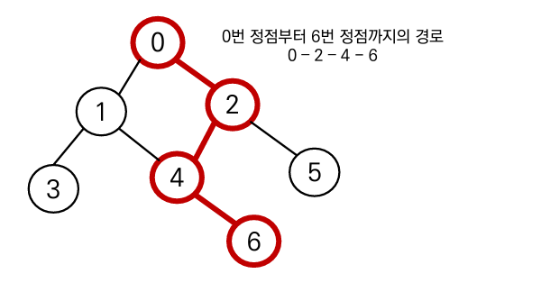
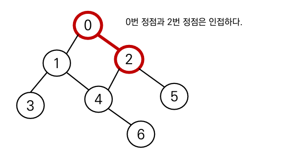
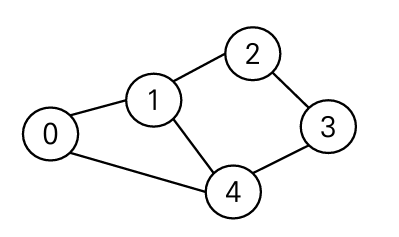
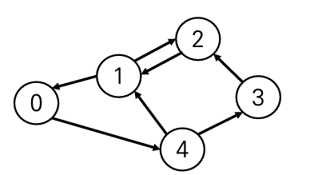
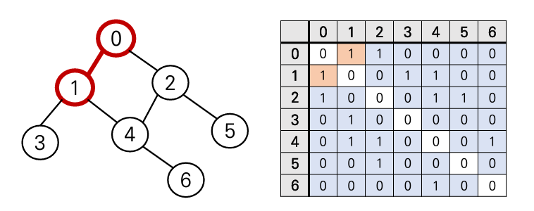
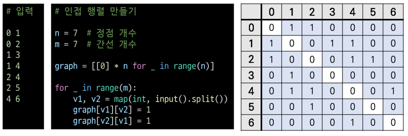
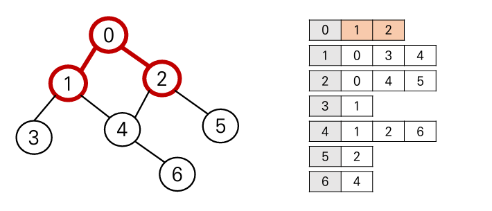
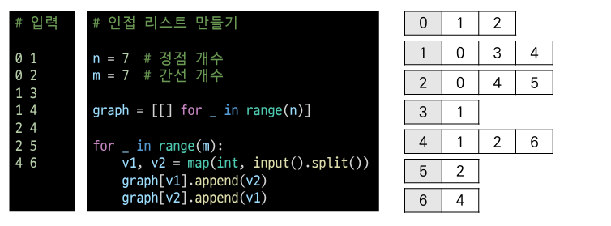

# 오전 알고리즘4 강의

## 그래프에 대한 이해

- `정점(Vertex)`과 이를 연결하는 `간선(Edge)`들의 집합으로 이루어진 비선형 자료구조

## 그래프 관련 용어

정점(Vertex) : 간선으로 연결되는 객체이며, 노드라고도 한다.

간선(Edge) : 정점 간의관계(연결)를 표현하는 선을 의미

경로(Path) : 시작 정점부터 도착 정점까지 거치는 정점을 나열한 것

인접(Adjacency) : 두 개의 정점이 하나의 간선으로 직접 연결된 상태를 의미한다.

## 그래프의 종류

1. 무방향 그래프(Undirected graph)
   - 간성의 방향이 없는 가장 일반적인 그래프
   - 간선을 통해 양방향의 정점이동 가능
   - 차수 : 하나의 정점에 연결된 간선의 개수
   - 모든 정점의 차수의 합 = 간선수 x 2

1. 유방향 그래프(Directed Graph)
   - 간성의 방향이 있는 그래프
   - 간선의 방향이 가리키는 점점으로 이동 가능
   - 차수 : 진입 차수와 진출 차수로 나누어 짐
     - 진입 차수 : 외부 정점에서 한 정점으로 들어오는 간선의 수
     - 진출 차수 : 한 정점에서 외부 정점으로 나가는 간선의 수

## 그래프의 표현

1. 인접 행렬
   - 두 정점을 연결하는 간선이 **없으면 0, 있으면 1**을 가지는 `행열`로 표현

1. 인접 리스트
   - 리스트를 통해 각 정점에 대한 인접 정접들을 `순차적`으로 표현하는 방식

# 오후 알고리즘 문제 풀이 & 코드리뷰

## 후기

이론은 이해가 됐지만 막상 혼자 문제 풀이를 할려고 하니 막막하다 알고리즘으로 넘어온 후로는 따라가기도 쉽지않다 그래도 코드리뷰를 통해 다른 사람들이 어떻게 접근 했는지를 배우고 이렇게 생각을 할 수 있구나 하기도하고
코드도 보면서 문제를 이해하면서 조금은 따라가고 있다고 생각한다...
