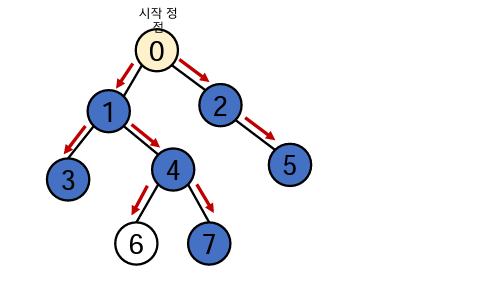
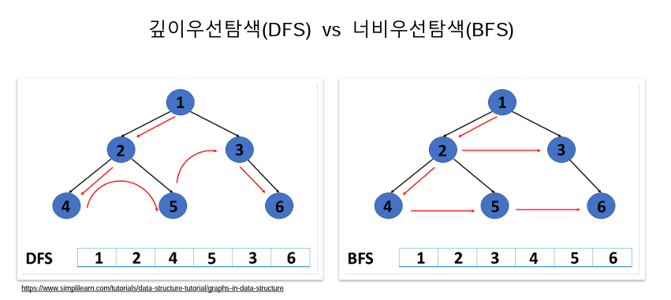
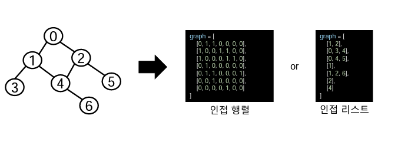
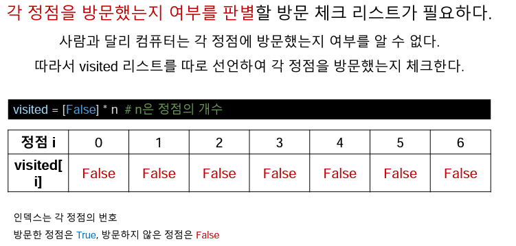
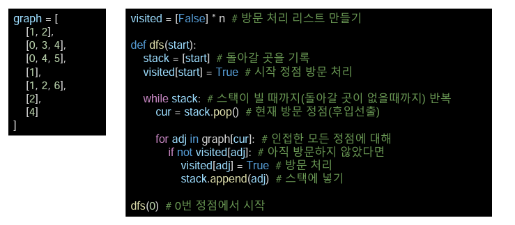

# 오전 알고리즘5 강의

## 깊이우선탐색(DFS)

### 1. 그래프 탐색 알고리즘

>  시작 정점에서 __간선을 타고 이동 할 수 있는 모든 정점을 찾는__ 알고리즘

 - 깊이우선탐색, 너비우선탐색
  - 스택 + 스래프 + 큐 개념을 함께 활용

  - 스택 + 그래프 == 깊이우선탐색(DFS)
  - 그래프 + 큐 == 너비우선탐색(BFS)

### 2. 깊이우선탐색(DFS)

  > 갈 수 있는 하위 정점까지 가장 긾게 탐색 더이상 갈 곳이 없다면 마지막 갈림길로 돌아와서 다른
    덩점을 탐색 하면서 모든 정점을 순회 하는 방법
    
  __❗❗Tip❗❗__ 미로 탈출을 생각 하면 이해하기 쉽다 출구를 찾다가 막히면 돌아서 다른 길을 찾는다
     
  - 모든 정점을 방문 할대 유리, 경우의 수, 순열과 조합 문제에 많이 사용
  - 너비우선탐색에 비해 코드 구현이 간단하다
  - 단, 모든 정점을 방문할 필요가 없거나 최단거리를 구하는 경우 = 너비우선탐색
### 3. DFS 동작 과정

  - 일단 탐색을 진행할 그래프가 필요하다.
  - 그래프는 **인접행열**, **인접리스트** 방식으로 표현할 수 있다.

  - 각 정점을 방문 했는지 여부를 판별 할 체크 리스트가 필요
  - 컴퓨터는 각 정점을 방문 했는지 알 수 없기 때문 방문 했다는 리스트를 만들어야 한다

### 4. DFS 구현의 방식

  - 직전 방문한 정점으로 차례로 돌아가야 하므로, 후입선출(LIFO 구조의 스택을 사용 한다)

### 5. 문제풀이

예제문제 : [BOJ2606 바이러스](https://www.acmicpc.net/problem/2606)

# 오후 알고리즘 문제풀이 & 코드리뷰

## 후기

어렵다... 코드리뷰를 하면서 질문도 하고 이해하려고 노력했지만 하루만에 이해하기에는 쉽지 않은 내용같다 좀 더 시간을 들여서 공부를 하고 추가로 내용도 찾아보면서 정리를 해야 할거 같다....

