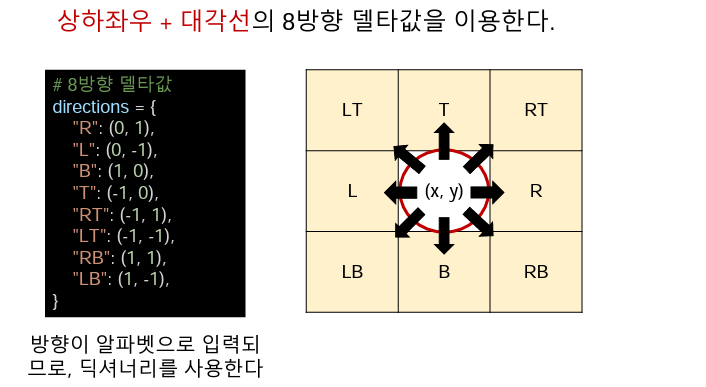
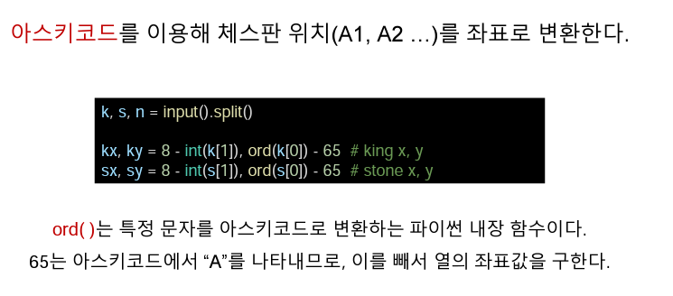

# 오전 알고리즘6 강의(코테 준비 방법)

## 1. 코딩테스트 준비 I(기본)

  - 문제의 내용을 코드로 구현 가능 한지 테스트
  - 문제 풀이에 시간 제한이 없는 경우가 많기 때문에 시간복잡도를 생각하지 않고 풀어 보는 것
  - 완전탐색 중에서도 2차원 배열의 탐색, 델타 탐색 등 선형 탐색이 주다

## 2. 단순구현(Implementation)

> 문제에 제시괸 ㄹ풀이 과정을 그대로 구현하는 유형

- 시뮬레이션의 경우 완전탐색 유형 중 하나로써, 모든 경우의 수를 탐색하여 풀이한다
- 아이디어나 알고리즘을 요구하기 보다는, 문제에 제시된 과정을 그대로 구현할 수 있는가가 핵심
- 예제 문제 : [BOJ1063 킹](https://www.acmicpc.net/problem/1063)

