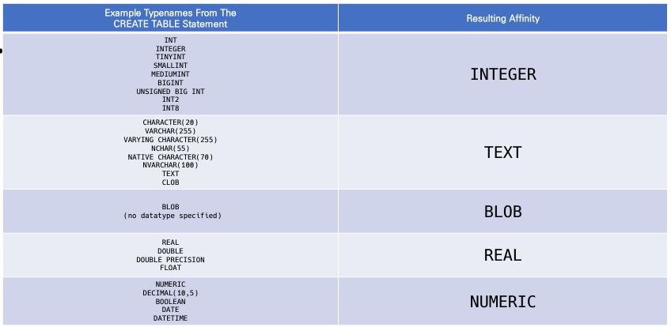
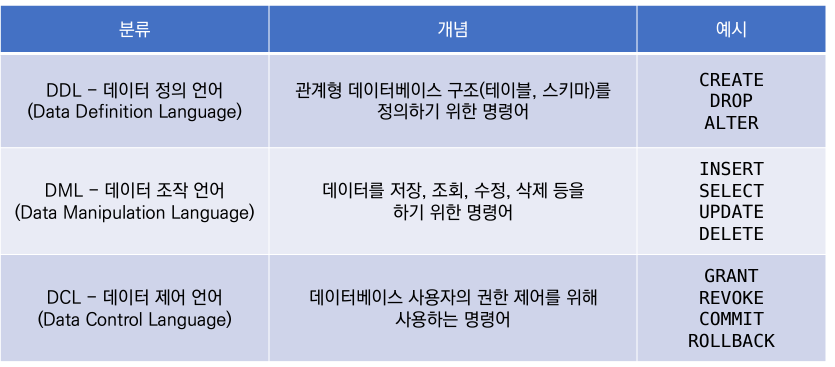
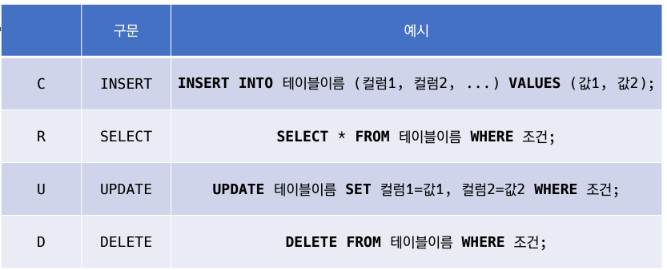

# 데이터베이스(Database)

- 데이터베이스는 __체계화된 데이터__의 모임
- 여러 사람이 공유하고 사용할 목적으로 통합 관리되는 정보의 집합
- 논리적으로 연관된(하나 이상의) 자료의 모음으로 그 내용을 고도로 구조화 함으로써 검색과  갱신의 효율화
- 즉, 몇 개의 자료 파일을 조기적으로 통합하여 자료 항목의 중복을 업애고 자료를 구조화하여 기억시켜 높은 자료의 집합체

**데이터 베이스로 얻는 장점들**
 - 중복 최소화
 - 무결성
 - 일관성
 - 독립성
 - 표준화
 - 보안 유지

## 관계형 데이터베이스(RDB, Relational Database)

  - 서로 관련된 데이터를 저장하고 접근 할 수 있는 데이터베이스 유형
  - 키와 값들의 간단한 관계를 표 형태로 정리한 데이터베이스

**스키마**

- 데이터베이스에서 자료의 구조, 표현방법, 관계등 전반적인 __명세를 기술__ 한것

**테이블**

 - 열과 행의 모델을 사용해 조직된 데이터 요소들의 집합

- **열** : 각 열에 목록이 저장되는 형태

- **행** : 실제 데이터가 저장된은 형태

- **기본키** : 각 행(레코드)의 고유값

## 관계형 데이터베이스 관리 시스템(RDBMS)

> 관계형 모델을 기반으로 하는 데이터베이스 관리시스템을 의미

**SQLite**

  - 서버 형태가 아닌 파일 형식으로 응용 프로그램에 넣어서 사용하는 비교적 **`가벼운 데이터베이스`**
  - 구글 안드로이드 운영체제에 기본적으로 탑재된 데이터베이스미여, 임베디드 소프트웨어에도 많이 활용됨
  - 로컬에서 간단한 DB 구숭얼 할 수 있으며 오픈소스 프로젝트이기 때문에 자유롭게 사용가능

**SQLite Data Type**

1. NULL
2. INTEGER
   - 크기에 따라 0, 1, 2, 3, 4, 6 또는 8 바이트에 저장된 부호 있는 정수
3. REAL
   - 8바이트 부동 소수점 숫자로 정장된 부동 소수점 값
4. TEXT
5. BLOB
   - 입력된 그대로 저확히 저장된 데이터(별다든 타입 없이 그대로 저장)

__Sqlite Type Affinity (1/2)__

- 특정 컬럼에 저장되도록 권장하는 데이터 타입

1. INTEGER
2. TEXT
3. BLOB
4. REAL
5. NUMERIC

## SQL

  - 관계형 데이터베이스 관리시스템의 __데이터관리__를 위해 설계된 __특수목적으로 프로그래밍언어__
  - 스키마 생성 및 수정
  - 자료 검색 및 관리
  - 객체 접근 및 정리
**DDL** : Definition language
**DML** : Maripulation language+
**DCL** : Contaol language

- __SQL Keywords -Data Manipulation Language__
  - INSERT : 새로운 데이터 삽입(추가)
  - SELECT : 저장되어있는 데이터 조회
  - UPDATE :저장되어있는 데이터 갱신
  - DELETE : 저장되어있는 데이터 삭제

- __필드 제약 조건__
  - NOT NULL : NULL 값 입력 금지
  - UNIQUE : 중복값 입력 금지(NULL 값은 중복 가능)
  - PRIMAWRY KET : 테이블에 반드시 하나 NOT NULL + UNIQUE
  - FOREIGN KEY : 외래키, 다른 테이블의 key
  - CHECK : 조건이 설정된 값 조회

## CRUD
**CREATE**
 - __INSERT__
   - 테이블 단일 행 삽입
     
   - 에티블에 정의된 모든 컴럭에 맞춰 순서대로 입력

- __READ__
  - __SELECT__
    - 테이블에서 데이터를 조회
    - SELECT문은 SQLite에서 가장 기본이 되는 문이며 다양한 절(clause)와 함꼐 사용
      - ORDER BY, DISTINCT, WHERE, LIMIT, GROUP BY ...
  - __LIMIT__
    - 쿼리에서 반환되는 행 수를 제한
    - 특정 행부터 시작해서 조회하기 위해 __OFFSET__ 키워드와 함꼐 사용하기도 함
  - __WHERE__
    - 쿼리에서 반환된 행에 대한 특정 검색 조건을 지정
  - __SELECT DISTINMCT__
    - 조회 결과에서 중복 행을 제거
- __DELETE__
  - 테이블에서 행을 제거
- __UPDATE__
  - 기존 행의 데이터를 수정
  - SET clause에서 테이블의 각 열에 대해 새로운 값을 설정

