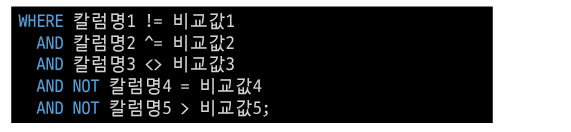
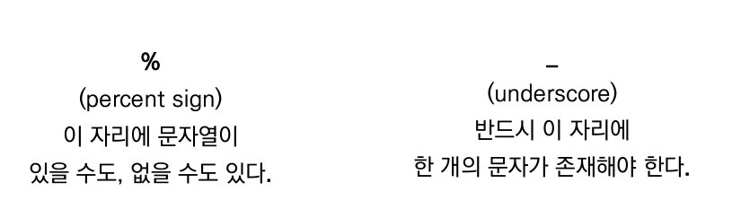
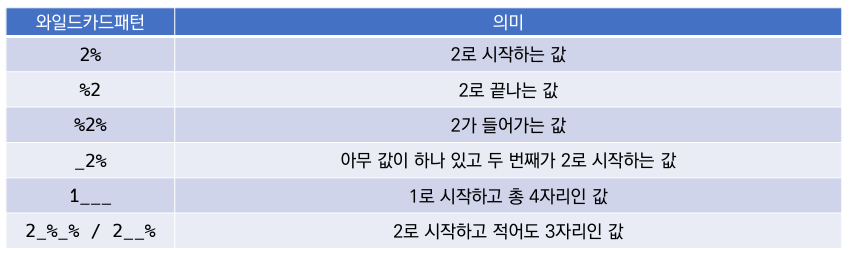

# CRUD

## WHERE

- __WHERE절에서 사용할 수 있는 연산자__
  - 비교연산자
    - =, > , >=, <- 는 숫자 혹은 문자 값의 대/소, 동일 여부를 확인하는 연산자
  - 논리 연산자
    - AND : 앞에 있는 조건과 뒤에 오는 조건이 모두 참인 경우
    - OR : 앞의 조건이나 뒤의 조건이 참인 경우
    - NOT : 뒤에오는 조건이 별과를 반대로

- __SQL 사용할 수 있는 연산자__
  - BETWEEN a AND b
    - a 와 b 사이의 비교 값( a <= 비교 값 <= b)
  - IN(값1, 값2, ....)
    - 목록 중에 값이 하나라도 일치하면 성공
  - LIKE
    - 비교 문자열과 형태 일치
    - 와일드카드(% : 0개이상의 문자, _ : 1개 단일 문자)
  - IS NULL/ IS NOT NULL
    - NULL 여부를 확인할 때는 항상 = 대신에 IS를 활용
  - 부정 연산자
    - 같지 않다(!=, ^=, <>)
    - ~와 같지 않다(NOT 칼럼명 =)
    - ~보다 크지 않다(NOT 칼럼명 >)

- __연산자 우선순위__
  - 1순위 : 괄호 ()
  - 2순위 : NOT
  - 3순위 : 비교연산자, SQL
  - 4순위 : AND
  - 5순위 : OR

## SQLite Aggregate Functions
- Aggregate Functions (집계 함수)
  - 값 집합에 대한 계산을 수행하고 단일 값을 반환
    - 여래 행으로부터 하나의 결과값을 반환하는 함수
  - SELECT 구문에서만 사용됨
  - 예시
    - 테이블 전체 행 수를 구하는 COUNT(*)
    - age 컬럼 전체 평균값을 구하는 AVG(age)
- __COUNT__
  - 그룹의 항목 수를 가져옴

- __AVG__
  - 모든 값의 평균을 계산

- __MAX__
  - 그룹에 있는 모든 값의 최대값을 가져옴

- __MIN__
  - 그룹에 있는 모든 값의 최소값을 가져옴

- __SUM__
  - 모든 값의 합을 계산

## LIKE

- 패턴 일치를 기반으로 데이터를 조회하는 방법
- SQLite는 패턴 구성을 위한 2개의 wildcards를 제공
  - % : 0개 이상의 문자
  - _ : 임의의 단일 문자

## ORDER BY

- 조회 결과를 집합을 정렬
- SELECT 문에 추가하여 사용
- 정렬 순서를 위한 2개의 keyword 제공
  - ASC - 오름차순(default)
  - DESC - 내림차순

