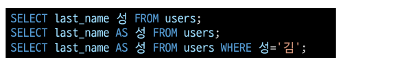

# 기본 함수와 연산

## 문자열 함수

- SUBSTR(문자열, start, length) : 문자열 자르기
  - 시작 인덱스는 1, 마지막 인덱스는 -1
- TRIM(문자열), LTRIM(문자열), RTRIM(문자열) : 문자열 공백 제거
- LENGTH(문자열) : 문자열의 길이
- REPLACE(문자열, 패턴, 변경값) : 패턴에 일치하는 부분을 변경
- UPPER(문자열), LOWER(문자열) : 대소문자 변경
- ||: 문자열 합치기

## 숫자 함수

- ABS(숫자) : 절대 값
- SIGN(숫자) : 부호(양수 1, 음수 -1, 0 0)
- MOD(숫자) : 숫자1을 숫자 2로 나운 나머지
- CEIL(숫자), FLOOR(숫자), ROUND(숫자, 자리) : 올림, 내림, 반올림
- POWER(숫자1, 숫자2 : 숫자1의 숫자2 제곱
- SQRT(숫자) : 제곱근

## 산술 연산자

- +, -, *, /와 같은 산술 연산자와 우선 순위를 지정하는 () 기호를 활용할 수 있음 

# GROUP BY

- Aggregate function (집계 함수) 다시보기
  - 값 집합에 대한 계산을 수행하고 단일 값을 반환
    - 여러 행으로 부터 하나의 결과값을 반환하는 함수
  - SELECT 구문에서만 사용됨
  - 예시
    - 테이블 전체 행 수를 구하는 COUNT(*)
    - age컬럼 전체 평균 값을 구하는 AVG(age)

- ALIAS
  - 칼럼명이나 테이블명이 너무 길거나 다른 명칭으로 확인하고 싶을 때는 ALILS를 활용
  - AS를 생략하고 공백으로 표시 할 수 있음
  - 별칭에 공백, 특수문자 등이 있는 경우 따옴표로 묶어서 표기

- __GROUP BY__
  - SELECT 문의 optional 절
  - 행 집합에서의 요약 행 집합을 만듦
  - 선택된 행 그루을 하나 이사으이 열 값으로 요약 행으로 만듦
  - ___문장에 WHERE 절이 포함된 경우 반드시 WHERE 절 뒤에 작성을 해야함___

