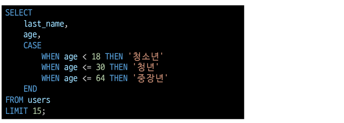
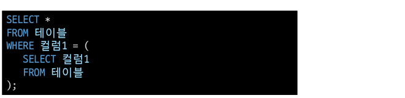

## CASE

- CASE문은 특정 상황에서 데이터를 변환하여 활용할 수 있음
- ELSE를 생갹하는 경우 NULL값이 지정됨

- 예시) 나이에 따라 청소년(~18), 청년(~30), 중장년(~64)으로 출력 하시오.
  

## 서브쿼리

- 서브쿼리는 특정한 값을 메인 쿼리에 반환하여 활용하는 것
- 실제 테이블에 없는 기준을 이용한 검색이 가능함
- 서브쿼리는 소괄호로 감싸서 사용하며, 메인 쿼리의 칼럼을 모두 사용할 수 있음
- 메인 쿼리는 서브쿼리의 칼럼을 이용할 수 없음

- 단일행 서브쿼리
  - 서브쿼리의 결과가 0 또는 1개인 경우
  - 단일행 비교 연산자와 함께 사용(=, <, <=, >=, >, <>)
- 다중행 서브쿼리
  - 서브쿼리 결과가 2개 이상인 경우
  - 다붕행 비교 연산자와 함께 사용(IN, EXISTS 등)
- 다중컬럼 서브쿼리