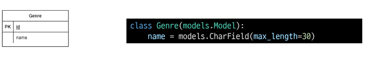
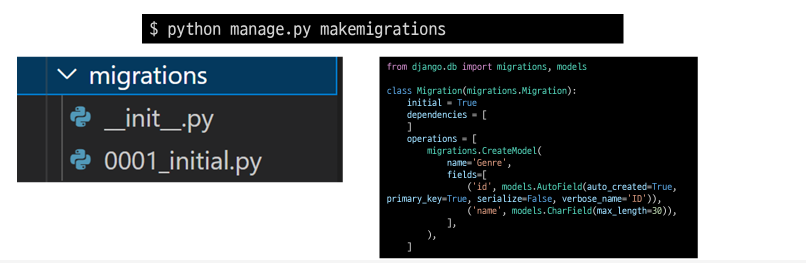
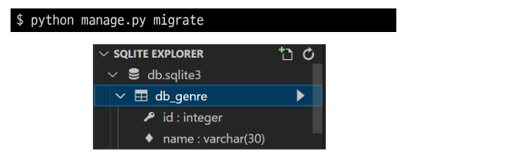
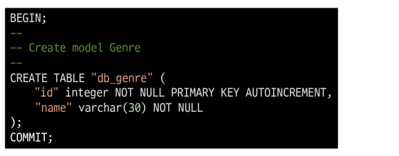
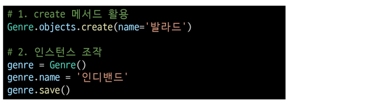
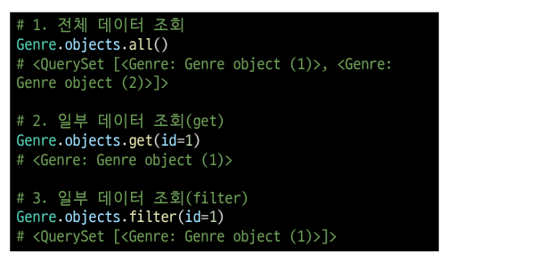
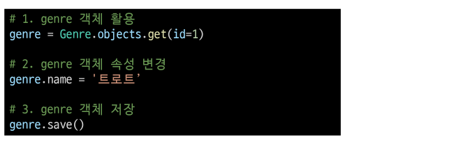
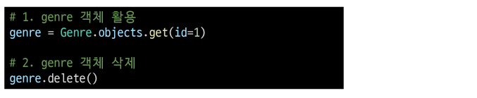

# ORM

- Object-Relational-Mapping
- 객체 지향 프로그래밍 언어를 사용하여 호환되지 않는 유형의 시스템 간의
  데이터를 변환하는 프로그래밍 기술
- 파이썬에서는 SQLalchemy, peewee 등 라이브러리가 있으며 Django 프레임워크에서는
  내장 Django ORM을 활용

## 모델 설계

- 클래스를 생성하여 내가 원하는 DB의 구조를 만든다.

- 클래그의 내용으로 데이터베이스에 반영하기 위한 마이그레이션 파일을 생성한다.

  

- DB에 migrate 한다.

- **Migration(마이그레이션)**
  - model에 생긴 변화를 DB에 반영하기 위한 방법
  - 마이그레이션 파일을 만들어 DB 스키마에 반영한다.
  - 명령어
    - makemigrations : 마이그레이션 파일 생성
    - migrate : 마이그레이션을 DB에 반영
  - Migrate 살펴보기

## ORM 기본조작

- Create

- Read

- Update

- Delete

