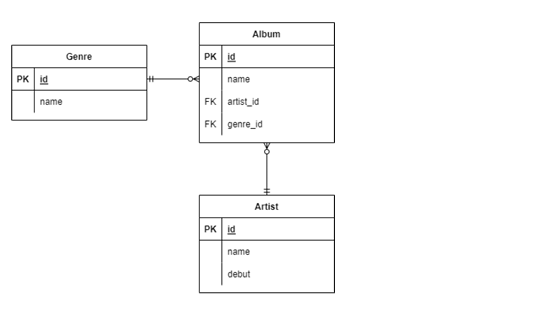

# ORM 확장(1:N)

- 모델링



```django
class Genre(models.Model):
	name = models.CharField(max_length=30)

class Artist(models.Model):
	name = models.CharField(max_length=30)
	debut = models.DateField()

class Album(models.Model):
	name = models.CharField(max_length=30)
	genre = models.ForeignKey('Genre', on_delete=models.CASCADE)
	artist = models.ForeignKey('Artist', on_delete=models.CASCADE)
```

- **Foreign Key(외래키)**
  - 키를 사용하여 부모 테이블의 유일한 값을 참조(참조 무결성)
    - 데이터베이스 관계 모델에서 관련된 2개의 테이블 간의 일관성
  - 외래 키의 값이 반드시 부모 테이블의 기본 키일 필요는 없지만 **`유일한 값`**이여야 함

- models.Foreginkey 필드
  - 2개의 필수 위치 인자
    - Model class : 참조하는 모델
    - on_delete : 외래 키가 참조하는 객체가 삭제되었을 때 처리 하는 방식
      - CASCADE : 부모 객체(참조 된 객체)가 삭제 됐을 때 이를 참조하는 객체도 삭제
      - PROTECT : 삭제되지 않음
      - SET_NULL : NULL 설정
      - SET_DEFAULT : 기본값 설정

