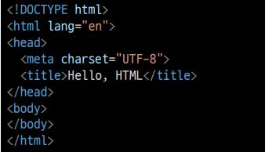
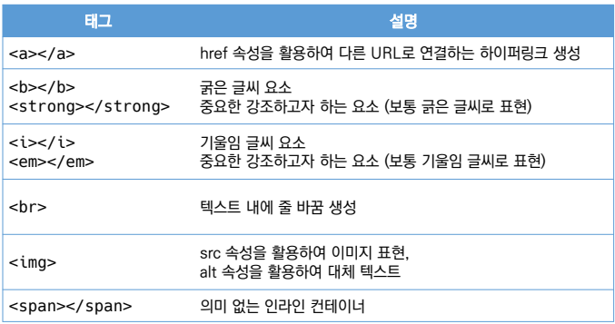
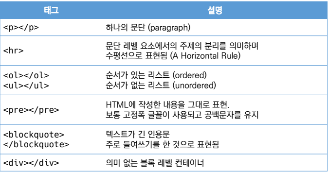
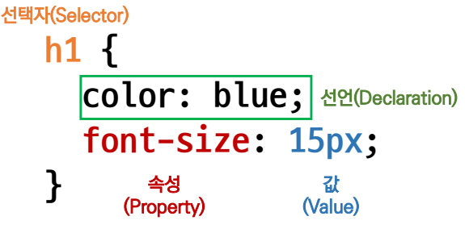
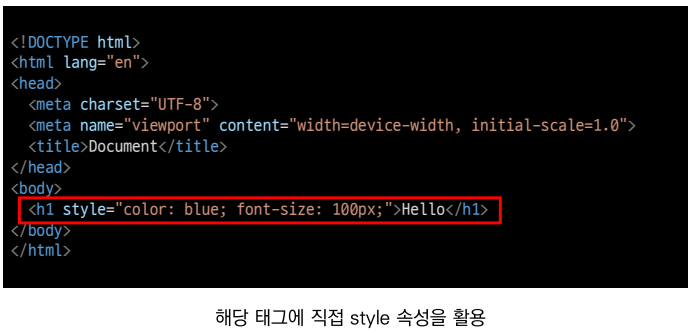
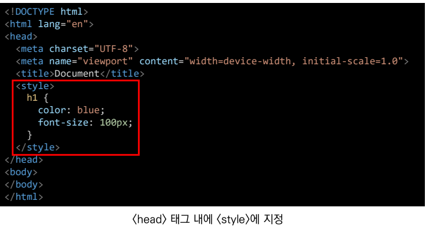
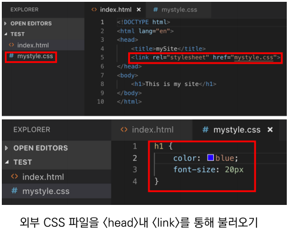

# 웹사이트
## 웹 표준
  - 웹에서 표준적으로 사용되는 기술이나 규칙
  - 어떤 브라우저든 웹체이지가 동일하게 보이도록 함(크로스 브라우징)

## 개발 환경 설정
- HTML/CSS 코드 작성을 위한 Visual Studio Code추천 확장 프로그램
  - Open in browser
  - Auto rename Tag
  - Auto Close Tag
  - Intellisense for CSS class name in HTML
  - HTML CSS Support

## 크롬 개발자 도구
  - 웹 브라우저 크롬에서 제공하는 개발과 관련된 다양한 기능을 제공
  - 주요 기능
    - Elements - DOM 탐색 및 CSS 확인 및 변경
      - Styles - 요소에 적용된 CSS확인
      - Computed - 스타일이 계선된 최종 결과
    - Sources, Network, Performance, Application, Security, Audits  등

# HTML 기초
> NAVER 사이트에 접속해서 개발자 도구를 활용하여 CSS를 제거한다면
  - HTML만 남은 웹사이트를 확인 할 수 있음
> **Hyper Text** Makrup Lanhuage
  - 참조(하이퍼링크)를 통해 사용자가 한 문서에서 다른 문서로 즉시 접근할 수 있는 텍스트
  - 웹 페이지를 구조화 하기위한 언어
> Hyper Text **Makrup Lanhuage**
  - 태그 등을 이용하여 문서나 데이터의 구조를 명시하는 언어 

`참고 사이트` https://html-css-js.com/

## HTML 기본 구조
- html : 문서의 최상위(root) 요소
  -head : 문서 메타데이터 요소
  - 문서 제목, 인코딩, 스타일, 외부 파일 로딩 등
  - 일반적으로 브라우제 나타자니 않는 내용
- body : 문서 본문 요소
  - 실제 화면 구성과 관련된 내용

## head 예시
- title : 브라우저 상단의 타이블
- mate : 문서 레벨 메타데이터 요소
- link : 외부 리소스 연결 요소 (CSS 파일, favicon 등)
- script : 스크립트 요소 (JavaScript 파일/코드)
- style : CSS 직접 작성

## head 예시 : Open Graph Protocol
- 메타 데이터를 표현하는 새로운 규약
  - HTML 문서의 메타데이터를 통해 문서의 정보를 전달
  - 메타정보에 해당하는 제목, 설명 등을 쓸 수 있도록 정의
  - 카톡 대화명 URL 공유 시 미리보기 화면

## 요소(element)
- HTML 요소는 시작 태그와 종료 태그 그리고 태그 사이에 위치한 내용으로 구성
  - 요소는 태그로 컨텐츠(내용)을 감싸는 것으로 그 정보의 성격과 의미를 정의
  - 내용이 없는 태그들로 존재(닫는 태그가 없음)
    - br, hr, img, input, link, meta ...
- 요소는 중첩(nested)될 수 있음
  - 요소의 중첩을 통해 하나의 문서를 구조화
  - 여는 태그와 닫는 태그의 쌍을 잘 확인 해야함
    - 오류를 반환하는 것이 아니 그냥 레이아웃이 깨진 상태로 출력 되기 떄문에,
      디버깅이 힘들어 질 수 있음
  
## 속성(attribute)

- 속성을 통해 태그의 부가적인 정보를 설정 할수 있음
- 요소는 속성을 가질 수 있으며, 경로나 크기와 같은 추가적인 정보를 제공
- 요소의 시작 태그에 작성하며 보통 이름과 값이 하나의 쌍으로 존재
- 태그와 상관없이 사용가능한 속성(HTML Global Attribute)들도 있음
   - 글로벌 속성
    - id : 문서 전체에서 유일한 고유 식별자 지정 
    - Class : 공백으로 구분된 해당 요소의 클래스의 목록(CSS, JS에서 요소를 선택하거나 접근)
    - Style : inline 스타일

## 텍스트로 작성된 코드가 웹사이트가 어떻게 될까??
- 렌더링(Rendering)
  - 웹사이트 코드를 사요자가 보게 되는 웹사이트로 바꾸는 과정

## DOM(Document Object Model) 트리
- 텍스트 파일인 HTML 문서를 브라우저에서 렌더링 하기 위한 구조
  - HTML 문서에 대한 모델을 구성함
  - HTML 문서 내 각 요소에 접근 / 수정에 필요한 프로터와 메서드를 제공함

## 인라인/블록 요소
- HTML 요소는 크게 인라인/블록 요소로 나눔
- 인라인 요소는 글자처럼 취급
- 블록 요소는 한 줄 모두 사용

## 텍스트 요소

## 그룹 컨텐츠

## CSS

> Cascading Style Sheets

**스타일을 지정하기 위한 언어**

선택하고, 스타일을 지전한다.

- CSS 구문

  ​	h1 {

  ​	color : blue;

  ​	font-size: 15px;

  ​	}

- CSS 구문은 선택자를 통해 스타일을 지정할 HTML 요소를 선택
- 중괄호 안에서 속성과 값, 하나의 쌍으로 이루어진 선언을 진행
- 각 쌍은 선택한 요소의 속성, 송석에 부여할 값을 믜이
  - 속성(Property) : 어떤 스타일 기능을 변경할지 결정
  - 값(Value) : 어떻게 스타일 기능을 변경할지 결정

**CSS 정의 방법**

- 인라인(inline)

- 내부 참조(embeddung) - \<style>

- 외부 참조(link file) - 분리된 CSS파일

**CSS 기초 선택자**

- 요소 선택자
  - HTML 태그를 직접 선택
- 클래스(class) 선택자
  - 마침료(.)문자로 시작하며, 해당 클래스가 적용된 항목을 선택
- 아이디(id) 선택자
  - \# 문자로 시작하며, 해당 아이기다 적용된 항목을 선택
  - 일반적으로 하나의 문서에 1번만 사용
  - 여러번 사용해도 동작은 하지만, 단일 id를 사용하는 것을 권장
