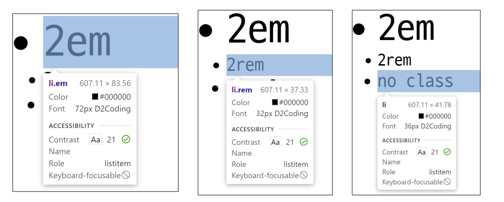
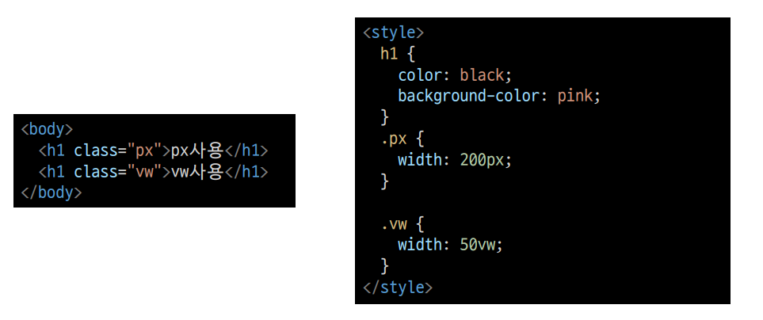
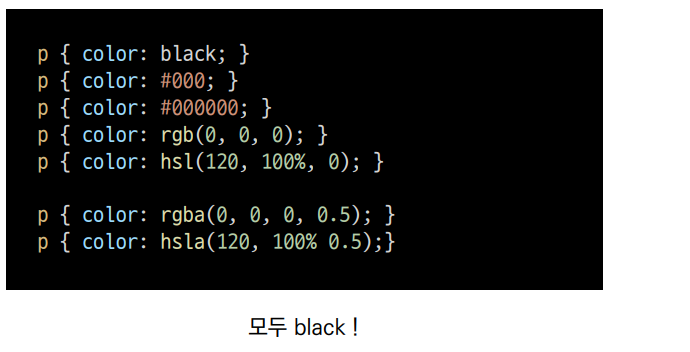
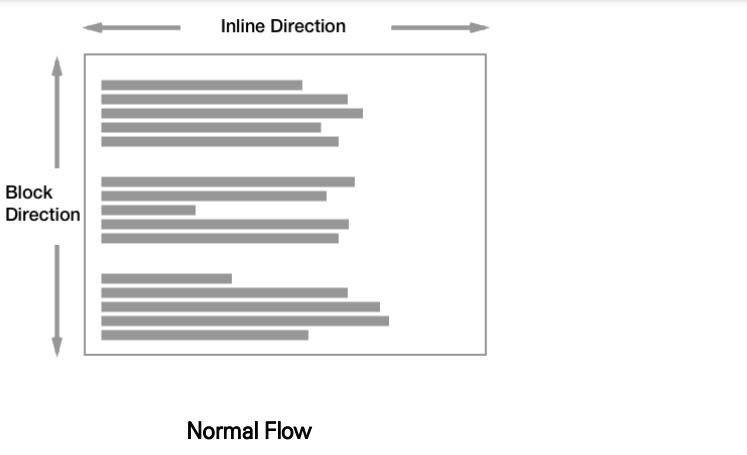
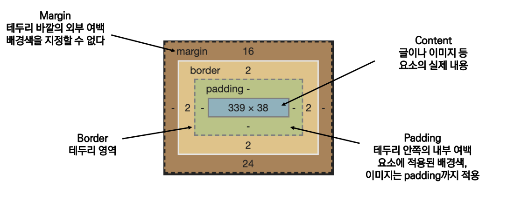
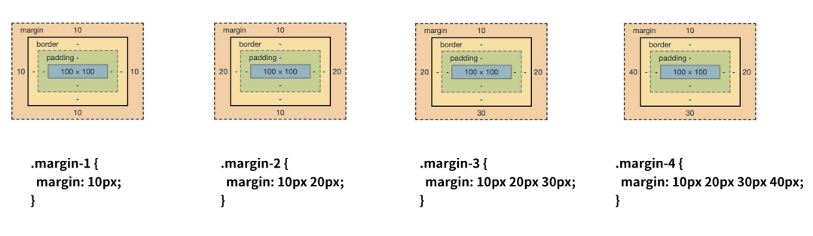
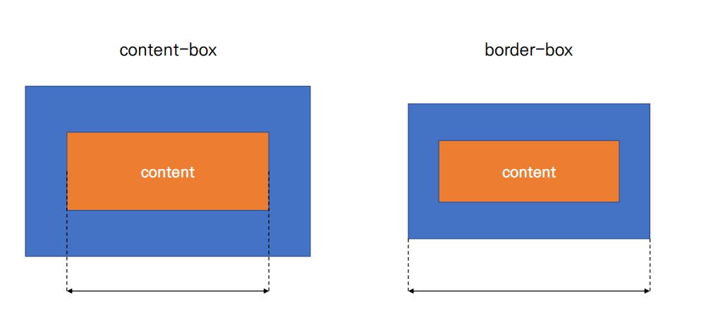
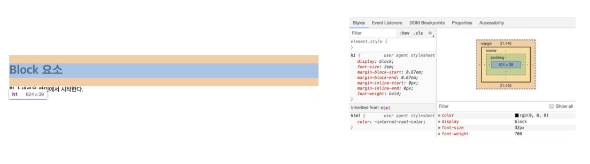
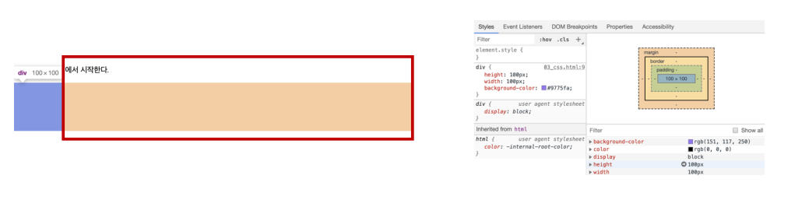
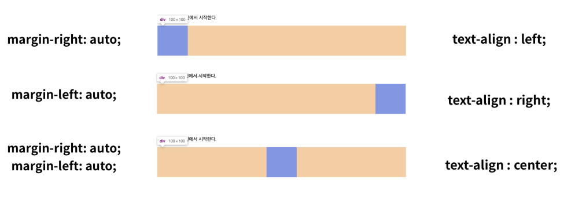

# CSS

## 기본 단위

- px(픽셀)
  - 모니터 해상도의 한 화소인 '픽셀' 기준
  - 픽셀의 크기는 변하지 않기 때문에 고정적인 단위
- %
  - 백분율 단위
  - 가변적인 레이아웃에서 자주 사용
- em
  - (바로 위, 부모 요소에 대한) 상속의 영향을 받음
  - 배수 단위, 요소에 지정된 사이즈에 상대적인 사이즈를 가짐
- rem
  - (바로 위, 부모 요소에 대한) 상속의 영향을 받지 않음
  - 최상위 요소(html)의 사이즈를 기준으로 배수 단위를 가짐

### 크기 단위 em / rem

- 웹 페이지를 방문한 유저에게 바로 보이게 되는 웹 컨텐츠의 영역 (디바이스 화면)'
- 디바이스의 viewport를 기준으로 상대적인 사이즈가 결정됨
- 예) vw, vh, vmin, vmax

### 색상 단위

- 색상키워트(backgraound-color: red;)
  - 대소문자를 구분하지 않음
  - red, blue, black 과 같은 특정 색을 글자로 나타냄
- RGB 색상(background-color: rgb(0, 255,0);)
  - 16진수 표기법 혹은 함수형 표기법을 사용해서 특정 색을 표현하는 방식
- HSL 색상(background-color: hsl(0, 100%, 50%);)
  - 색상, 채도, 명도를 통해 특정 색을 표현하는 방식
- a는 alpha(투명도)

### CSS 문서 표현 

- 텍스트
  - 서체(font-family), 서체 스타일(font-style, font-weight 등)
  - 자간(letter-spacing), 단어 간격(word-spacing), 행간(line-height) 등
- 컬러, 배경(backrground-image, background-color)
- 기타 HTML 태그별 스타일링
  - 목록(i), 표(table)

## CSS Selectors

### 선택자 유형

- 기본 선택자
  - 전체 선택자, 요소 선택자
  - 클래스 선택자, 아이디 선택자, 속성 선택자
- 결합자(Combinators)
  - 자손 결합자, 자식 결합자
  - 일반 형제 결합자, 인접 형제 결합자
- 의사 클래스/요소(Pseudo Class)
  - 링크, 동적 의사 클래스
  - 구조적 의사 클래스, 기타 의사 클래스, 의사 엘리먼트, 속성 선택자

### CSS 선택자 정리

- 요소 선택자
  - HTML 태그를 직접 선택
- 클래스(class) 선택자
  - 마침표(.)문자로 시작하며, 해당 클래스가 적용된 항목을 선택
- 아이디(ID) 선택자
  - \# 문자로 시작하며, 해당 아이디가 적용된 항목을 선택
  - 일반적으로 하나의 문서에 1번만 사용
  - 여러번 사용해도 동작하지만, 단일 ID를 사용하는 것을 권장

### CSS 적용 우선순위(cascading order)

1. 중요도(Importance) : 사용시 주의
   - !important
2. 우선 순위(Specificity)
   - 인라인 > id > class, 속성, pseudo-class > 요소, pseudo-element
3. CSS 파일 로딩 순서

### CSS 상속

- CSS는 상속을 통해 부모 요소의 속성을 자식에게 상속한다.
  - 속성(프로퍼티) 중에는 상속이 되는 것과 않는 것들이 있다.
  - 상속이 되는 것 예시
    - Text 관련 요소(font, color, text-align), opacity, visibility 등
  - 상속 되지 않는 것 예시
    -  Box model 관련 요소(width, height, margin, padding, border, box-sizing, display),
      position 관련 요소(position, top/right/bottom/left, z-index) 등

## CSS Box model

### CSS 원친

> 모든 요소는 **`네모(박스모델)`** 이고, **위에서부터 아래로, 왼쪽에서 오른쪽**으로 쌓인다.
> **`(좌측 상단에 배치)`**
>
> 

- 모든 HTML 요소는 box 형태로 되어있음
- 하나의 박스는 네 부분(영역)으로 이루어짐
  - margin
  - border
  - padding
  - content

### Box model 구성(margin/padding)

### box-sizing

- 기본적으로 모든 요소의 box-sizing은 content-box
  - Padding를 제외한 순수 contents 영역만을 box로 지정
- 다만, 우리가 일반적으로 영역을 볼 때는 border까지의 너비를 100px 보는것을 원함
  - 그 경우 box-sizing을 border-box로 설정

## CSS Display

- 모든 요소는 네모(박스모델)이고, 좌측 상단데 배치
- **`display에 따라 크기와 배치가 달라진다`**

### 대표적인 Display

- display : block
  - 줄 바꿈이 일어나는 요소
  - 화면 크기 전체의 가로폭을 차지한다
  - 블록 레벨 요소 안에 인라인 레벨 요소가 들어 갈 수 있음
- display :  inline
  - 줄바꿈이 일어나지 않는 행위 일부 요소
  - content 너비만큼 가로폴을 차지한다.
  - width, height, margin-top, margin-bottom을 지정할 수 없다
  - 상하 여백은 line-height로 지정한다

#### 블록 레벨 요소와 인라인 레벨요소

- 블록 레벨 요소와 인라인 레벨 요소 구분 (HTML 4.1까지)
- 대표적인 블록 레벨 요소
  - div / ul, ol, li / p / hr / form 등
- 대표적인 인라인 레벨 요소
  - span / a / img / input, label / b, em, i, strong 등

**block**

- block의 기본 너비는 가질수 있는 너비의 100%를 가진다
  
- 너비를 가질 수 없다면 자동으로 margin 을 부여
  

**inline**

- inline의 기본 너비는 컨텐츠의 영역만큼
  
- 속성에 따른 수평 정렬
  

**display**

- display : inline-block
  - block과 inline레벨 요소의 특징을 모두 가짐
  - inline처럼 한줄에 표시할 수 있고, block처럼 width,height, margin 속성을 모두 지정할 수 있음
- display : none
  - 해당 요소를 화면에 표시하지 않고, 공간조차 부여되지 않음
  - 이와 비슷한 visibility : hidden은 해당 요소가 공간은 차지하나 화면에 표시만 하지 않는다.
- 이외 다양한 display 속성은  https://developer.mozilla.org/ko/docs/Web/CSS/display 참조
